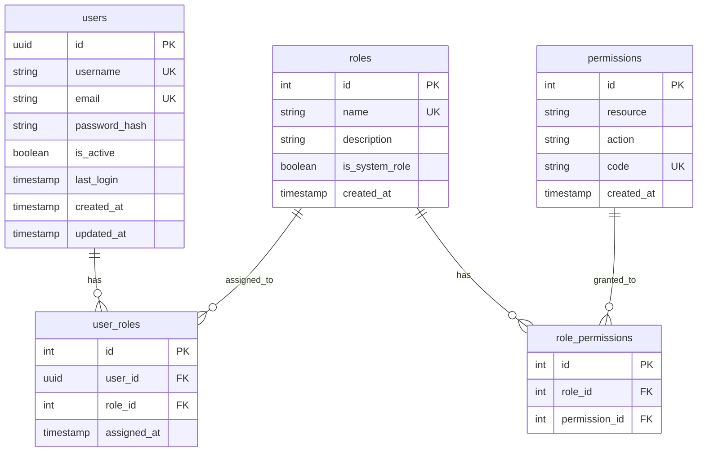
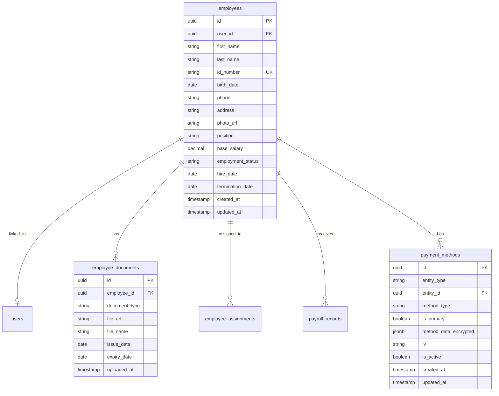
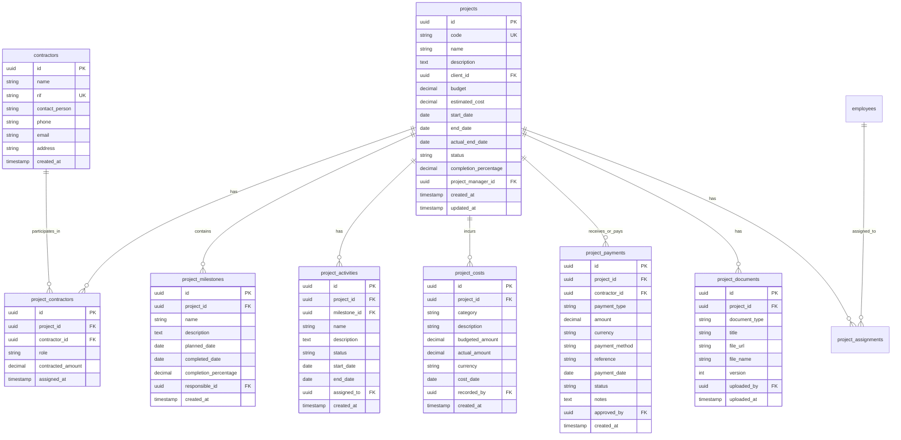
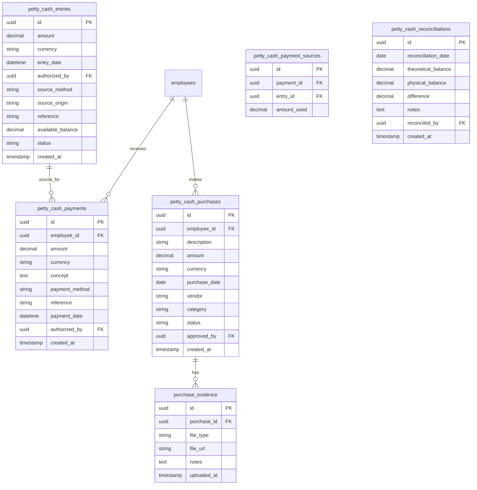
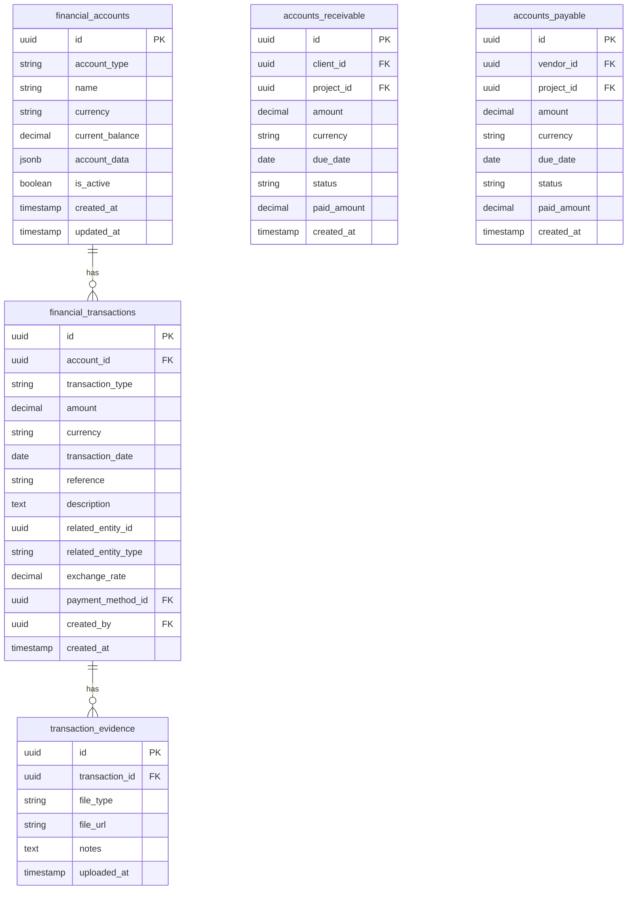
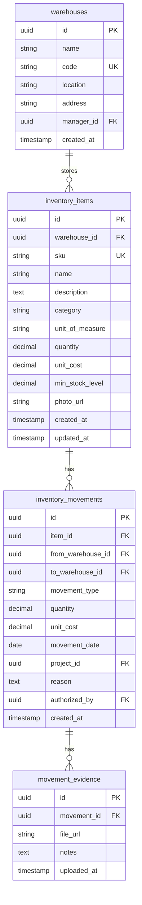
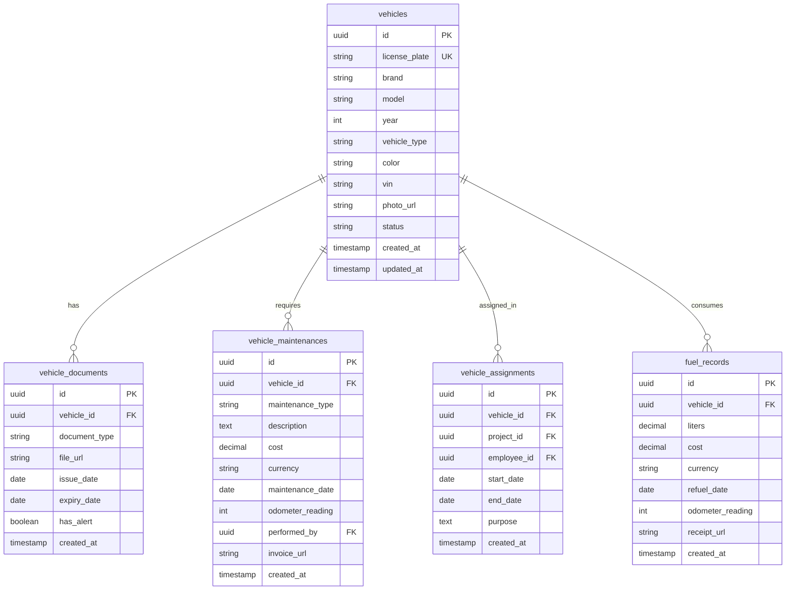
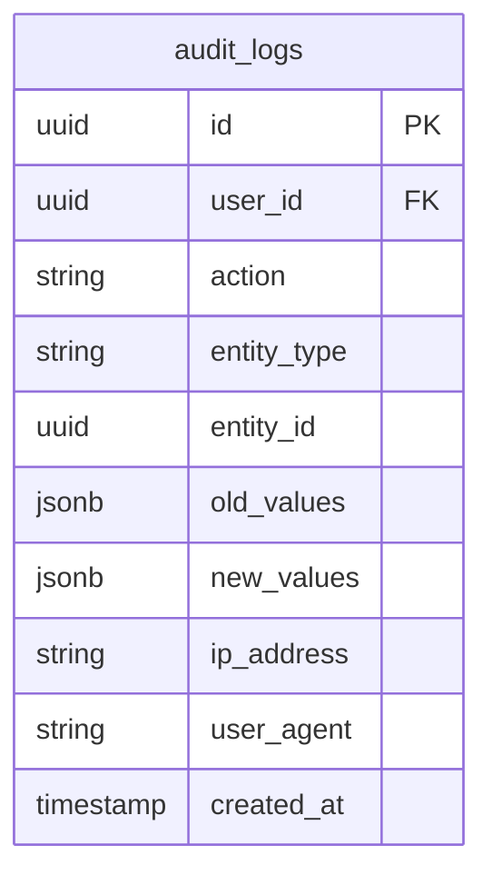

# PLANIFICACIÓN TÉCNICA COMPLETA - ERP EMPRESARIAL
## Sistema ERP para Empresa de Servicios Petroleros en Venezuela

**Versión:** 1.0
**Fecha:** Diciembre 2025
**Estado:** Pendiente de Aprobación

---

## TABLA DE CONTENIDOS

1. [Resumen Ejecutivo](#1-resumen-ejecutivo)
2. [Arquitectura del Sistema](#2-arquitectura-del-sistema)
3. [Módulos Adicionales Propuestos](#3-módulos-adicionales-propuestos)
4. [Casos de Uso Principales](#4-casos-de-uso-principales)
5. [Historias de Usuario](#5-historias-de-usuario)
6. [Roadmap del Proyecto](#6-roadmap-del-proyecto)
7. [Documentación Técnica a Generar](#7-documentación-técnica-a-generar)
8. [Plan de Pruebas](#8-plan-de-pruebas)
9. [Riesgos y Mitigación](#9-riesgos-y-mitigación)
10. [Estimación Total](#10-estimación-total)

---

## 1. RESUMEN EJECUTIVO

### 1.1 Alcance del Proyecto

Este proyecto consiste en el desarrollo de un **Sistema ERP Empresarial Personalizado** para una pequeña empresa de servicios petroleros en Venezuela. El sistema integrará todos los procesos operativos, financieros y administrativos de la empresa en una plataforma unificada, con énfasis especial en:

- **Gestión completa de proyectos** con trazabilidad de avance, costos y pagos
- **Sistema robusto de caja chica** con control de entradas/salidas y conciliaciones
- **Gestión de empleados y nómina** adaptada a la legislación venezolana con medios de pago múltiples (Binance USDT, bancos, Pago Móvil, Zelle)
- **Finanzas multi-moneda** (Bs, USD y USDT) con evidencia documental y soporte para wallets crypto
- **Procura y gestión de proveedores**
- **Inventario multi-almacén** con trazabilidad completa
- **Flota de vehículos** con mantenimientos y costos operativos

### 1.2 Objetivos Principales

**Objetivos de Negocio:**
1. Centralizar toda la información operativa y financiera en un solo sistema
2. Eliminar procesos manuales y hojas de cálculo dispersas
3. Mejorar la trazabilidad de proyectos, costos y pagos
4. Facilitar la toma de decisiones con información en tiempo real
5. Cumplir con regulaciones fiscales y laborales venezolanas
6. Reducir errores administrativos y mejorar la eficiencia operativa

**Objetivos Técnicos:**
1. Desarrollar una arquitectura escalable y mantenible
2. Implementar seguridad robusta con roles y permisos granulares
3. Garantizar alta disponibilidad y respaldo de datos
4. Soportar operaciones offline para contextos con internet irregular
5. Proveer interfaces responsivas accesibles desde dispositivos móviles
6. Integrar con sistemas de pago venezolanos (Pago Móvil, Zelle, bancos) y criptomonedas (Binance USDT)
7. Garantizar seguridad de datos sensibles (wallets, información bancaria) con encriptación

### 1.3 Stakeholders

| Rol | Responsabilidad | Nivel de Acceso |
|-----|----------------|-----------------|
| Gerente General | Supervisión estratégica, aprobación de proyectos | Total |
| Gerente Administrativo | Supervisión de finanzas, nómina, procura | Administrativo completo |
| Gerente de Operaciones | Gestión de proyectos, inventario, flota | Operacional completo |
| Contador | Contabilidad, reportes fiscales, finanzas | Financiero completo |
| Jefe de RRHH | Nómina, empleados, vacaciones | RRHH completo |
| Supervisor de Proyecto | Seguimiento de proyectos asignados | Proyectos específicos |
| Encargado de Almacén | Entradas/salidas de inventario | Inventario |
| Empleados | Registro de compras menores (caja chica) | Limitado |

### 1.4 Restricciones y Consideraciones

**Contexto Operativo:**
- Operación en Venezuela con conectividad a internet irregular
- Necesidad de soporte multi-moneda (Bs, USD y USDT) con alta volatilidad cambiaria
- Pagos de nómina principalmente por Binance USDT, manteniendo soporte para métodos tradicionales
- Cumplimiento de regulaciones laborales y fiscales venezolanas
- Usuarios con niveles técnicos variables
- Necesidad de evidencia documental exhaustiva para auditorías

**Restricciones Técnicas:**
- Debe funcionar en dispositivos con recursos limitados
- Almacenamiento de archivos (fotos, documentos) debe ser eficiente
- Respaldos automáticos críticos por inestabilidad eléctrica
- Interfaz en español exclusivamente
- Soporte para múltiples navegadores y dispositivos móviles

---

## 2. ARQUITECTURA DEL SISTEMA

### 2.1 Stack Tecnológico Seleccionado

Basado en la investigación de mejores prácticas para ERPs en 2025, se propone el **PERN Stack** (PostgreSQL, Express.js, React, Node.js) por las siguientes razones:

#### **Backend: Node.js + Express.js**

**Justificación:**
- Node.js es líder en desarrollo backend moderno, con amplia comunidad y soporte
- Manejo eficiente de operaciones I/O intensivas (crítico para ERP)
- Express.js proporciona arquitectura minimalista y flexible
- Ecosistema maduro con librerías para todas las necesidades del ERP
- JavaScript unificado en frontend y backend reduce complejidad

**Librerías Clave:**
```javascript
// Autenticación y Seguridad
- passport.js (estrategias de autenticación)
- jsonwebtoken (JWT para sesiones)
- bcrypt (hashing de contraseñas)
- helmet (headers de seguridad HTTP)
- express-rate-limit (prevención de ataques)

// Base de Datos y ORM
- Sequelize (ORM para PostgreSQL)
- pg (driver nativo PostgreSQL)

// Validación y Sanitización
- joi / express-validator (validación de datos)

// Archivos y Documentos
- multer (subida de archivos)
- sharp (procesamiento de imágenes)
- pdf-lib (generación de PDFs)

// Reportería
- exceljs (generación de Excel)
- pdfmake (generación de PDFs complejos)

// Logging y Monitoreo
- winston (logging estructurado)
- morgan (HTTP request logger)

// Tareas Programadas
- node-cron (tareas programadas)

// Comunicaciones
- nodemailer (envío de correos)
```

#### **Frontend: React.js**

**Justificación:**
- Framework más popular y maduro en 2025
- Componentes reutilizables ideales para interfaces complejas de ERP
- Virtual DOM para rendimiento óptimo
- Ecosistema robusto de librerías UI y herramientas
- Comunidad masiva y documentación extensa

**Librerías Clave:**
```javascript
// Framework y Routing
- React 18+ (con Hooks y Concurrent Features)
- React Router v6 (navegación SPA)

// State Management
- Redux Toolkit (estado global)
- Redux Persist (persistencia de estado)
- React Query / TanStack Query (estado de servidor, caché)

// UI Components
- Material-UI (MUI) v5 / Ant Design (componentes empresariales)
- Tailwind CSS (utilidades de estilo)

// Forms
- React Hook Form (manejo eficiente de formularios)
- Yup / Zod (validación de esquemas)

// Tablas y Grids
- TanStack Table / AG-Grid (tablas complejas con filtros)

// Gráficos y Reportes
- Recharts / Chart.js (visualización de datos)
- react-to-print (impresión de reportes)

// Archivos
- react-dropzone (carga de archivos drag & drop)
- react-image-crop (edición de imágenes)

// Fechas
- date-fns / dayjs (manejo de fechas)

// Notificaciones
- react-toastify (toasts)
- notistack (snackbars)

// Permisos
- @casl/react (control de permisos en UI)
```

#### **Base de Datos: PostgreSQL**

**Justificación:**
- Base de datos relacional más avanzada y popular en 2025
- Ideal para datos estructurados y transacciones complejas de ERP
- Soporte robusto para JSON (flexibilidad cuando se necesita)
- Integridad referencial y constraints (crítico para datos financieros)
- Excelente rendimiento en queries complejos
- ACID compliance (transacciones financieras seguras)
- Procedimientos almacenados y triggers para lógica de negocio
- Extensiones poderosas (pg_trgm para búsquedas, uuid-ossp, etc.)

**Características Clave para ERP:**
- Transacciones (BEGIN, COMMIT, ROLLBACK)
- Vistas materializadas para reportes complejos
- Row-level security para multi-tenancy
- Full-text search
- JSON/JSONB para datos semi-estructurados
- Particionamiento de tablas (escalabilidad futura)

#### **Almacenamiento de Archivos**

**Opción 1 (Recomendada): Almacenamiento Local + Respaldo en la Nube**
```
- Filesystem local para desarrollo/despliegue inicial
- Estructura organizada por módulo y fecha
- Backups automáticos a servicio cloud (AWS S3 / Backblaze B2)
```

**Opción 2: Servicio Cloud desde el Inicio**
```
- AWS S3 / Google Cloud Storage / Azure Blob Storage
- Mayor costo pero mejor redundancia
- Acceso más rápido desde múltiples ubicaciones
```

**Recomendación Inicial:** Sistema híbrido con almacenamiento local + respaldo automático a cloud económico (Backblaze B2 o similar).

### 2.2 Patrones de Diseño y Arquitectura

#### **Arquitectura General: Monolito Modular**

Para un equipo pequeño y proyecto inicial, se recomienda **Monolito Modular** sobre microservicios:

```
┌─────────────────────────────────────────────────────────────┐
│                      FRONTEND (React SPA)                    │
│  ┌─────────────┐ ┌─────────────┐ ┌─────────────────────┐   │
│  │  Dashboard  │ │  Proyectos  │ │  Finanzas/Nómina   │   │
│  └─────────────┘ └─────────────┘ └─────────────────────┘   │
└────────────────────────┬────────────────────────────────────┘
                         │ HTTP/REST API
┌────────────────────────▼────────────────────────────────────┐
│              BACKEND API (Node.js/Express)                   │
│  ┌─────────────────────────────────────────────────────┐    │
│  │            API Layer (Controllers)                  │    │
│  └─────────────────────┬───────────────────────────────┘    │
│  ┌─────────────────────▼───────────────────────────────┐    │
│  │      Business Logic Layer (Services)                │    │
│  │  ┌──────────┐ ┌──────────┐ ┌───────────────────┐   │    │
│  │  │ Projects │ │ Finance  │ │ Inventory/HR/etc  │   │    │
│  │  └──────────┘ └──────────┘ └───────────────────┘   │    │
│  └─────────────────────┬───────────────────────────────┘    │
│  ┌─────────────────────▼───────────────────────────────┐    │
│  │       Data Access Layer (Repositories/ORM)          │    │
│  └─────────────────────┬───────────────────────────────┘    │
│  ┌─────────────────────▼───────────────────────────────┐    │
│  │       Cross-Cutting Concerns (Middleware)           │    │
│  │  - Authentication/Authorization (JWT + RBAC)        │    │
│  │  - Logging (Winston)                                │    │
│  │  - Error Handling                                   │    │
│  │  - Validation                                       │    │
│  │  - Audit Trail                                      │    │
│  └─────────────────────────────────────────────────────┘    │
└────────────────────────┬────────────────────────────────────┘
                         │
┌────────────────────────▼────────────────────────────────────┐
│                   PostgreSQL Database                        │
│  ┌──────────┐ ┌──────────┐ ┌──────────┐ ┌──────────────┐  │
│  │  users   │ │ projects │ │ finances │ │ audit_logs   │  │
│  └──────────┘ └──────────┘ └──────────┘ └──────────────┘  │
└─────────────────────────────────────────────────────────────┘

┌─────────────────────────────────────────────────────────────┐
│               File Storage (Local/Cloud)                     │
│  /uploads/projects/  /uploads/employees/  /uploads/petty-cash/│
└─────────────────────────────────────────────────────────────┘
```

#### **Patrones de Diseño a Utilizar**

**1. Repository Pattern**
- Abstracción de acceso a datos
- Facilita testing (mock repositories)
- Independencia de ORM específico

```javascript
// Ejemplo conceptual
class ProjectRepository {
  async findById(id) { /* implementación */ }
  async create(data) { /* implementación */ }
  async update(id, data) { /* implementación */ }
  // ...
}
```

**2. Service Layer Pattern**
- Lógica de negocio separada de controllers
- Reutilización de lógica entre endpoints
- Facilita testing unitario

```javascript
// Ejemplo conceptual
class ProjectService {
  constructor(projectRepository, auditService) {
    this.projectRepository = projectRepository;
    this.auditService = auditService;
  }

  async createProject(data, user) {
    // Validaciones de negocio
    // Cálculos
    const project = await this.projectRepository.create(data);
    await this.auditService.log('project_created', user, project);
    return project;
  }
}
```

**3. Factory Pattern**
- Creación de objetos complejos (reportes, documentos PDF)
- Generación de diferentes tipos de pagos

**4. Strategy Pattern**
- Cálculos de depreciación (métodos diferentes)
- Cálculos de nómina (diferentes tipos de empleados)
- Métodos de pago (efectivo, transferencia, Pago Móvil, etc.)

**5. Observer Pattern**
- Notificaciones en tiempo real (WebSockets)
- Eventos de sistema (proyecto completado → generar reporte)

**6. Middleware Pattern**
- Authentication
- Authorization (RBAC)
- Logging
- Error handling
- Validación de input

### 2.3 Estructura del Proyecto

```
erp-petroleum-services/
├── backend/
│   ├── src/
│   │   ├── config/               # Configuraciones (DB, JWT, etc.)
│   │   ├── modules/              # Módulos de negocio
│   │   │   ├── auth/
│   │   │   │   ├── controllers/
│   │   │   │   ├── services/
│   │   │   │   ├── repositories/
│   │   │   │   ├── models/
│   │   │   │   ├── validators/
│   │   │   │   └── routes.js
│   │   │   ├── projects/
│   │   │   ├── petty-cash/
│   │   │   ├── employees/
│   │   │   ├── payroll/
│   │   │   ├── finances/
│   │   │   ├── procurement/
│   │   │   ├── inventory/
│   │   │   ├── fleet/
│   │   │   ├── documents/        # Módulo de gestión documental
│   │   │   ├── hse/              # Módulo de seguridad
│   │   │   └── assets/           # Activos fijos
│   │   ├── shared/               # Código compartido
│   │   │   ├── middleware/
│   │   │   ├── utils/
│   │   │   ├── constants/
│   │   │   └── errors/
│   │   ├── database/
│   │   │   ├── migrations/
│   │   │   ├── seeders/
│   │   │   └── connection.js
│   │   ├── jobs/                 # Tareas programadas (cron)
│   │   ├── websockets/           # Real-time notifications
│   │   └── app.js                # Inicialización de Express
│   ├── tests/
│   │   ├── unit/
│   │   ├── integration/
│   │   └── e2e/
│   ├── uploads/                  # Archivos subidos (local)
│   ├── .env.example
│   ├── package.json
│   └── README.md
│
├── frontend/
│   ├── src/
│   │   ├── components/           # Componentes reutilizables
│   │   │   ├── common/          # Botones, inputs, modales, etc.
│   │   │   ├── layout/          # Header, Sidebar, Footer
│   │   │   └── forms/           # Formularios reutilizables
│   │   ├── pages/               # Páginas/vistas principales
│   │   │   ├── Dashboard/
│   │   │   ├── Projects/
│   │   │   ├── PettyCash/
│   │   │   ├── Employees/
│   │   │   ├── Payroll/
│   │   │   ├── Finances/
│   │   │   ├── Procurement/
│   │   │   ├── Inventory/
│   │   │   ├── Fleet/
│   │   │   ├── HSE/
│   │   │   └── Reports/
│   │   ├── store/               # Redux store
│   │   │   ├── slices/
│   │   │   └── index.js
│   │   ├── services/            # API calls
│   │   │   ├── api.js          # Axios instance configurado
│   │   │   ├── authService.js
│   │   │   ├── projectService.js
│   │   │   └── ...
│   │   ├── hooks/               # Custom hooks
│   │   ├── utils/
│   │   ├── constants/
│   │   ├── styles/              # CSS global, temas
│   │   ├── routes/              # Configuración de rutas
│   │   ├── App.jsx
│   │   └── main.jsx
│   ├── public/
│   ├── tests/
│   ├── package.json
│   └── README.md
│
├── docs/                         # Documentación
│   ├── api/                     # Documentación de API (Swagger)
│   ├── architecture/            # Diagramas de arquitectura
│   ├── user-manual/             # Manual de usuario
│   └── developer-guide/         # Guía de desarrollo
│
├── docker/                       # Configuración Docker (opcional)
│   ├── docker-compose.yml
│   ├── Dockerfile.backend
│   └── Dockerfile.frontend
│
└── README.md
```

### 2.4 Diagrama Entidad-Relación (Preliminar)

#### **Módulo: Autenticación y Usuarios**



#### **Módulo: Empleados**



**Nota sobre payment_methods:**
- `entity_type`: 'employee' | 'contractor' | 'vendor'
- `entity_id`: ID del empleado, contratista o proveedor
- `method_type`: 'bank_transfer' | 'pago_movil' | 'zelle' | 'binance_usdt' | 'cash'
- `method_data_encrypted`: Datos sensibles encriptados (AES-256)
  - Para bank_transfer: { bank_name, account_type, account_number, id_number, account_holder }
  - Para pago_movil: { bank_name, phone, id_number }
  - Para zelle: { email, full_name }
  - Para binance_usdt: { binance_email, binance_id, network, wallet_address, binance_pay_id }
  - Para cash: { notes }
- `iv`: Initialization Vector para desencriptación
- `is_primary`: Método preferido para pagos por defecto

#### **Módulo: Proyectos**



#### **Módulo: Caja Chica**



#### **Módulo: Finanzas**



**Nota sobre financial_accounts (Tabla Generalizada):**
- Reemplaza `bank_accounts` para soportar múltiples tipos de cuentas
- `account_type`: 'bank' | 'binance_wallet' | 'cash' | 'other_wallet'
- `name`: Nombre descriptivo (ej: "Banco Mercantil USD", "Binance USDT Principal", "Caja Oficina")
- `currency`: 'VES' | 'USD' | 'USDT' | 'EUR'
- `account_data`: Datos específicos del tipo de cuenta (JSONB)
  - Para bank: { bank_name, account_number, account_type, swift_code }
  - Para binance_wallet: { binance_email, wallet_address, network, notes }
  - Para cash: { location, responsible_person }

**Actualización en financial_transactions:**
- `payment_method_id`: Vincula con tabla payment_methods para trazabilidad completa
- Permite registrar exactamente cómo se realizó cada transacción (banco, Binance, efectivo, etc.)

#### **Módulo: Inventario**



#### **Módulo: Flota de Vehículos**



#### **Módulo: Auditoría (Transversal)**



### 2.5 Seguridad y Autenticación

#### **Sistema de Roles y Permisos (RBAC)**

**Modelo de Permisos Granulares:**

Cada permiso se define como: `{recurso}:{acción}`

**Acciones estándar:**
- `create` - Crear nuevos registros
- `read` - Ver/listar registros
- `update` - Editar registros existentes
- `delete` - Eliminar registros
- `approve` - Aprobar operaciones (requiere autorización)
- `export` - Exportar datos

**Recursos principales:**
```
- projects
- petty_cash
- employees
- payroll
- finances
- procurement
- inventory
- fleet
- documents
- reports
- settings
```

**Ejemplos de permisos:**
- `projects:read` - Puede ver proyectos
- `projects:create` - Puede crear proyectos
- `payroll:approve` - Puede aprobar nóminas
- `finances:export` - Puede exportar reportes financieros

#### **Roles Predefinidos (Configurables)**

```javascript
const PREDEFINED_ROLES = {
  SUPER_ADMIN: {
    name: 'Super Administrador',
    permissions: ['*:*'], // Todos los permisos
    description: 'Acceso total al sistema'
  },

  GENERAL_MANAGER: {
    name: 'Gerente General',
    permissions: [
      'projects:*',
      'finances:*',
      'employees:read',
      'payroll:read',
      'reports:*',
      'procurement:approve',
      'petty_cash:read'
    ],
    description: 'Supervisión estratégica y aprobaciones críticas'
  },

  ADMIN_MANAGER: {
    name: 'Gerente Administrativo',
    permissions: [
      'finances:*',
      'payroll:*',
      'procurement:*',
      'petty_cash:*',
      'employees:read',
      'employees:update',
      'reports:read',
      'reports:export'
    ],
    description: 'Gestión administrativa y financiera'
  },

  OPERATIONS_MANAGER: {
    name: 'Gerente de Operaciones',
    permissions: [
      'projects:*',
      'inventory:*',
      'fleet:*',
      'procurement:create',
      'procurement:read',
      'employees:read'
    ],
    description: 'Gestión operativa'
  },

  ACCOUNTANT: {
    name: 'Contador',
    permissions: [
      'finances:*',
      'payroll:read',
      'reports:*',
      'projects:read',
      'procurement:read'
    ],
    description: 'Contabilidad y reportes fiscales'
  },

  HR_MANAGER: {
    name: 'Jefe de RRHH',
    permissions: [
      'employees:*',
      'payroll:*',
      'reports:read'
    ],
    description: 'Gestión de recursos humanos'
  },

  PROJECT_SUPERVISOR: {
    name: 'Supervisor de Proyecto',
    permissions: [
      'projects:read',
      'projects:update', // Solo proyectos asignados
      'inventory:read',
      'inventory:request',
      'fleet:read'
    ],
    description: 'Supervisión de proyectos específicos'
  },

  WAREHOUSE_MANAGER: {
    name: 'Encargado de Almacén',
    permissions: [
      'inventory:*',
      'procurement:read'
    ],
    description: 'Gestión de almacén e inventario'
  },

  EMPLOYEE: {
    name: 'Empleado',
    permissions: [
      'petty_cash:create', // Solo sus propias compras
      'petty_cash:read', // Solo sus registros
      'employees:read', // Solo su perfil
      'projects:read' // Proyectos asignados
    ],
    description: 'Acceso básico de empleado'
  }
};
```

#### **Implementación de Autenticación**

**Estrategia: JWT (JSON Web Tokens)**

```javascript
// Flujo de autenticación
1. Usuario envía credenciales (username/email + password)
2. Backend valida contra base de datos
3. Si válido, genera JWT con:
   - user_id
   - roles
   - permisos (opcional, puede consultar en cada request)
   - exp (expiración)
4. Frontend almacena JWT en localStorage/sessionStorage
5. Cada request incluye JWT en header: Authorization: Bearer <token>
6. Backend valida JWT en middleware
7. Request procede si token válido y permisos adecuados

// Refresh Tokens para sesiones largas
- Access Token: 15 minutos de vida
- Refresh Token: 7 días de vida
- Endpoint /auth/refresh para renovar access token
```

**Middleware de Autorización:**

```javascript
// Pseudocódigo conceptual
function authorize(requiredPermissions) {
  return async (req, res, next) => {
    const user = req.user; // Del JWT decodificado

    // Obtener permisos del usuario (de roles)
    const userPermissions = await getUserPermissions(user.id);

    // Verificar si tiene los permisos requeridos
    const hasPermission = requiredPermissions.every(perm =>
      userPermissions.includes(perm) || userPermissions.includes('*:*')
    );

    if (!hasPermission) {
      return res.status(403).json({ error: 'Forbidden' });
    }

    next();
  };
}

// Uso en rutas
router.post('/projects',
  authenticate, // Valida JWT
  authorize(['projects:create']), // Valida permisos
  createProject // Controller
);
```

### 2.6 Consideraciones de Escalabilidad

**Fase Inicial (MVP):**
- Monolito modular en un solo servidor
- PostgreSQL en mismo servidor o servidor dedicado
- Archivos en filesystem local con backup

**Escalabilidad Futura (cuando crezca):**
1. **Separación de servicios:**
   - Backend API en servidor separado
   - Base de datos en servidor dedicado
   - Almacenamiento de archivos en cloud

2. **Caching:**
   - Redis para sesiones y caché de datos frecuentes
   - Reducir consultas a DB

3. **Load Balancing:**
   - Si tráfico aumenta, múltiples instancias del backend
   - Nginx como load balancer

4. **CDN para frontend:**
   - Servir assets estáticos desde CDN
   - Mejorar tiempos de carga

5. **Microservicios (solo si es necesario):**
   - Separar módulos críticos (finanzas, nómina)
   - Comunicación via REST o message queues

**No premature optimization:** Comenzar simple y escalar según necesidad real.

---

## 3. MÓDULOS ADICIONALES PROPUESTOS

Basado en la investigación de mejores prácticas para ERPs en la industria petrolera y de servicios, se proponen los siguientes módulos adicionales:

### 3.1 Módulo HSE (Health, Safety & Environment) - **CRÍTICO**

**Prioridad:** MUST HAVE (Obligatorio para sector petrolero)

**Justificación:**
La industria petrolera tiene requisitos estrictos de seguridad y medio ambiente. Según investigación, las empresas con prácticas HSE robustas tienen 50% menos incidentes y mejoran eficiencia operativa en 20%. Es un requerimiento regulatorio y contractual común.

**Funcionalidades:**
1. **Gestión de Incidentes y Accidentes:**
   - Registro de incidentes (leves, graves, casi-accidentes)
   - Investigación de causas raíz
   - Acciones correctivas y preventivas
   - Seguimiento de resolución
   - Fotografías y evidencia

2. **Inspecciones de Seguridad:**
   - Checklists configurables por tipo de proyecto
   - Inspecciones programadas y aleatorias
   - Registro fotográfico de hallazgos
   - Generación de reportes
   - Seguimiento de no conformidades

3. **Capacitaciones y Certificaciones:**
   - Catálogo de entrenamientos HSE obligatorios
   - Registro de asistencia
   - Certificaciones de empleados
   - Alertas de vencimiento de certificaciones
   - Evidencia documental (certificados)

4. **Equipos de Protección Personal (EPP):**
   - Inventario de EPPs
   - Entrega a empleados
   - Control de vencimiento
   - Registro fotográfico

5. **Permisos de Trabajo:**
   - Permisos de trabajo en caliente
   - Permisos de trabajo en altura
   - Análisis de riesgo de tarea (ART)
   - Aprobaciones multi-nivel
   - Validación de EPPs y certificaciones

6. **Reportes HSE:**
   - Indicadores (TRIR, LTIR, etc.)
   - Horas hombre trabajadas
   - Días sin incidentes
   - Cumplimiento de inspecciones

**Integración con otros módulos:**
- Proyectos: Cada proyecto tiene plan HSE y registros
- Empleados: Certificaciones y entrenamientos
- Documentos: Almacena políticas, procedimientos, permisos

### 3.2 Módulo de Gestión Documental (DMS) - **MUY IMPORTANTE**

**Prioridad:** SHOULD HAVE (Muy recomendado)

**Justificación:**
Los ERPs modernos integran Document Management Systems (DMS) para centralizar toda la documentación empresarial. Mejora la trazabilidad, cumplimiento regulatorio y eficiencia operativa.

**Funcionalidades:**
1. **Repositorio Centralizado:**
   - Estructura de carpetas jerárquica
   - Categorización por módulo/proyecto
   - Búsqueda avanzada (full-text search)
   - Filtros por fecha, tipo, autor, tags

2. **Control de Versiones:**
   - Historial de versiones de cada documento
   - Comparación entre versiones
   - Restauración de versiones anteriores
   - Notas de cambios

3. **Metadatos y Taxonomía:**
   - Metadatos personalizables
   - Tags/etiquetas
   - Clasificación automática (AI opcional)

4. **Flujos de Aprobación:**
   - Workflows configurables
   - Aprobaciones multi-nivel
   - Notificaciones automáticas
   - Historial de aprobaciones

5. **Firma Digital:**
   - Firma electrónica de documentos
   - Validación de identidad
   - Trazabilidad de firmas

6. **Vencimientos y Alertas:**
   - Documentos con fecha de vencimiento
   - Alertas automáticas pre-vencimiento
   - Dashboard de documentos por vencer

**Integración:**
- Todos los módulos pueden adjuntar/vincular documentos
- Proyectos: Contratos, planos, permisos
- Empleados: Documentos personales
- Finanzas: Facturas, comprobantes
- Flota: Seguros, permisos de circulación

### 3.3 Módulo de Activos Fijos - **IMPORTANTE**

**Prioridad:** SHOULD HAVE

**Justificación:**
Las empresas de servicios petroleros tienen activos significativos (equipos, maquinaria, vehículos, herramientas especializadas). Un módulo de activos fijos permite control del ciclo de vida completo, depreciación contable y fiscal.

**Funcionalidades:**
1. **Registro de Activos:**
   - Catálogo completo de activos
   - Clasificación por tipo y categoría
   - Datos de adquisición (fecha, costo, proveedor)
   - Ubicación física actual
   - Fotografías y documentos

2. **Depreciación:**
   - Métodos de depreciación configurables:
     - Línea recta
     - Saldo decreciente
     - Unidades de producción
   - Depreciación contable vs fiscal
   - Cálculos automáticos mensuales/anuales
   - Reportes de depreciación

3. **Mantenimiento de Activos:**
   - Planes de mantenimiento preventivo
   - Historial de mantenimientos
   - Costos de mantenimiento
   - Alertas de mantenimientos programados

4. **Transferencias y Disposiciones:**
   - Transferencias entre ubicaciones
   - Ventas de activos
   - Bajas por obsolescencia
   - Cálculo de ganancia/pérdida en venta

5. **Asignación de Activos:**
   - Asignación a empleados
   - Asignación a proyectos
   - Control de responsabilidad

6. **Reportes:**
   - Inventario de activos
   - Depreciación acumulada
   - Valor neto en libros
   - Activos por ubicación/proyecto

**Integración:**
- Finanzas: Movimientos contables de depreciación
- Proyectos: Asignación de equipos a proyectos
- Flota: Los vehículos son activos fijos

### 3.4 Módulo CRM (Customer Relationship Management) - **DESEABLE**

**Prioridad:** COULD HAVE (Nice to have)

**Justificación:**
Para una pequeña empresa, la gestión de clientes puede ser básica inicialmente. Sin embargo, un CRM ligero ayuda a gestionar oportunidades, seguimiento de clientes y historial de proyectos por cliente.

**Funcionalidades Básicas:**
1. **Base de Datos de Clientes:**
   - Información de contacto
   - Empresas vs personas
   - Historial de comunicaciones
   - Documentos del cliente

2. **Pipeline de Oportunidades:**
   - Oportunidades de negocio
   - Etapas (prospecto, cotización, negociación, cerrado)
   - Valor estimado
   - Probabilidad de cierre

3. **Cotizaciones:**
   - Generación de cotizaciones
   - Plantillas personalizables
   - Aprobación y envío
   - Seguimiento de estado

4. **Historial de Proyectos:**
   - Proyectos completados por cliente
   - Valor facturado
   - Satisfacción del cliente

**Nota:** Este módulo puede implementarse en fases posteriores si se valida la necesidad.

### 3.5 Módulo de Control de Calidad - **DESEABLE**

**Prioridad:** COULD HAVE

**Justificación:**
Dependiendo del tipo de servicios, puede ser importante documentar controles de calidad, inspecciones y pruebas realizadas en proyectos.

**Funcionalidades Básicas:**
1. **Planes de Calidad:**
   - Definición de estándares de calidad por proyecto
   - Criterios de aceptación

2. **Inspecciones y Pruebas:**
   - Registro de inspecciones
   - Resultados de pruebas
   - No conformidades
   - Acciones correctivas

3. **Certificados de Calidad:**
   - Generación de certificados
   - Trazabilidad de materiales/trabajos

**Nota:** Evaluar necesidad con stakeholders. Puede integrarse con HSE.

### 3.6 Resumen de Módulos Propuestos

| Módulo | Prioridad | Fase Sugerida | Justificación |
|--------|-----------|---------------|---------------|
| **HSE** | MUST HAVE | Fase 2 (Post-MVP) | Obligatorio sector petrolero, reduce riesgos, requisito contractual |
| **Gestión Documental** | SHOULD HAVE | Fase 3 | Centraliza documentación, mejora trazabilidad, cumplimiento |
| **Activos Fijos** | SHOULD HAVE | Fase 3 | Control de equipos, depreciación, obligación contable |
| **CRM** | COULD HAVE | Fase 4 (Futuro) | Útil pero no crítico para pequeña empresa inicialmente |
| **Control de Calidad** | COULD HAVE | Fase 4 (Futuro) | Depende de tipo de servicios, puede integrarse con HSE |

**Recomendación:** Comenzar con los 7 módulos core (Proyectos, Caja Chica, Empleados, Nómina, Finanzas, Procura, Inventario, Flota) y agregar HSE en Fase 2 como prioridad máxima.

---

## 4. CASOS DE USO PRINCIPALES

A continuación se detallan 3-5 casos de uso típicos por cada módulo core y adicionales propuestos:

### 4.1 Módulo: Autenticación y Control de Acceso

#### CU-AUTH-01: Inicio de Sesión
**Actores:** Todos los usuarios
**Precondiciones:** Usuario tiene credenciales válidas
**Flujo Normal:**
1. Usuario ingresa a la aplicación
2. Sistema muestra formulario de login
3. Usuario ingresa username/email y contraseña
4. Sistema valida credenciales contra base de datos
5. Sistema genera JWT con información de usuario y roles
6. Sistema redirige a dashboard personalizado según rol

**Flujos Alternativos:**
- 4a. Credenciales inválidas: Sistema muestra error y permite reintentar (máximo 5 intentos)
- 4b. Usuario bloqueado: Sistema muestra mensaje y requiere desbloqueo por administrador
- 4c. Contraseña expirada: Sistema solicita cambio de contraseña

**Postcondiciones:** Usuario autenticado con sesión activa

#### CU-AUTH-02: Gestión de Roles
**Actores:** Super Administrador, Gerente General
**Precondiciones:** Usuario con permisos `roles:create`, `roles:update`
**Flujo Normal:**
1. Administrador accede a módulo de roles
2. Sistema muestra lista de roles existentes
3. Administrador selecciona "Crear nuevo rol"
4. Sistema muestra formulario con lista de permisos disponibles
5. Administrador define nombre, descripción y selecciona permisos
6. Sistema valida y crea el rol
7. Rol disponible para asignación a usuarios

**Postcondiciones:** Nuevo rol creado y disponible

#### CU-AUTH-03: Asignación de Roles a Usuario
**Actores:** Super Administrador, Gerente de RRHH
**Precondiciones:** Usuario y roles existen
**Flujo Normal:**
1. Administrador accede a perfil de usuario
2. Sistema muestra roles actuales del usuario
3. Administrador selecciona roles adicionales o remueve existentes
4. Sistema valida y actualiza asignaciones
5. Sistema registra cambio en log de auditoría
6. Cambios aplican inmediatamente (o en próximo login según configuración)

**Postcondiciones:** Usuario tiene roles actualizados

### 4.2 Módulo: Gestión de Proyectos

#### CU-PROJ-01: Crear Nuevo Proyecto
**Actores:** Gerente General, Gerente de Operaciones
**Precondiciones:** Usuario con permiso `projects:create`, cliente existe en sistema
**Flujo Normal:**
1. Usuario accede a módulo de proyectos
2. Usuario selecciona "Nuevo Proyecto"
3. Sistema muestra formulario con campos:
   - Código de proyecto (auto-generado o manual)
   - Nombre
   - Descripción
   - Cliente (selección de lista)
   - Empresas contratistas (múltiple selección)
   - Presupuesto
   - Fechas (inicio, fin estimado)
   - Gerente de proyecto
4. Usuario completa información y envía
5. Sistema valida datos
6. Sistema crea proyecto con estado "Planificación"
7. Sistema registra en auditoría
8. Sistema muestra confirmación y permite agregar documentos iniciales

**Flujos Alternativos:**
- 5a. Código duplicado: Sistema genera código único automáticamente
- 8a. Usuario carga contrato, especificaciones técnicas, etc.

**Postcondiciones:** Proyecto creado, visible para usuarios con permisos

#### CU-PROJ-02: Registrar Avance de Proyecto
**Actores:** Gerente de Proyecto, Supervisor de Proyecto
**Precondiciones:** Proyecto existe y está en estado "En Ejecución"
**Flujo Normal:**
1. Usuario accede a detalles del proyecto
2. Usuario selecciona "Registrar Avance"
3. Sistema muestra formulario:
   - Porcentaje de avance actual (muestra último registrado)
   - Nuevo porcentaje de avance
   - Hito completado (opcional)
   - Actividades completadas (checklist)
   - Observaciones
   - Evidencia fotográfica (cargar fotos)
4. Usuario completa información
5. Sistema valida que nuevo porcentaje >= anterior
6. Sistema registra avance con timestamp
7. Sistema actualiza porcentaje del proyecto
8. Sistema notifica a gerente general y gerente de operaciones
9. Sistema actualiza dashboard del proyecto

**Flujos Alternativos:**
- 5a. Porcentaje menor al anterior: Sistema solicita justificación
- 6a. Sistema permite registrar múltiples fotos "antes" y "después"

**Postcondiciones:** Avance registrado, stakeholders notificados

#### CU-PROJ-03: Registrar Costo del Proyecto
**Actores:** Gerente de Proyecto, Contador, Gerente Administrativo
**Precondiciones:** Proyecto existe
**Flujo Normal:**
1. Usuario accede a apartado "Costos" del proyecto
2. Usuario selecciona "Registrar Costo"
3. Sistema muestra formulario:
   - Categoría/partida de costo (materiales, mano de obra, servicios, etc.)
   - Descripción
   - Monto presupuestado (referencia)
   - Monto real gastado
   - Moneda (Bs o USD)
   - Fecha del costo
   - Factura/comprobante (subir archivo)
4. Usuario completa y envía
5. Sistema valida y registra costo
6. Sistema actualiza "Costo Acumulado" del proyecto
7. Sistema compara con presupuesto y genera alerta si supera umbral (ej. 90%)
8. Sistema actualiza gráficos de costos

**Flujos Alternativos:**
- 7a. Costo supera presupuesto: Sistema genera alerta a gerentes
- 7b. Sistema sugiere solicitar adendum al cliente

**Postcondiciones:** Costo registrado, presupuesto actualizado

#### CU-PROJ-04: Gestionar Pagos de Proyecto
**Actores:** Gerente Administrativo, Contador
**Precondiciones:** Proyecto tiene contratistas asignados
**Flujo Normal:**
1. Usuario accede a apartado "Pagos" del proyecto
2. Usuario selecciona "Registrar Pago"
3. Sistema muestra formulario:
   - Tipo de pago (a contratista / de cliente)
   - Empresa contratista/cliente
   - Monto
   - Moneda
   - Método de pago (transferencia, efectivo, Pago Móvil, Zelle, etc.)
   - Referencia bancaria
   - Fecha de pago
   - Estado (programado, realizado, validado)
   - Comprobante (subir captura/PDF)
   - Notas
4. Usuario completa información
5. Sistema valida
6. Sistema solicita aprobación si monto > umbral definido
7. Una vez aprobado, sistema registra pago
8. Sistema actualiza "Pagos Realizados" vs "Pagos Programados"
9. Sistema actualiza cuentas por pagar/cobrar relacionadas

**Flujos Alternativos:**
- 6a. Pago requiere aprobación: Notifica a aprobador, pago queda en estado "Pendiente Aprobación"
- 9a. Sistema vincula con transacción financiera en módulo de finanzas

**Postcondiciones:** Pago registrado, aprobado y trazado

#### CU-PROJ-05: Cargar Evidencia Documental
**Actores:** Gerente de Proyecto, Supervisor
**Precondiciones:** Proyecto existe
**Flujo Normal:**
1. Usuario accede a apartado "Documentos" del proyecto
2. Usuario selecciona "Subir Documento"
3. Sistema muestra formulario:
   - Tipo de documento (contrato, plano, foto de avance, acta, factura, etc.)
   - Título/nombre del documento
   - Descripción
   - Archivo (drag & drop o selección)
   - Versión (auto-incrementa si ya existe documento con mismo nombre)
4. Usuario carga archivo
5. Sistema valida formato y tamaño
6. Sistema almacena en estructura: `/uploads/projects/{project_id}/documents/`
7. Sistema registra metadata (nombre, tipo, versión, fecha, usuario)
8. Sistema genera miniatura si es imagen o PDF
9. Documento visible en lista de documentos del proyecto

**Flujos Alternativos:**
- 5a. Archivo muy grande: Sistema comprime o rechaza según configuración
- 8a. Sistema permite previsualización inline

**Postcondiciones:** Documento almacenado y vinculado al proyecto

### 4.3 Módulo: Caja Chica

#### CU-PC-01: Registrar Entrada a Caja Chica
**Actores:** Gerente Administrativo, Contador
**Precondiciones:** Usuario con permiso `petty_cash:create_entry`
**Flujo Normal:**
1. Usuario accede a módulo "Caja Chica"
2. Usuario selecciona "Nueva Entrada"
3. Sistema muestra formulario:
   - Monto
   - Moneda (Bs / USD)
   - Fecha y hora de entrada
   - Método de ingreso (efectivo, transferencia desde banco, etc.)
   - Origen del dinero (selección de cuenta bancaria, efectivo en mano, etc.)
   - Comprobante/referencia (opcional)
   - Evidencia (captura de comprobante)
4. Usuario completa información
5. Sistema valida y registra entrada
6. Sistema establece "Saldo Disponible" = monto de la entrada
7. Sistema actualiza saldo total de caja chica
8. Entrada queda en estado "Activa"

**Postcondiciones:** Entrada registrada, saldo disponible para pagos

#### CU-PC-02: Empleado Registra Compra Menor
**Actores:** Cualquier empleado autorizado
**Precondiciones:** Usuario con permiso `petty_cash:create_purchase`
**Flujo Normal:**
1. Empleado accede a "Mis Compras" en módulo de caja chica
2. Empleado selecciona "Registrar Compra"
3. Sistema muestra formulario:
   - Descripción del artículo/servicio
   - Monto gastado
   - Moneda
   - Fecha de compra
   - Proveedor
   - Categoría de gasto (materiales, alimentación, transporte, etc.)
   - Evidencia (foto de recibo, factura, producto)
4. Empleado completa y envía
5. Sistema valida y registra compra en estado "Pendiente Aprobación"
6. Sistema calcula balance del empleado:
   - Si empleado no tiene pagos previos: Balance = -monto (sistema debe al empleado)
   - Si empleado tiene pagos previos: ajusta balance
7. Sistema notifica a aprobador

**Flujos Alternativos:**
- 6a. Empleado ya tiene balance negativo: Se acumula deuda del sistema al empleado
- 6b. Empleado ya tiene balance positivo (recibió más de lo gastado): Se reduce balance

**Postcondiciones:** Compra registrada, balance del empleado actualizado

#### CU-PC-03: Aprobar y Pagar Compra de Empleado
**Actores:** Gerente Administrativo, Contador
**Precondiciones:** Compra en estado "Pendiente Aprobación"
**Flujo Normal:**
1. Aprobador accede a "Compras Pendientes"
2. Sistema muestra lista de compras pendientes con evidencia
3. Aprobador revisa compra y evidencia
4. Aprobador selecciona "Aprobar y Pagar"
5. Sistema muestra detalles de la compra y balance del empleado
6. Sistema muestra entradas de caja chica disponibles
7. Aprobador selecciona:
   - Entrada(s) de caja chica de donde saldrá el dinero
   - Método de pago (efectivo, Pago Móvil, transferencia, Zelle)
   - Referencia de pago
   - Comprobante (captura de pago)
8. Sistema valida que entrada(s) tengan saldo suficiente
9. Sistema registra pago
10. Sistema descuenta saldo de entrada(s) seleccionadas
11. Sistema actualiza balance del empleado
12. Sistema cambia estado de compra a "Pagada"
13. Sistema notifica al empleado

**Flujos Alternativos:**
- 8a. Una entrada no tiene suficiente saldo: Sistema permite seleccionar múltiples entradas
- 8b. No hay saldo suficiente en ninguna entrada: Sistema alerta y sugiere crear nueva entrada
- 4a. Aprobador rechaza compra: Sistema solicita razón, notifica empleado, compra pasa a "Rechazada"

**Postcondiciones:** Compra aprobada, empleado pagado, saldos actualizados

#### CU-PC-04: Pago Directo a Empleado (sin compra previa)
**Actores:** Gerente Administrativo
**Precondiciones:** Empleado existe
**Flujo Normal:**
1. Usuario accede a "Pagos Directos" en caja chica
2. Usuario selecciona "Nuevo Pago"
3. Sistema muestra formulario:
   - Empleado (selección)
   - Monto a pagar
   - Moneda
   - Concepto/razón del pago (adelanto, reembolso, etc.)
   - Método de pago
   - Entradas de caja chica origen (selección múltiple si necesario)
   - Referencia
   - Comprobante
4. Usuario completa información
5. Sistema valida saldo disponible en entradas seleccionadas
6. Sistema registra pago
7. Sistema descuenta de entradas origen
8. Sistema actualiza balance del empleado (aumenta deuda del empleado hacia caja chica o reduce deuda de caja chica hacia empleado según contexto)
9. Sistema notifica al empleado

**Postcondiciones:** Pago registrado, saldos actualizados

#### CU-PC-05: Conciliación de Caja Chica
**Actores:** Contador, Gerente Administrativo
**Precondiciones:** Período de conciliación definido (diario/semanal/mensual)
**Flujo Normal:**
1. Usuario accede a "Conciliaciones"
2. Usuario selecciona "Nueva Conciliación"
3. Sistema muestra:
   - Saldo teórico (según sistema): Suma de entradas - suma de pagos
   - Campo para ingresar saldo físico (efectivo contado físicamente)
   - Lista de movimientos del período
4. Usuario ingresa saldo físico
5. Sistema calcula diferencia = saldo físico - saldo teórico
6. Si diferencia != 0:
   - Sistema solicita explicación
   - Usuario ingresa notas justificativas
7. Usuario confirma conciliación
8. Sistema registra conciliación con timestamp
9. Sistema genera reporte de conciliación (PDF)
10. Si hay diferencia significativa, sistema alerta a gerencia

**Flujos Alternativos:**
- 6a. Diferencia pequeña (ej. < 1 USD): Sistema puede permitir ajuste automático
- 6b. Diferencia grande: Sistema puede bloquear nuevas operaciones hasta resolución

**Postcondiciones:** Conciliación registrada, diferencias documentadas

### 4.4 Módulo: Empleados y Nómina

#### CU-EMP-01: Registrar Nuevo Empleado
**Actores:** Jefe de RRHH, Gerente Administrativo
**Precondiciones:** Usuario con permiso `employees:create`
**Flujo Normal:**
1. Usuario accede a módulo "Empleados"
2. Usuario selecciona "Nuevo Empleado"
3. Sistema muestra formulario con secciones:
   - **Datos Personales:** Nombre, apellido, cédula, fecha nacimiento, teléfono, dirección
   - **Fotografía:** Subir foto del empleado
   - **Datos Laborales:** Cargo, fecha de ingreso, salario base, tipo de contrato
   - **Datos Bancarios:** Banco, número de cuenta
   - **Usuario del Sistema:** (Opcional) Crear usuario vinculado
4. Usuario completa información
5. Sistema valida unicidad de cédula
6. Sistema crea empleado
7. Si se seleccionó crear usuario: sistema crea usuario vinculado y envía credenciales temporales
8. Sistema muestra confirmación y permite subir documentos (cédula, título, referencias)

**Postcondiciones:** Empleado creado, opcionalmente con usuario de sistema vinculado

#### CU-EMP-02: Subir Documentos del Empleado
**Actores:** Jefe de RRHH
**Precondiciones:** Empleado existe
**Flujo Normal:**
1. Usuario accede a perfil del empleado
2. Usuario selecciona apartado "Documentos"
3. Usuario selecciona "Subir Documento"
4. Sistema muestra formulario:
   - Tipo de documento (cédula, título, certificación, referencia, contrato, etc.)
   - Archivo
   - Fecha de emisión
   - Fecha de vencimiento (si aplica)
5. Usuario carga documento
6. Sistema almacena en `/uploads/employees/{employee_id}/documents/`
7. Si documento tiene fecha de vencimiento, sistema programa alerta 30 días antes

**Postcondiciones:** Documento almacenado, alertas programadas si aplica

#### CU-EMP-03: Calcular y Generar Nómina
**Actores:** Jefe de RRHH, Contador
**Precondiciones:** Empleados activos existen, período de pago definido
**Flujo Normal:**
1. Usuario accede a módulo "Nómina"
2. Usuario selecciona "Generar Nómina"
3. Sistema solicita:
   - Período de pago (quincenal/mensual)
   - Fecha de inicio y fin
   - Incluir solo ciertos empleados o todos
4. Usuario selecciona parámetros
5. Sistema calcula para cada empleado:
   - Salario base (proporcional a días trabajados)
   - Horas extras (si aplica)
   - Bonificaciones
   - **Deducciones:**
     - IVSS (cálculo automático según escala)
     - Paro forzoso
     - Préstamos/adelantos registrados
     - ISLR (si aplica)
   - **Total neto a pagar**
6. Sistema muestra tabla resumen con todos los empleados
7. Usuario revisa y puede ajustar manualmente casos especiales
8. Usuario confirma nómina
9. Sistema genera:
   - Recibos de pago individuales (PDF)
   - Reporte consolidado de nómina (Excel + PDF)
   - Archivo para pago bancario masivo (formato TXT según banco)
10. Sistema registra nómina en estado "Generada"

**Flujos Alternativos:**
- 7a. Usuario detecta error: Puede cancelar y regenerar
- 9a. Sistema permite enviar recibos por email a cada empleado

**Postcondiciones:** Nómina generada, lista para aprobación y pago

#### CU-EMP-04: Aprobar y Pagar Nómina
**Actores:** Gerente Administrativo, Gerente General
**Precondiciones:** Nómina en estado "Generada"
**Flujo Normal:**
1. Aprobador accede a nóminas pendientes
2. Sistema muestra nómina con detalles
3. Aprobador revisa monto total, empleados incluidos, deducciones
4. Aprobador selecciona "Aprobar"
5. Sistema cambia estado a "Aprobada"
6. Usuario con permisos de finanzas procesa pago:
   - Selecciona cuenta bancaria origen
   - Carga archivo de pago masivo al banco
   - O marca como pagada manualmente
7. Sistema registra pagos individuales en finanzas
8. Sistema vincula pagos con cuentas bancarias
9. Sistema marca nómina como "Pagada"
10. Sistema notifica a empleados que su pago está procesado

**Postcondiciones:** Nómina aprobada y pagada, registros financieros actualizados

#### CU-EMP-05: Registrar Préstamo a Empleado
**Actores:** Jefe de RRHH, Gerente Administrativo
**Precondiciones:** Empleado activo
**Flujo Normal:**
1. Usuario accede a perfil del empleado
2. Usuario selecciona "Préstamos"
3. Usuario selecciona "Nuevo Préstamo"
4. Sistema muestra formulario:
   - Monto del préstamo
   - Número de cuotas
   - Fecha de inicio de descuento
   - Observaciones
5. Usuario completa información
6. Sistema calcula monto por cuota (monto / cuotas)
7. Sistema registra préstamo
8. Sistema marca próxima nómina para incluir primera cuota de descuento
9. En cada nómina subsiguiente, sistema descuenta cuota automáticamente hasta saldar

**Postcondiciones:** Préstamo registrado, descuentos automáticos programados

### 4.5 Módulo: Finanzas

#### CU-FIN-01: Registrar Transacción Bancaria (Ingreso)
**Actores:** Contador, Gerente Administrativo
**Precondiciones:** Cuenta bancaria existe
**Flujo Normal:**
1. Usuario accede a módulo "Finanzas" → "Transacciones"
2. Usuario selecciona "Nuevo Ingreso"
3. Sistema muestra formulario:
   - Cuenta bancaria
   - Monto
   - Moneda
   - Fecha de transacción
   - Referencia bancaria
   - Descripción/concepto
   - Relacionado a (proyecto, cliente, otro)
   - Comprobante (captura/PDF)
4. Usuario completa información
5. Sistema valida y registra transacción
6. Sistema actualiza saldo de cuenta bancaria
7. Si está relacionado a cuentas por cobrar, sistema marca como cobrado
8. Sistema registra en libro de bancos

**Postcondiciones:** Transacción registrada, saldo actualizado

#### CU-FIN-02: Registrar Transacción Bancaria (Egreso)
**Actores:** Contador, Gerente Administrativo
**Precondiciones:** Cuenta bancaria con saldo suficiente
**Flujo Normal:**
1. Usuario accede a "Nuevo Egreso"
2. Sistema muestra formulario similar a ingreso
3. Usuario completa información
4. Sistema valida saldo disponible
5. Sistema registra egreso
6. Sistema actualiza saldo de cuenta
7. Si está relacionado a cuentas por pagar, sistema marca como pagado

**Flujos Alternativos:**
- 4a. Saldo insuficiente: Sistema alerta pero permite registrar (puede ser un cheque post-fechado)

**Postcondiciones:** Egreso registrado, saldo actualizado

#### CU-FIN-03: Conciliación Bancaria
**Actores:** Contador
**Precondiciones:** Período definido, estado de cuenta del banco disponible
**Flujo Normal:**
1. Usuario accede a "Conciliaciones Bancarias"
2. Usuario selecciona "Nueva Conciliación"
3. Sistema solicita:
   - Cuenta bancaria
   - Fecha de corte
   - Saldo según banco
4. Sistema muestra:
   - Saldo según sistema al corte
   - Transacciones registradas en el período
   - Campo para saldo según banco
5. Usuario ingresa saldo según banco
6. Sistema calcula diferencia
7. Si hay diferencia:
   - Sistema muestra transacciones que pueden estar pendientes (cheques no cobrados, transferencias en tránsito)
   - Usuario marca transacciones pendientes
   - Sistema recalcula diferencia
8. Usuario confirma conciliación
9. Sistema genera reporte de conciliación

**Postcondiciones:** Conciliación registrada, diferencias identificadas

#### CU-FIN-04: Gestionar Cuentas por Cobrar
**Actores:** Contador, Gerente Administrativo
**Precondiciones:** Proyectos con pagos pendientes de clientes
**Flujo Normal:**
1. Usuario accede a "Cuentas por Cobrar"
2. Sistema muestra lista de cuentas pendientes con:
   - Cliente
   - Proyecto relacionado
   - Monto
   - Fecha de vencimiento
   - Días de atraso (si aplica)
   - Estado
3. Usuario puede filtrar por cliente, proyecto, estado
4. Usuario selecciona una cuenta
5. Usuario puede:
   - Ver detalles y facturas asociadas
   - Registrar pago parcial o total
   - Enviar recordatorio al cliente
   - Marcar como incobrable (requiere justificación)

**Postcondiciones:** Estado de cuentas por cobrar actualizado

#### CU-FIN-05: Generar Reporte Financiero
**Actores:** Contador, Gerente General, Gerente Administrativo
**Precondiciones:** Datos financieros en el sistema
**Flujo Normal:**
1. Usuario accede a "Reportes Financieros"
2. Sistema muestra opciones:
   - Balance General
   - Estado de Resultados
   - Flujo de Caja
   - Libro de Bancos
   - Reporte de IVA
   - Reporte de ISLR
3. Usuario selecciona tipo de reporte
4. Sistema solicita parámetros (fecha inicio, fecha fin, moneda)
5. Usuario define parámetros
6. Sistema genera reporte
7. Sistema muestra reporte en pantalla
8. Usuario puede exportar a PDF o Excel

**Postcondiciones:** Reporte generado y exportado

### 4.6 Módulo: Procura/Compras

#### CU-PROC-01: Crear Solicitud de Compra
**Actores:** Supervisor de Proyecto, Gerente de Operaciones, Encargado de Almacén
**Precondiciones:** Usuario con permiso `procurement:create`
**Flujo Normal:**
1. Usuario accede a "Procura" → "Solicitudes"
2. Usuario selecciona "Nueva Solicitud"
3. Sistema muestra formulario:
   - Solicitante (auto-completa con usuario actual)
   - Proyecto relacionado (opcional)
   - Lista de artículos/servicios:
     - Descripción
     - Cantidad
     - Unidad de medida
     - Especificaciones
   - Justificación
   - Fecha requerida
   - Prioridad
4. Usuario completa y envía
5. Sistema valida y crea solicitud en estado "Pendiente Aprobación"
6. Sistema notifica a aprobador según monto y jerarquía

**Postcondiciones:** Solicitud creada, en espera de aprobación

#### CU-PROC-02: Aprobar Solicitud de Compra
**Actores:** Gerente de Operaciones, Gerente Administrativo, Gerente General (según monto)
**Precondiciones:** Solicitud en estado "Pendiente Aprobación"
**Flujo Normal:**
1. Aprobador accede a "Solicitudes Pendientes"
2. Sistema muestra solicitudes según nivel de aprobación del usuario
3. Aprobador revisa solicitud
4. Aprobador puede:
   - Aprobar: Solicitud pasa a estado "Aprobada"
   - Rechazar: Solicitud pasa a "Rechazada" (requiere justificación)
   - Solicitar modificación: Notifica a solicitante
5. Si aprobada, sistema notifica a departamento de compras

**Flujos Alternativos:**
- Multi-nivel: Si monto > umbral, requiere múltiples aprobaciones (jerarquía)

**Postcondiciones:** Solicitud aprobada o rechazada

#### CU-PROC-03: Generar Orden de Compra
**Actores:** Encargado de Compras, Gerente Administrativo
**Precondiciones:** Solicitud aprobada, cotizaciones obtenidas
**Flujo Normal:**
1. Usuario accede a solicitud aprobada
2. Usuario selecciona "Crear Orden de Compra"
3. Sistema muestra formulario:
   - Proveedor seleccionado (de cotizaciones)
   - Artículos de la solicitud
   - Precios unitarios (de cotización)
   - Condiciones de pago
   - Fecha de entrega esperada
   - Dirección de entrega
4. Usuario completa información
5. Sistema genera número de orden automático
6. Sistema crea orden de compra en estado "Emitida"
7. Sistema genera documento PDF de orden de compra
8. Usuario puede enviar por email al proveedor
9. Sistema vincula orden con solicitud original

**Postcondiciones:** Orden de compra generada y enviada a proveedor

#### CU-PROC-04: Recibir Materiales/Servicios
**Actores:** Encargado de Almacén
**Precondiciones:** Orden de compra emitida
**Flujo Normal:**
1. Proveedor entrega materiales
2. Usuario accede a orden de compra
3. Usuario selecciona "Registrar Recepción"
4. Sistema muestra artículos de la orden
5. Usuario verifica y registra:
   - Artículos recibidos
   - Cantidades (pueden ser parciales)
   - Estado (conforme / no conforme)
   - Fotografías de productos recibidos
   - Acta de recepción (subir documento)
6. Usuario confirma recepción
7. Sistema actualiza estado de orden (Recibida Parcial / Recibida Total)
8. Si todo conforme, sistema:
   - Genera entrada de inventario (si aplica)
   - Notifica a finanzas para validar factura y procesar pago
9. Si hay no conformidades, sistema notifica a compras para gestión con proveedor

**Postcondiciones:** Recepción registrada, inventario actualizado

#### CU-PROC-05: Gestionar Proveedores
**Actores:** Gerente Administrativo, Encargado de Compras
**Precondiciones:** -
**Flujo Normal:**
1. Usuario accede a "Proveedores"
2. Usuario selecciona "Nuevo Proveedor"
3. Sistema muestra formulario:
   - Razón social
   - RIF
   - Persona de contacto
   - Teléfono, email
   - Dirección
   - Productos/servicios que ofrece
   - Condiciones de pago
   - Documentos (RIF, registro mercantil, referencias)
4. Usuario completa información
5. Sistema crea proveedor
6. Proveedor disponible para órdenes de compra

**Postcondiciones:** Proveedor registrado en sistema

### 4.7 Módulo: Inventario

#### CU-INV-01: Crear Almacén
**Actores:** Gerente de Operaciones, Gerente Administrativo
**Precondiciones:** Usuario con permiso `inventory:create_warehouse`
**Flujo Normal:**
1. Usuario accede a "Inventario" → "Almacenes"
2. Usuario selecciona "Nuevo Almacén"
3. Sistema muestra formulario:
   - Nombre del almacén
   - Código único
   - Ubicación física
   - Dirección completa
   - Encargado (selección de empleado)
4. Usuario completa información
5. Sistema valida unicidad de código
6. Sistema crea almacén

**Postcondiciones:** Almacén creado, disponible para inventario

#### CU-INV-02: Registrar Entrada de Inventario (por Compra)
**Actores:** Encargado de Almacén
**Precondiciones:** Orden de compra recibida, materiales físicamente en almacén
**Flujo Normal:**
1. Usuario accede a "Movimientos de Inventario"
2. Usuario selecciona "Nueva Entrada"
3. Sistema muestra formulario:
   - Tipo de entrada: "Por Compra"
   - Orden de compra relacionada (selección)
   - Almacén destino
   - Artículos (carga automáticamente de la orden)
   - Cantidades recibidas
   - Costo unitario (de la orden)
   - Fecha de recepción
   - Documentación de respaldo (remisión, acta)
   - Fotografías de productos
4. Usuario verifica información y confirma
5. Sistema registra entrada
6. Para cada artículo:
   - Si artículo ya existe en almacén: Incrementa cantidad, actualiza costo promedio
   - Si es nuevo: Crea registro en inventario del almacén
7. Sistema vincula entrada con orden de compra

**Postcondiciones:** Inventario actualizado, entrada registrada

#### CU-INV-03: Registrar Salida de Inventario (por Proyecto)
**Actores:** Encargado de Almacén
**Precondiciones:** Proyecto existe, artículos disponibles en almacén
**Flujo Normal:**
1. Usuario accede a "Movimientos de Inventario"
2. Usuario selecciona "Nueva Salida"
3. Sistema muestra formulario:
   - Tipo de salida: "Asignación a Proyecto"
   - Proyecto destino (selección)
   - Almacén origen
   - Artículos (búsqueda y selección)
   - Cantidades a retirar
   - Empleado que recibe
   - Justificación
   - Fotografías (opcional)
4. Sistema valida stock disponible
5. Usuario confirma salida
6. Sistema registra salida
7. Sistema decrementa cantidades en inventario del almacén
8. Sistema vincula salida con proyecto (para control de costos)
9. Sistema genera comprobante de salida (PDF)

**Flujos Alternativos:**
- 4a. Stock insuficiente: Sistema alerta y no permite continuar (o permite con aprobación especial)

**Postcondiciones:** Inventario decrementado, salida registrada y vinculada a proyecto

#### CU-INV-04: Transferir Inventario entre Almacenes
**Actores:** Encargado de Almacén
**Precondiciones:** Múltiples almacenes existen, artículos en almacén origen
**Flujo Normal:**
1. Usuario accede a "Transferencias"
2. Usuario selecciona "Nueva Transferencia"
3. Sistema muestra formulario:
   - Almacén origen
   - Almacén destino
   - Artículos y cantidades
   - Razón de transferencia
   - Empleado responsable del transporte
4. Usuario completa información
5. Sistema valida stock en origen
6. Usuario confirma transferencia
7. Sistema crea movimiento de salida en almacén origen
8. Sistema crea movimiento de entrada en almacén destino
9. Sistema genera guía de transferencia (PDF)
10. Encargado de almacén destino debe confirmar recepción

**Postcondiciones:** Inventario transferido entre almacenes

#### CU-INV-05: Ajuste de Inventario (Inventario Físico)
**Actores:** Encargado de Almacén, Gerente de Operaciones
**Precondiciones:** Inventario físico realizado
**Flujo Normal:**
1. Usuario accede a "Ajustes de Inventario"
2. Usuario selecciona "Nuevo Ajuste"
3. Sistema muestra formulario:
   - Almacén
   - Fecha de inventario físico
   - Lista de artículos del almacén con cantidad según sistema
4. Usuario ingresa cantidades reales contadas físicamente
5. Sistema calcula diferencias (sobrante o faltante)
6. Para artículos con diferencias, usuario ingresa:
   - Razón del ajuste (merma, robo, error de registro, hallazgo, etc.)
   - Notas
7. Usuario confirma ajuste
8. Sistema registra ajuste con aprobación pendiente
9. Aprobador revisa y aprueba
10. Sistema ajusta cantidades en inventario
11. Si hay pérdidas significativas, sistema genera alerta a gerencia

**Postcondiciones:** Inventario ajustado a cantidades físicas reales

### 4.8 Módulo: Flota de Vehículos

#### CU-FLEET-01: Registrar Vehículo
**Actores:** Gerente de Operaciones, Gerente Administrativo
**Precondiciones:** Usuario con permiso `fleet:create`
**Flujo Normal:**
1. Usuario accede a "Flota" → "Vehículos"
2. Usuario selecciona "Nuevo Vehículo"
3. Sistema muestra formulario:
   - Placa (identificador único)
   - Marca y modelo
   - Año
   - Tipo (camioneta, camión, auto, moto, etc.)
   - Color
   - VIN
   - Fotografía del vehículo
4. Usuario completa información
5. Sistema valida unicidad de placa
6. Sistema crea vehículo con estado "Activo"

**Postcondiciones:** Vehículo registrado en sistema

#### CU-FLEET-02: Subir Documentos del Vehículo
**Actores:** Gerente de Operaciones, Encargado Administrativo
**Precondiciones:** Vehículo existe
**Flujo Normal:**
1. Usuario accede a detalles del vehículo
2. Usuario selecciona "Documentos"
3. Usuario selecciona "Subir Documento"
4. Sistema muestra formulario:
   - Tipo de documento (título, SAMAT, seguro, permiso circulación, revisión técnica)
   - Archivo
   - Fecha de emisión
   - Fecha de vencimiento
5. Usuario carga documento
6. Sistema almacena documento
7. Sistema programa alerta 30 días antes del vencimiento
8. Alerta incluida en dashboard de vehículos

**Postcondiciones:** Documento almacenado, alertas programadas

#### CU-FLEET-03: Registrar Mantenimiento
**Actores:** Encargado de Flota, Gerente de Operaciones
**Precondiciones:** Vehículo existe
**Flujo Normal:**
1. Usuario accede a vehículo
2. Usuario selecciona "Mantenimientos"
3. Usuario selecciona "Registrar Mantenimiento"
4. Sistema muestra formulario:
   - Tipo de mantenimiento (preventivo / correctivo)
   - Descripción de trabajos realizados
   - Fecha de mantenimiento
   - Lectura de odómetro
   - Costo
   - Moneda
   - Taller/proveedor
   - Factura (subir PDF/foto)
   - Evidencia fotográfica (antes/después)
5. Usuario completa información
6. Sistema registra mantenimiento
7. Sistema actualiza historial del vehículo
8. Sistema suma costo a costos operativos del vehículo

**Postcondiciones:** Mantenimiento registrado, historial actualizado

#### CU-FLEET-04: Asignar Vehículo a Proyecto
**Actores:** Gerente de Operaciones, Supervisor de Proyecto
**Precondiciones:** Vehículo disponible, proyecto existe
**Flujo Normal:**
1. Usuario accede a "Asignaciones"
2. Usuario selecciona "Nueva Asignación"
3. Sistema muestra formulario:
   - Vehículo (selección de disponibles)
   - Proyecto
   - Empleado conductor
   - Fecha inicio
   - Fecha fin estimada
   - Propósito/descripción
4. Usuario completa información
5. Sistema valida disponibilidad del vehículo
6. Sistema crea asignación
7. Sistema cambia estado del vehículo a "Asignado"
8. Sistema vincula costos de combustible y mantenimiento al proyecto durante período

**Postcondiciones:** Vehículo asignado, costos vinculados a proyecto

#### CU-FLEET-05: Registrar Carga de Combustible
**Actores:** Empleado conductor, Encargado de Flota
**Precondiciones:** Vehículo existe
**Flujo Normal:**
1. Usuario accede a vehículo
2. Usuario selecciona "Cargas de Combustible"
3. Usuario selecciona "Registrar Carga"
4. Sistema muestra formulario:
   - Fecha y hora de carga
   - Litros cargados
   - Costo total
   - Moneda
   - Lectura de odómetro
   - Estación de servicio
   - Factura/recibo (foto)
5. Usuario completa información
6. Sistema registra carga
7. Sistema calcula rendimiento (km/litro) comparando con última carga
8. Sistema suma costo a costos operativos del vehículo
9. Si rendimiento es anormalmente bajo, sistema genera alerta (posible fuga, robo, problema mecánico)

**Postcondiciones:** Carga registrada, rendimiento calculado

### 4.9 Módulo: HSE (Adicional)

#### CU-HSE-01: Registrar Incidente de Seguridad
**Actores:** Supervisor de Proyecto, Empleado, Gerente de Operaciones
**Precondiciones:** Proyecto en ejecución
**Flujo Normal:**
1. Usuario accede a "HSE" → "Incidentes"
2. Usuario selecciona "Registrar Incidente"
3. Sistema muestra formulario:
   - Tipo de incidente (leve, grave, casi-accidente, ambiental)
   - Fecha y hora
   - Proyecto relacionado
   - Ubicación específica
   - Personas involucradas
   - Descripción detallada del evento
   - Causas inmediatas identificadas
   - Acciones inmediatas tomadas
   - Fotografías de la escena
   - Testigos
4. Usuario completa información
5. Sistema registra incidente con estado "Pendiente Investigación"
6. Sistema notifica a gerente de operaciones y responsable HSE
7. Sistema requiere investigación de causa raíz

**Postcondiciones:** Incidente registrado, investigación requerida

#### CU-HSE-02: Realizar Inspección de Seguridad
**Actores:** Supervisor HSE, Gerente de Operaciones
**Precondiciones:** Proyecto activo, checklist definido
**Flujo Normal:**
1. Usuario accede a "Inspecciones HSE"
2. Usuario selecciona "Nueva Inspección"
3. Sistema muestra formulario:
   - Proyecto
   - Tipo de inspección (rutinaria, programada, sorpresa)
   - Checklist aplicable (carga automáticamente según tipo de proyecto)
   - Fecha de inspección
4. Usuario realiza inspección, para cada ítem del checklist:
   - Marca como Conforme / No Conforme / No Aplica
   - Agrega observaciones
   - Carga fotografías de hallazgos
5. Usuario completa inspección
6. Sistema calcula puntaje de cumplimiento
7. Para cada no conformidad:
   - Sistema requiere acción correctiva
   - Responsable asignado
   - Fecha límite de corrección
8. Sistema genera reporte de inspección (PDF)
9. Sistema programa seguimiento de acciones correctivas

**Postcondiciones:** Inspección registrada, acciones correctivas asignadas

#### CU-HSE-03: Gestionar Certificaciones de Empleados
**Actores:** Jefe de RRHH, Responsable HSE
**Precondiciones:** Empleado existe
**Flujo Normal:**
1. Usuario accede a perfil del empleado → "Certificaciones HSE"
2. Usuario selecciona "Agregar Certificación"
3. Sistema muestra formulario:
   - Tipo de certificación (altura, espacios confinados, manejo de químicos, primeros auxilios, etc.)
   - Entidad emisora
   - Número de certificado
   - Fecha de emisión
   - Fecha de vencimiento
   - Archivo del certificado (PDF)
4. Usuario completa información
5. Sistema registra certificación
6. Sistema programa alerta 60 días antes del vencimiento
7. Dashboard de empleado muestra estado de certificaciones

**Postcondiciones:** Certificación registrada, alertas programadas

#### CU-HSE-04: Solicitar Permiso de Trabajo
**Actores:** Supervisor de Proyecto
**Precondiciones:** Proyecto activo, actividad requiere permiso
**Flujo Normal:**
1. Usuario accede a "Permisos de Trabajo"
2. Usuario selecciona "Nuevo Permiso"
3. Sistema muestra formulario:
   - Tipo de permiso (trabajo en caliente, trabajo en altura, espacio confinado, etc.)
   - Proyecto
   - Ubicación específica
   - Fecha y hora de inicio
   - Duración estimada
   - Descripción de trabajos
   - Empleados asignados
   - Análisis de Riesgo de Tarea (ART) - checklist
4. Sistema valida certificaciones de empleados asignados
5. Usuario completa ART marcando riesgos y controles
6. Usuario especifica EPPs requeridos
7. Usuario envía permiso para aprobación
8. Sistema notifica a aprobador HSE
9. Aprobador revisa y aprueba/rechaza
10. Si aprobado, sistema genera permiso (PDF) con código QR
11. Permiso debe estar en sitio de trabajo durante ejecución

**Flujos Alternativos:**
- 4a. Empleado sin certificación requerida: Sistema bloquea y alerta

**Postcondiciones:** Permiso aprobado y emitido

#### CU-HSE-05: Generar Reportes HSE
**Actores:** Gerente de Operaciones, Responsable HSE, Gerente General
**Precondiciones:** Datos HSE registrados
**Flujo Normal:**
1. Usuario accede a "Reportes HSE"
2. Sistema muestra opciones:
   - Indicadores HSE (TRIR, LTIR, días sin incidentes)
   - Incidentes del período
   - Inspecciones realizadas
   - Cumplimiento de capacitaciones
   - Certificaciones por vencer
3. Usuario selecciona tipo de reporte
4. Sistema solicita parámetros (fecha inicio, fin, proyectos)
5. Sistema genera reporte con gráficos e indicadores
6. Usuario exporta a PDF o Excel

**Postcondiciones:** Reporte generado

### 4.10 Módulo: Gestión Documental (Adicional)

#### CU-DOC-01: Subir Documento al Repositorio Central
**Actores:** Cualquier usuario con permisos
**Precondiciones:** Usuario autenticado
**Flujo Normal:**
1. Usuario accede a "Documentos"
2. Usuario navega a carpeta destino o crea nueva
3. Usuario selecciona "Subir Documento"
4. Sistema muestra formulario:
   - Título del documento
   - Tipo/categoría
   - Tags/etiquetas
   - Descripción
   - Archivo
   - Nivel de confidencialidad (público, interno, confidencial)
5. Usuario carga documento
6. Sistema almacena archivo
7. Sistema extrae metadata automática (tamaño, tipo, fecha)
8. Sistema indexa contenido para búsqueda full-text
9. Documento visible según permisos de confidencialidad

**Postcondiciones:** Documento almacenado e indexado

#### CU-DOC-02: Versionar Documento
**Actores:** Usuario con permisos de edición en el documento
**Precondiciones:** Documento existe
**Flujo Normal:**
1. Usuario accede al documento
2. Usuario selecciona "Subir Nueva Versión"
3. Sistema muestra formulario:
   - Archivo nuevo
   - Notas de cambios (obligatorio)
   - Versión mayor o menor (auto-incrementa)
4. Usuario carga nueva versión
5. Sistema mantiene versión anterior en historial
6. Sistema actualiza versión actual
7. Sistema registra cambio en log

**Postcondiciones:** Nueva versión disponible, historial preservado

---

*(Continúa en siguiente sección...)*