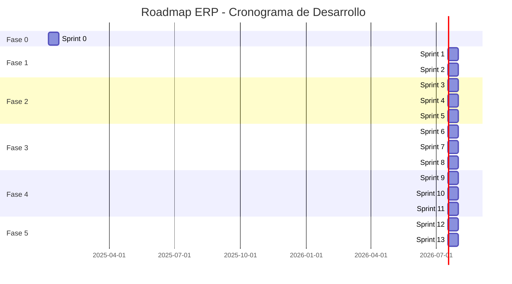

# PLANIFICACIÓN ERP - PARTE 2
## Historias de Usuario, Roadmap y Plan de Implementación

---

## 5. HISTORIAS DE USUARIO PRIORIZADAS

Las historias de usuario están organizadas por prioridad usando el método **MoSCoW**:
- **M** (Must Have): Funcionalidades críticas para el MVP
- **S** (Should Have): Importantes pero no bloqueantes para lanzamiento
- **C** (Could Have): Deseables, agregan valor pero no esenciales
- **W** (Won't Have): Fuera de alcance para esta fase

### 5.1 Épica: Autenticación y Control de Acceso

#### US-AUTH-001 [MUST HAVE]
**Como** usuario del sistema
**Quiero** iniciar sesión con mi username y contraseña
**Para** acceder de forma segura a las funcionalidades del ERP

**Criterios de Aceptación:**
- Formulario de login con campos username/email y password
- Validación de credenciales contra base de datos
- Generación de JWT con información de usuario y roles
- Redirección a dashboard personalizado según rol
- Mensaje de error claro si credenciales inválidas
- Bloqueo tras 5 intentos fallidos
- Sesión expira tras 8 horas de inactividad

**Estimación:** 8 horas

---

#### US-AUTH-002 [MUST HAVE]
**Como** super administrador
**Quiero** crear y gestionar roles con permisos específicos
**Para** controlar el acceso de los usuarios a diferentes módulos

**Criterios de Aceptación:**
- CRUD completo de roles
- Lista de permisos disponibles organizada por módulo
- Selección múltiple de permisos para cada rol
- Roles predefinidos (Super Admin, Gerente, Contador, etc.)
- No permitir eliminar roles del sistema predefinidos
- Validación: no permitir rol sin nombre único

**Estimación:** 12 horas

---

#### US-AUTH-003 [MUST HAVE]
**Como** administrador
**Quiero** asignar uno o múltiples roles a un usuario
**Para** que tenga los permisos adecuados según sus responsabilidades

**Criterios de Aceptación:**
- Selección múltiple de roles por usuario
- Visualización de permisos resultantes (consolidados)
- Cambios se aplican inmediatamente
- Log de auditoría registra cambios de roles
- Notificación al usuario de cambios en sus permisos

**Estimación:** 6 horas

---

#### US-AUTH-004 [SHOULD HAVE]
**Como** usuario
**Quiero** recuperar mi contraseña mediante email
**Para** poder acceder al sistema si la olvido

**Criterios de Aceptación:**
- Link "Olvidé mi contraseña" en login
- Ingreso de email registrado
- Envío de link temporal (válido 1 hora) por email
- Formulario de cambio de contraseña con confirmación
- Contraseña debe cumplir requisitos de seguridad (mín 8 caracteres, mayúscula, número, símbolo)

**Estimación:** 8 horas

---

### 5.2 Épica: Gestión de Proyectos

#### US-PROJ-001 [MUST HAVE]
**Como** gerente de operaciones
**Quiero** crear un nuevo proyecto con información básica y contratistas
**Para** iniciar el seguimiento del proyecto

**Criterios de Aceptación:**
- Formulario con campos: código, nombre, descripción, cliente, presupuesto, fechas
- Selección múltiple de empresas contratistas
- Asignación de gerente de proyecto (selección de empleados)
- Código auto-generado secuencial si no se especifica
- Estado inicial: "Planificación"
- Confirmación visual tras creación exitosa

**Estimación:** 10 horas

---

#### US-PROJ-002 [MUST HAVE]
**Como** gerente de proyecto
**Quiero** registrar el avance del proyecto con porcentaje y evidencia fotográfica
**Para** mantener trazabilidad del progreso

**Criterios de Aceptación:**
- Formulario con: nuevo porcentaje de avance, hito completado, actividades, observaciones
- Carga de múltiples fotografías (drag & drop o selección)
- Validación: porcentaje entre 0-100 y >= avance anterior
- Timestamp automático de registro
- Visualización de historial de avances
- Notificación a stakeholders cuando se alcance 25%, 50%, 75%, 100%

**Estimación:** 14 horas

---

#### US-PROJ-003 [MUST HAVE]
**Como** gerente de proyecto
**Quiero** registrar costos reales del proyecto categorizados
**Para** comparar con el presupuesto y detectar sobrecostos

**Criterios de Aceptación:**
- Formulario con: categoría, descripción, monto presupuestado (ref), monto real, moneda, fecha, factura
- Carga de comprobante/factura en PDF o imagen
- Actualización automática de "Costo Acumulado"
- Gráfico de barras: presupuesto vs real por categoría
- Alerta visual si costo acumulado > 90% del presupuesto
- Alerta crítica si costo > presupuesto

**Estimación:** 16 horas

---

#### US-PROJ-004 [MUST HAVE]
**Como** gerente administrativo
**Quiero** registrar pagos realizados o recibidos del proyecto
**Para** tener trazabilidad financiera completa

**Criterios de Aceptación:**
- Formulario con: tipo (a contratista/de cliente), empresa, monto, moneda, método, referencia, fecha, estado, comprobante
- Estado: Programado / Realizado / Validado
- Pagos > $5,000 USD requieren aprobación de gerente general
- Comprobante obligatorio para estado "Realizado"
- Visualización de timeline de pagos programados vs realizados
- Indicador de pagos pendientes

**Estimación:** 14 horas

---

#### US-PROJ-005 [MUST HAVE]
**Como** gerente de proyecto
**Quiero** cargar documentos del proyecto organizados por tipo
**Para** tener toda la documentación centralizada y versionada

**Criterios de Aceptación:**
- Tipos predefinidos: Contrato, Addendum, Plano, Especificación Técnica, Foto de Avance, Acta, Factura, Permiso, Otro
- Carga de archivos (múltiples formatos: PDF, Word, Excel, imágenes, CAD)
- Sistema de versiones: si se sube documento con mismo nombre, incrementa versión
- Visualización de lista de documentos con: nombre, tipo, versión, fecha, usuario
- Previsualización de PDFs e imágenes inline
- Descarga de cualquier versión del documento

**Estimación:** 16 horas

---

#### US-PROJ-006 [SHOULD HAVE]
**Como** gerente general
**Quiero** ver un dashboard del proyecto con KPIs principales
**Para** tener visión rápida del estado

**Criterios de Aceptación:**
- Tarjetas con: % Avance, Presupuesto vs Real, Pagos Pendientes, Días Transcurridos vs Totales
- Gráfico de línea de tiempo: avance planificado vs real
- Gráfico de costos por categoría
- Línea de tiempo de hitos
- Alertas visibles: sobrecostos, atrasos, pagos vencidos
- Últimas 5 fotos de avance

**Estimación:** 12 horas

---

### 5.3 Épica: Caja Chica

#### US-PC-001 [MUST HAVE]
**Como** gerente administrativo
**Quiero** registrar una entrada a caja chica con su origen
**Para** tener control de los fondos disponibles

**Criterios de Aceptación:**
- Formulario con: monto, moneda, fecha/hora, método de ingreso, origen, referencia, comprobante
- Origen puede ser: cuenta bancaria (selección), efectivo en mano, otro
- Saldo disponible de la entrada = monto inicial
- Estado: Activa / Parcialmente Utilizada / Agotada (automático según saldo)
- Visualización de lista de entradas con saldo disponible
- Total de saldo disponible en caja chica visible en dashboard

**Estimación:** 10 horas

---

#### US-PC-002 [MUST HAVE]
**Como** empleado
**Quiero** registrar una compra menor que realicé con mi dinero
**Para** solicitar reembolso de caja chica

**Criterios de Aceptación:**
- Formulario con: descripción, monto, moneda, fecha, proveedor, categoría, evidencia fotográfica
- Carga obligatoria de al menos 1 foto de recibo/factura
- Compra queda en estado "Pendiente Aprobación"
- Balance del empleado se actualiza (negativo = sistema debe al empleado)
- Empleado puede ver lista de sus compras con estados
- Notificación al aprobador designado

**Estimación:** 12 horas

---

#### US-PC-003 [MUST HAVE]
**Como** gerente administrativo
**Quiero** aprobar una compra de empleado y procesarle el pago
**Para** reembolsar sus gastos desde caja chica

**Criterios de Aceptación:**
- Lista de compras pendientes con filtros por empleado, fecha, monto
- Vista detallada de compra con evidencia fotográfica ampliable
- Opción de aprobar o rechazar (razón obligatoria si rechaza)
- Al aprobar: formulario de pago con selección de entrada(s) origen, método, referencia, comprobante
- Validación de saldo suficiente en entrada(s) seleccionadas
- Si una entrada no basta, permitir seleccionar múltiples
- Descuento automático de saldo en entradas origen
- Balance del empleado se actualiza
- Notificación al empleado del pago

**Estimación:** 18 horas

---

#### US-PC-004 [MUST HAVE]
**Como** gerente administrativo
**Quiero** realizar un pago directo a empleado desde caja chica
**Para** entregarle adelantos o fondos sin compra previa

**Criterios de Aceptación:**
- Formulario con: empleado, monto, moneda, concepto, método, entrada(s) origen, referencia, comprobante
- Conceptos sugeridos: Adelanto, Viáticos, Reembolso Directo, Otro
- Validación de saldo suficiente
- Actualización de balance del empleado (según contexto)
- Registro del pago con evidencia
- Descuento de entradas origen

**Estimación:** 10 horas

---

#### US-PC-005 [MUST HAVE]
**Como** contador
**Quiero** realizar conciliación de caja chica comparando saldo teórico vs físico
**Para** detectar discrepancias

**Criterios de Aceptación:**
- Saldo teórico calculado automáticamente: Σ entradas - Σ pagos
- Campo para ingresar saldo físico (efectivo contado)
- Cálculo automático de diferencia
- Si diferencia != 0: campo obligatorio de notas/justificación
- Reporte de conciliación generado en PDF con: fecha, movimientos del período, saldos, diferencia, notas
- Registro en historial de conciliaciones
- Alerta a gerencia si diferencia > $50 USD

**Estimación:** 12 horas

---

#### US-PC-006 [SHOULD HAVE]
**Como** gerente administrativo
**Quiero** ver un dashboard de caja chica con saldos y balances de empleados
**Para** tener visibilidad del estado actual

**Criterios de Aceptación:**
- Tarjeta de saldo total disponible en caja chica
- Tarjeta de total desembolsado en el mes
- Lista de entradas activas con saldo disponible
- Lista de empleados con balance (sistema les debe vs empleados deben)
- Compras pendientes de aprobación (conteo)
- Gráfico de gastos por categoría del mes
- Últimas 10 transacciones

**Estimación:** 10 horas

---

### 5.4 Épica: Empleados y Nómina

#### US-EMP-001 [MUST HAVE]
**Como** jefe de RRHH
**Quiero** registrar un nuevo empleado con datos completos
**Para** tener su ficha en el sistema

**Criterios de Aceptación:**
- Formulario con pestañas: Datos Personales, Laborales, Bancarios, Usuario Sistema
- Datos personales: nombre, apellido, cédula (único), fecha nac, teléfono, dirección, foto
- Datos laborales: cargo, fecha ingreso, salario base, tipo contrato, estado (activo/inactivo)
- Datos bancarios: banco (selección), tipo cuenta, número cuenta
- Opción de crear usuario vinculado (genera credenciales temporales)
- Validación de cédula única
- Foto opcional pero recomendada

**Estimación:** 14 horas

---

#### US-EMP-002 [MUST HAVE]
**Como** jefe de RRHH
**Quiero** subir documentos del empleado con fechas de vencimiento
**Para** tener documentación completa y alertas de vencimientos

**Criterios de Aceptación:**
- Tipos predefinidos: Cédula, Título, Certificación, Referencia, Contrato, Exámenes Médicos, Antecedentes, Otro
- Campos: tipo, archivo, fecha emisión, fecha vencimiento (opcional)
- Si tiene fecha vencimiento: alerta automática 30 días antes
- Visualización de lista de documentos con estado (vigente/por vencer/vencido)
- Filtro de documentos por vencer en dashboard de RRHH

**Estimación:** 10 horas

---

#### US-EMP-003 [MUST HAVE]
**Como** jefe de RRHH
**Quiero** calcular la nómina de un período con deducciones automáticas
**Para** generar recibos de pago

**Criterios de Aceptación:**
- Selección de período: quincenal (1ra o 2da quincena) o mensual
- Selección de empleados (todos o específicos)
- Cálculo automático por empleado:
  - Salario base (proporcional si no trabajó todo el período)
  - Horas extras (si se registraron)
  - Bonificaciones (si se asignaron)
  - Deducciones IVSS (según tabla legal vigente)
  - Deducción paro forzoso (0.5% del salario)
  - Préstamos (cuotas pendientes)
  - ISLR (si salario > umbral)
  - Total neto
- Tabla resumen con todos los empleados y montos
- Posibilidad de ajustar manualmente antes de confirmar
- Generación de recibos de pago individuales en PDF
- Generación de reporte consolidado (Excel)
- Generación de archivo TXT para banco (pago masivo)
- Estado inicial: "Generada"

**Estimación:** 24 horas

---

#### US-EMP-004 [MUST HAVE]
**Como** gerente administrativo
**Quiero** aprobar una nómina generada
**Para** proceder con el pago a empleados

**Criterios de Aceptación:**
- Vista de nómina pendiente con detalles y monto total
- Desglose por empleado expandible
- Opciones: Aprobar / Rechazar (con razón) / Solicitar modificación
- Al aprobar: estado cambia a "Aprobada"
- Nóminas > $20,000 USD requieren aprobación adicional de gerente general
- Log de auditoría registra aprobación con usuario y timestamp

**Estimación:** 8 horas

---

#### US-EMP-005 [MUST HAVE]
**Como** contador
**Quiero** marcar una nómina aprobada como pagada con evidencia bancaria
**Para** cerrar el ciclo de pago

**Criterios de Aceptación:**
- Selección de cuenta bancaria desde la cual se pagó
- Carga de archivo de respuesta del banco (opcional)
- Fecha de pago efectivo
- Generación automática de transacciones financieras (egresos) vinculadas a cada empleado
- Estado cambia a "Pagada"
- Envío opcional de recibos de pago por email a empleados
- Actualización de saldo de cuenta bancaria

**Estimación:** 12 horas

---

#### US-EMP-006 [SHOULD HAVE]
**Como** jefe de RRHH
**Quiero** registrar un préstamo a empleado con cuotas automáticas
**Para** descontarlas en nóminas futuras

**Criterios de Aceptación:**
- Formulario: empleado, monto, número de cuotas, fecha inicio, observaciones
- Cálculo automático de monto por cuota (monto / cuotas)
- Estado: Activo / Saldado
- Sistema descuenta cuota automáticamente en cada nómina hasta saldar
- Visualización en perfil de empleado con saldo pendiente
- Opción de pago anticipado (saldar de una vez)

**Estimación:** 10 horas

---

### 5.5 Épica: Finanzas

#### US-FIN-001 [MUST HAVE]
**Como** contador
**Quiero** registrar una transacción de ingreso bancario con comprobante
**Para** mantener el libro de bancos actualizado

**Criterios de Aceptación:**
- Formulario: cuenta bancaria, monto, moneda, fecha, referencia, descripción, relacionado a (proyecto/cliente/otro), comprobante
- Comprobante obligatorio (captura o PDF)
- Actualización automática de saldo de cuenta bancaria
- Si relacionado a cuenta por cobrar: opción de marcar como cobrada (total o parcial)
- Registro en libro de bancos
- Notificación si es pago significativo (> $10,000 USD)

**Estimación:** 12 horas

---

#### US-FIN-002 [MUST HAVE]
**Como** contador
**Quiero** registrar una transacción de egreso bancario con comprobante
**Para** tener control de salidas de dinero

**Criterios de Aceptación:**
- Similar a ingreso
- Validación de saldo disponible (alerta si saldo insuficiente pero permitir registrar para cheques post-fechados)
- Si relacionado a cuenta por pagar: opción de marcar como pagada
- Categorización de egreso: nómina, proveedor, impuestos, servicios, otros

**Estimación:** 12 horas

---

#### US-FIN-003 [MUST HAVE]
**Como** contador
**Quiero** gestionar cuentas por cobrar de proyectos
**Para** hacer seguimiento de cobros pendientes

**Criterios de Aceptación:**
- Vista de lista con filtros: cliente, proyecto, estado (pendiente/parcial/cobrada), fecha vencimiento
- Indicador visual de cuentas vencidas (días atraso en rojo)
- Opción de registrar pago (total o parcial) vinculado a transacción bancaria
- Opción de enviar recordatorio de pago al cliente (email)
- Opción de marcar como incobrable (requiere justificación y aprobación)
- Dashboard con: total por cobrar, vencidas, por vencer en 30 días

**Estimación:** 16 horas

---

#### US-FIN-004 [MUST HAVE]
**Como** contador
**Quiero** gestionar cuentas por pagar a proveedores
**Para** no perder fechas de pago y mantener buenas relaciones

**Criterios de Aceptación:**
- Similar a cuentas por cobrar
- Filtros: proveedor, proyecto, estado, fecha vencimiento
- Alertas de cuentas próximas a vencer (7 días antes)
- Opción de programar pago (crea recordatorio)
- Opción de registrar pago vinculado a transacción bancaria
- Dashboard con: total por pagar, vencidas, por pagar en 30 días

**Estimación:** 16 horas

---

#### US-FIN-005 [SHOULD HAVE]
**Como** contador
**Quiero** realizar conciliación bancaria mensual
**Para** asegurar que registros coincidan con estado de cuenta del banco

**Criterios de Aceptación:**
- Selección de cuenta bancaria y fecha de corte
- Saldo según sistema al corte (calculado automáticamente)
- Campo para ingresar saldo según estado de cuenta del banco
- Cálculo de diferencia
- Lista de transacciones del período con checkbox para marcar como "conciliadas"
- Identificación de transacciones pendientes (cheques no cobrados, transferencias en tránsito)
- Ajuste del saldo considerando pendientes
- Generación de reporte de conciliación (PDF)

**Estimación:** 14 horas

---

#### US-FIN-006 [MUST HAVE]
**Como** gerente general
**Quiero** ver reportes financieros básicos (Balance, Estado Resultados, Flujo Caja)
**Para** tomar decisiones informadas

**Criterios de Aceptación:**
- Selección de tipo de reporte y período (fecha inicio-fin)
- Opción de moneda (Bs, USD, o ambas)
- **Balance General:** Activos, Pasivos, Patrimonio al cierre del período
- **Estado de Resultados:** Ingresos, Costos, Gastos, Utilidad/Pérdida del período
- **Flujo de Caja:** Entradas y salidas por categoría, saldo inicial y final
- Visualización en pantalla con gráficos
- Exportación a PDF y Excel
- Comparación con período anterior (opcional)

**Estimación:** 20 horas

---

### 5.6 Épica: Procura/Compras

#### US-PROC-001 [MUST HAVE]
**Como** supervisor de proyecto
**Quiero** crear una solicitud de compra de materiales
**Para** iniciar el proceso de adquisición

**Criterios de Aceptación:**
- Formulario con: solicitante (auto), proyecto (opcional), lista de artículos (descripción, cantidad, unidad, especificaciones), justificación, fecha requerida, prioridad
- Opción de agregar múltiples artículos
- Estado inicial: "Pendiente Aprobación"
- Notificación automática al aprobador según monto y jerarquía
- Número de solicitud auto-generado

**Estimación:** 12 horas

---

#### US-PROC-002 [MUST HAVE]
**Como** gerente
**Quiero** aprobar o rechazar solicitudes de compra
**Para** controlar las adquisiciones

**Criterios de Aceptación:**
- Vista de solicitudes pendientes asignadas al usuario (según nivel de aprobación)
- Filtros: solicitante, proyecto, fecha, prioridad
- Detalle de solicitud con artículos y justificación
- Opciones: Aprobar / Rechazar (razón obligatoria) / Solicitar modificación
- Jerarquía de aprobación según monto:
  - < $500 USD: Gerente de Operaciones
  - $500 - $2,000 USD: Gerente Administrativo
  - > $2,000 USD: Gerente General
- Log de auditoría de aprobaciones
- Notificación al solicitante y departamento de compras

**Estimación:** 14 horas

---

#### US-PROC-003 [SHOULD HAVE]
**Como** encargado de compras
**Quiero** generar orden de compra desde solicitud aprobada
**Para** formalizar la compra con el proveedor

**Criterios de Aceptación:**
- Selección de proveedor (de base de datos)
- Artículos pre-cargados de la solicitud
- Campos editables: precio unitario, condiciones de pago, fecha entrega, dirección entrega
- Generación de número de orden automático (formato: OC-YYYY-####)
- Generación de documento PDF de orden de compra con logo de empresa
- Opción de enviar por email al proveedor
- Estado: Emitida / Recibida Parcial / Recibida Total / Cancelada

**Estimación:** 16 horas

---

#### US-PROC-004 [MUST HAVE]
**Como** encargado de almacén
**Quiero** registrar la recepción de materiales de una orden de compra
**Para** actualizar inventario y validar factura

**Criterios de Aceptación:**
- Búsqueda de orden de compra por número
- Lista de artículos esperados
- Registro por artículo: cantidad recibida (puede ser menor a solicitada), estado (conforme/no conforme)
- Si no conforme: campo de observaciones y fotografías
- Carga de acta de recepción (documento)
- Fotografías de productos recibidos
- Actualización de estado de orden
- Generación automática de entrada a inventario (si todo conforme)
- Notificación a finanzas para validar factura
- Notificación a compras si hay no conformidades

**Estimación:** 16 horas

---

#### US-PROC-005 [SHOULD HAVE]
**Como** gerente administrativo
**Quiero** mantener una base de datos de proveedores
**Para** facilitar la gestión de compras

**Criterios de Aceptación:**
- CRUD de proveedores
- Campos: razón social, RIF (único), contacto, teléfono, email, dirección, productos/servicios, condiciones de pago, documentos (RIF, registro mercantil)
- Búsqueda y filtros
- Historial de órdenes de compra al proveedor
- Calificación de proveedor (1-5 estrellas) opcional

**Estimación:** 10 horas

---

### 5.7 Épica: Inventario

#### US-INV-001 [MUST HAVE]
**Como** gerente de operaciones
**Quiero** crear almacenes con ubicaciones y encargados
**Para** organizar el inventario

**Criterios de Aceptación:**
- Formulario: nombre, código (único), ubicación, dirección, encargado (empleado)
- CRUD completo
- Validación de código único
- Al menos un almacén debe existir para operar inventario

**Estimación:** 6 horas

---

#### US-INV-002 [MUST HAVE]
**Como** encargado de almacén
**Quiero** registrar entrada de inventario por compra
**Para** reflejar materiales recibidos

**Criterios de Aceptación:**
- Vinculación con orden de compra recibida
- Almacén destino
- Artículos y cantidades (pre-cargados de orden)
- Costo unitario (de orden)
- Documentación (remisión, acta)
- Fotografías
- Si artículo ya existe: incrementa cantidad y recalcula costo promedio
- Si es nuevo: crea registro en inventario del almacén
- Generación de comprobante de entrada (PDF)

**Estimación:** 14 horas

---

#### US-INV-003 [MUST HAVE]
**Como** encargado de almacén
**Quiero** registrar salida de inventario para un proyecto
**Para** asignar materiales y controlar stock

**Criterios de Aceptación:**
- Almacén origen
- Proyecto destino
- Búsqueda de artículos por nombre, SKU, categoría
- Selección de artículos y cantidades a retirar
- Validación de stock disponible (no permitir salida si stock insuficiente sin aprobación especial)
- Empleado que recibe
- Justificación
- Fotografías opcionales
- Decremento de cantidades en inventario
- Vinculación de costo al proyecto
- Generación de comprobante de salida (PDF)

**Estimación:** 14 horas

---

#### US-INV-004 [SHOULD HAVE]
**Como** encargado de almacén
**Quiero** transferir inventario entre almacenes
**Para** redistribuir materiales según necesidad

**Criterios de Aceptación:**
- Almacén origen y destino
- Artículos y cantidades
- Razón de transferencia
- Empleado responsable del transporte
- Validación de stock en origen
- Generación de guía de transferencia (PDF) con código QR
- Estado: Enviada / Recibida
- Encargado de almacén destino debe confirmar recepción
- Al confirmar: decrementa origen, incrementa destino

**Estimación:** 12 horas

---

#### US-INV-005 [MUST HAVE]
**Como** encargado de almacén
**Quiero** realizar ajustes de inventario tras inventario físico
**Para** corregir diferencias entre sistema y realidad

**Criterios de Aceptación:**
- Selección de almacén y fecha de inventario físico
- Lista de artículos con cantidad según sistema
- Ingreso de cantidad real contada
- Cálculo automático de diferencias (sobrante/faltante)
- Por cada diferencia: razón (merma, robo, error registro, hallazgo, etc.) y notas
- Estado: Pendiente Aprobación
- Aprobador revisa y aprueba
- Al aprobar: ajusta cantidades en inventario
- Si pérdidas > umbral: alerta a gerencia
- Generación de reporte de ajuste (PDF)

**Estimación:** 14 horas

---

#### US-INV-006 [SHOULD HAVE]
**Como** gerente de operaciones
**Quiero** ver reportes de inventario (stock actual, movimientos, valoración)
**Para** tomar decisiones de compra

**Criterios de Aceptación:**
- **Reporte de Stock Actual:** por almacén o consolidado, con cantidad, costo unitario, valor total
- **Reporte de Movimientos:** entradas y salidas de período, por artículo o almacén
- **Reporte de Valoración:** valor total de inventario por almacén
- **Alertas de Stock Mínimo:** artículos bajo nivel mínimo
- Filtros: almacén, categoría, fecha
- Exportación a Excel y PDF

**Estimación:** 14 horas

---

### 5.8 Épica: Flota de Vehículos

#### US-FLEET-001 [MUST HAVE]
**Como** gerente de operaciones
**Quiero** registrar vehículos de la empresa
**Para** controlar la flota

**Criterios de Aceptación:**
- Formulario: placa (único), marca, modelo, año, tipo, color, VIN, fotografía
- CRUD completo
- Estado: Activo / Mantenimiento / Inactivo / Vendido
- Validación de placa única

**Estimación:** 8 horas

---

#### US-FLEET-002 [MUST HAVE]
**Como** encargado administrativo
**Quiero** subir documentos del vehículo con fechas de vencimiento
**Para** mantener documentación vigente y recibir alertas

**Criterios de Aceptación:**
- Tipos: Título, SAMAT, Seguro, Permiso Circulación, Revisión Técnica, Otro
- Campos: tipo, archivo, fecha emisión, fecha vencimiento
- Alerta automática 30 días antes de vencimiento
- Indicador visual en lista de vehículos (íconos de documentos próximos a vencer)
- Dashboard de vehículos con documentos por vencer

**Estimación:** 10 horas

---

#### US-FLEET-003 [MUST HAVE]
**Como** gerente de operaciones
**Quiero** registrar mantenimientos de vehículos
**Para** llevar historial y controlar costos operativos

**Criterios de Aceptación:**
- Formulario: vehículo, tipo (preventivo/correctivo), descripción, fecha, odómetro, costo, moneda, taller, factura, fotografías
- Visualización de historial de mantenimientos por vehículo
- Cálculo de costo total de mantenimientos del vehículo (lifetime)
- Sugerencia de próximo mantenimiento según odómetro (ej. cada 5,000 km)

**Estimación:** 12 horas

---

#### US-FLEET-004 [SHOULD HAVE]
**Como** gerente de operaciones
**Quiero** asignar un vehículo a un proyecto o empleado
**Para** controlar uso y vincular costos

**Criterios de Aceptación:**
- Formulario: vehículo (disponibles), proyecto o empleado, fecha inicio, fecha fin estimada, propósito
- Validación de disponibilidad (no permitir asignar vehículo ya asignado sin liberarlo)
- Estado de vehículo cambia a "Asignado"
- Costos de combustible y mantenimiento durante asignación se vinculan al proyecto
- Opción de liberar asignación (finalizar antes de tiempo)

**Estimación:** 10 horas

---

#### US-FLEET-005 [MUST HAVE]
**Como** empleado conductor
**Quiero** registrar cargas de combustible del vehículo
**Para** controlar consumo y detectar anomalías

**Criterios de Aceptación:**
- Formulario: vehículo, fecha/hora, litros, costo, moneda, odómetro, estación, recibo (foto)
- Cálculo automático de rendimiento (km/litro) comparando con última carga
- Si rendimiento < 50% del promedio del vehículo: alerta (posible problema mecánico, fuga, robo)
- Visualización de historial de cargas con gráfico de rendimiento
- Suma de costos de combustible del vehículo

**Estimación:** 12 horas

---

### 5.9 Épica: Reportería y Dashboards

#### US-DASH-001 [MUST HAVE]
**Como** usuario del sistema
**Quiero** ver un dashboard personalizado según mi rol al iniciar sesión
**Para** tener visibilidad rápida de información relevante

**Criterios de Aceptación:**
- Dashboard diferente según rol del usuario
- Widgets configurables (arrastrar y soltar para reordenar)
- **Gerente General:** proyectos activos, KPIs financieros, alertas críticas, proyectos con sobrecosto, proyectos atrasados
- **Gerente Administrativo:** caja chica, cuentas por pagar próximas a vencer, nóminas pendientes, resumen financiero
- **Gerente de Operaciones:** proyectos activos, inventario bajo mínimo, vehículos en mantenimiento, solicitudes de compra pendientes
- **Contador:** transacciones del día, conciliaciones pendientes, cuentas por cobrar vencidas
- **Empleado:** mis compras en caja chica, mis recibos de pago, proyectos asignados
- Actualización en tiempo real de notificaciones

**Estimación:** 20 horas

---

### 5.10 Resumen de Priorización MoSCoW

| Prioridad | Cantidad de Historias | % del Total |
|-----------|----------------------|-------------|
| **MUST HAVE** | 42 | 70% |
| **SHOULD HAVE** | 15 | 25% |
| **COULD HAVE** | 3 | 5% |
| **WON'T HAVE** | 0 | 0% |

**Estimación Total de Historias MUST HAVE:** ~460 horas de desarrollo

---

## 6. ROADMAP DEL PROYECTO

El desarrollo se organizará en **Sprints de 2 semanas** con un equipo de desarrollo de 2-3 personas.

### 6.1 Fase 0: Setup y Fundamentos (Sprint 0) - 2 semanas

**Objetivo:** Preparar el entorno de desarrollo, arquitectura base y sistema de autenticación

#### Tareas Sprint 0:

**T0.1: Configuración del Entorno de Desarrollo**
- Descripción: Setup completo del stack tecnológico
- Dependencias: Ninguna
- Tiempo estimado: 1 día
- Tecnologías: Node.js 20+, PostgreSQL 16, React 18
- Criterio de finalización:
  - Backend corriendo en `localhost:5000`
  - Frontend corriendo en `localhost:3000`
  - PostgreSQL corriendo y accesible
  - Variables de entorno configuradas (.env files)

**T0.2: Inicialización de Repositorio y Control de Versiones**
- Descripción: Setup de Git, estructura de branches, GitFlow
- Dependencias: T0.1
- Tiempo estimado: 0.5 días
- Tecnologías: Git, GitHub/GitLab
- Criterio de finalización:
  - Repositorio creado con estructura monorepo o multi-repo
  - Branches: main, develop, feature/*, hotfix/*
  - .gitignore configurado
  - README con instrucciones de setup

**T0.3: Estructura Base del Backend**
- Descripción: Arquitectura modular del backend con carpetas y configuración inicial
- Dependencias: T0.1, T0.2
- Tiempo estimado: 1 día
- Tecnologías: Express.js, folder structure
- Criterio de finalización:
  - Carpetas: config, modules, shared, database creadas
  - app.js inicializado con Express
  - Middleware básicos: body-parser, cors, helmet
  - Health check endpoint: GET /health

**T0.4: Configuración de Base de Datos**
- Descripción: Setup de PostgreSQL, Sequelize ORM, migraciones iniciales
- Dependencias: T0.3
- Tiempo estimado: 1 día
- Tecnologías: PostgreSQL, Sequelize
- Criterio de finalización:
  - Conexión a base de datos exitosa
  - Sequelize configurado con entornos (dev, test, prod)
  - Sistema de migraciones funcionando
  - Seeders para datos iniciales (roles, permisos)

**T0.5: Implementación de Autenticación Base (JWT)**
- Descripción: Sistema de login, generación de JWT, middleware de autenticación
- Dependencias: T0.4
- Tiempo estimado: 2 días
- Tecnologías: Passport.js, jsonwebtoken, bcrypt
- Criterio de finalización:
  - Tabla users creada con campos necesarios
  - Endpoint POST /auth/login funcional
  - Generación de JWT con user_id y roles
  - Middleware authenticate que valida JWT
  - Endpoint GET /auth/me para obtener usuario actual
  - Passwords hasheadas con bcrypt (salt rounds: 10)

**T0.6: Sistema de Roles y Permisos (RBAC)**
- Descripción: Tablas de roles y permisos, middleware de autorización
- Dependencias: T0.5
- Tiempo estimado: 2 días
- Tecnologías: Sequelize models, custom middleware
- Criterio de finalización:
  - Tablas: roles, permissions, user_roles, role_permissions creadas
  - Seeders con roles predefinidos y permisos base
  - Middleware authorize(permissions) funcionando
  - Endpoint GET /roles para listar roles
  - Endpoint POST /users/:id/roles para asignar roles

**T0.7: Estructura Base del Frontend**
- Descripción: Setup de React con routing, state management, estructura de carpetas
- Dependencias: T0.1, T0.2
- Tiempo estimado: 1 día
- Tecnologías: React, React Router, Redux Toolkit
- Criterio de finalización:
  - Carpetas: components, pages, store, services, utils creadas
  - React Router configurado con rutas básicas
  - Redux store configurado con auth slice
  - Axios instance configurada con interceptors
  - Layout base con header y sidebar

**T0.8: Interfaz de Login y Manejo de Sesión**
- Descripción: Página de login, manejo de JWT en frontend, rutas protegidas
- Dependencias: T0.5, T0.7
- Tiempo estimado: 1.5 días
- Tecnologías: React Hook Form, Yup, Redux Persist
- Criterio de finalización:
  - Página de login con formulario validado
  - Envío de credenciales a backend
  - Almacenamiento de JWT en localStorage
  - Redirección a dashboard tras login exitoso
  - Rutas protegidas (redirect a login si no autenticado)
  - Logout funcional (limpia JWT)

**T0.9: Sistema de Logging y Manejo de Errores**
- Descripción: Winston para logging, middleware de errores global
- Dependencias: T0.3
- Tiempo estimado: 1 día
- Tecnologías: Winston, Morgan
- Criterio de finalización:
  - Winston configurado con niveles (error, warn, info, debug)
  - Logs guardados en: logs/error.log, logs/combined.log
  - Morgan para logging de requests HTTP
  - Middleware de errores global que captura excepciones
  - Formato de respuesta de error estandarizado

**T0.10: Auditoría Básica (Audit Logs)**
- Descripción: Tabla de audit_logs, función helper para registrar acciones
- Dependencias: T0.4, T0.6
- Tiempo estimado: 1 día
- Tecnologías: Sequelize, hooks
- Criterio de finalización:
  - Tabla audit_logs creada
  - Helper function: logAudit(user_id, action, entity_type, entity_id, old_values, new_values)
  - Hooks en modelos críticos (users, projects) para auto-auditar cambios
  - Endpoint GET /audit-logs (solo admin) para consultar

**Entregables Sprint 0:**
- Repositorio configurado y funcionando
- Sistema de autenticación y autorización completo
- Arquitectura base backend y frontend
- Sistema de logging y auditoría

---

### 6.2 Fase 1: Módulo de Empleados (Sprint 1-2) - 4 semanas

**Objetivo:** Implementar gestión completa de empleados como base para otros módulos

#### Sprint 1 (Semanas 3-4): CRUD de Empleados y Documentos

**T1.1: Modelo y Migración de Empleados**
- Tiempo: 0.5 días
- Dependencias: T0.4
- Tareas:
  - Crear modelo Employee con todos los campos
  - Relación con User (1:1 opcional)
  - Migración para tabla employees
  - Seeders con 10 empleados de prueba

**T1.2: API de Empleados (Backend)**
- Tiempo: 2 días
- Dependencias: T1.1
- Endpoints:
  - POST /employees (crear) - requiere `employees:create`
  - GET /employees (listar con paginación, filtros) - requiere `employees:read`
  - GET /employees/:id (detalle) - requiere `employees:read`
  - PUT /employees/:id (actualizar) - requiere `employees:update`
  - DELETE /employees/:id (soft delete) - requiere `employees:delete`
- Validaciones con Joi
- Tests unitarios de servicios

**T1.3: Interfaz de Lista de Empleados (Frontend)**
- Tiempo: 1.5 días
- Dependencias: T1.2
- Componentes:
  - EmployeeList con tabla (AG-Grid o TanStack Table)
  - Filtros: búsqueda por nombre, cargo, estado
  - Paginación
  - Botones de acción: Ver, Editar, Eliminar (según permisos)
  - Botón "Nuevo Empleado"

**T1.4: Formulario de Creación/Edición de Empleado**
- Tiempo: 2 días
- Dependencias: T1.2
- Componentes:
  - EmployeeForm con pestañas (Datos Personales, Laborales, Bancarios, Usuario)
  - Validación con Yup
  - Carga de fotografía con preview (react-dropzone)
  - Opción de crear usuario vinculado
  - Manejo de errores y confirmación de éxito

**T1.5: Modelo y API de Documentos de Empleados**
- Tiempo: 1.5 días
- Dependencias: T1.1
- Tareas:
  - Modelo EmployeeDocument
  - Migración
  - Endpoints:
    - POST /employees/:id/documents (subir) - multer para archivos
    - GET /employees/:id/documents (listar)
    - DELETE /documents/:id (eliminar)
  - Almacenamiento en `/uploads/employees/{employee_id}/documents/`
  - Generación de URLs firmadas para acceso seguro

**T1.6: Interfaz de Gestión de Documentos**
- Tiempo: 1.5 días
- Dependencias: T1.5
- Componentes:
  - DocumentList en perfil de empleado
  - Formulario de subida con drag & drop
  - Vista de documento con previsualización (PDFs e imágenes)
  - Indicadores de vencimiento (semáforo: verde, amarillo, rojo)
  - Descarga de documentos

**T1.7: Sistema de Alertas de Documentos por Vencer**
- Tiempo: 1 día
- Dependencias: T1.5
- Tareas:
  - Job con node-cron que corre diariamente
  - Consulta documentos que vencen en 30, 15, 7 días
  - Genera notificaciones internas
  - Envío de emails a RRHH (opcional con nodemailer)

**T1.8: Dashboard de RRHH**
- Tiempo: 1 día
- Dependencias: T1.4, T1.6
- Componentes:
  - Tarjetas: Total empleados activos, nuevos este mes, documentos por vencer
  - Lista de documentos próximos a vencer con links a empleados
  - Gráfico de empleados por cargo
  - Últimas acciones en módulo de empleados

#### Sprint 2 (Semanas 5-6): Nómina

**T2.1: Modelos de Nómina y Préstamos**
- Tiempo: 1 día
- Dependencias: T1.1
- Tareas:
  - Modelo Payroll (nómina)
  - Modelo PayrollRecord (registro por empleado)
  - Modelo Loan (préstamos)
  - Migraciones

**T2.2: Lógica de Cálculo de Nómina (Backend)**
- Tiempo: 3 días
- Dependencias: T2.1
- Tareas:
  - Servicio PayrollService con función calculatePayroll(period, employees)
  - Cálculo de salario base proporcional
  - Cálculo de deducciones IVSS (tabla configurable)
  - Cálculo de paro forzoso (0.5%)
  - Descuento de cuotas de préstamos
  - Cálculo de ISLR si aplica (tabla configurable)
  - Tests unitarios exhaustivos

**T2.3: API de Nómina**
- Tiempo: 2 días
- Dependencias: T2.2
- Endpoints:
  - POST /payroll/calculate (calcular nómina) - requiere `payroll:create`
  - GET /payroll (listar nóminas) - requiere `payroll:read`
  - GET /payroll/:id (detalle) - requiere `payroll:read`
  - PUT /payroll/:id/approve (aprobar) - requiere `payroll:approve`
  - PUT /payroll/:id/pay (marcar como pagada) - requiere `payroll:pay`
  - GET /payroll/:id/receipts (descargar recibos) - requiere `payroll:read`

**T2.4: Interfaz de Generación de Nómina**
- Tiempo: 2 días
- Dependencias: T2.3
- Componentes:
  - PayrollCalculate con formulario de parámetros
  - Tabla de resultados con desglose por empleado
  - Posibilidad de ajustes manuales
  - Botón "Confirmar Nómina"
  - Generación de PDFs de recibos individuales (pdfmake)

**T2.5: Flujo de Aprobación de Nómina**
- Tiempo: 1.5 días
- Dependencias: T2.3
- Componentes:
  - Lista de nóminas pendientes de aprobación
  - Vista detallada con opción de aprobar/rechazar
  - Aprobación multi-nivel si monto > umbral
  - Notificaciones a aprobadores

**T2.6: Gestión de Préstamos a Empleados**
- Tiempo: 1.5 días
- Dependencias: T2.1
- Componentes:
  - Formulario de registro de préstamo en perfil de empleado
  - Lista de préstamos activos con saldo pendiente
  - Historial de descuentos realizados
  - Opción de pago anticipado

**T2.7: Integración con Módulo de Finanzas (Registro de Pago)**
- Tiempo: 1 día
- Dependencias: T2.3, (futuro módulo finanzas)
- Tareas:
  - Al marcar nómina como pagada, generar transacciones financieras
  - Vincular con cuenta bancaria
  - Actualizar saldo de cuenta

**Entregables Fase 1:**
- Módulo de Empleados completo y funcional
- Módulo de Nómina con cálculos automáticos
- Sistema de gestión de documentos con alertas
- Tests unitarios de lógica crítica

---

### 6.3 Fase 2: Módulos Financieros (Sprint 3-5) - 6 semanas

**Objetivo:** Implementar finanzas, caja chica y base de proyectos

#### Sprint 3 (Semanas 7-8): Finanzas Básicas

**T3.1: Modelos Financieros (Cuentas Bancarias, Transacciones)**
- Tiempo: 1 día
- Tareas:
  - Modelo BankAccount
  - Modelo FinancialTransaction
  - Modelo TransactionEvidence
  - Modelo AccountsReceivable
  - Modelo AccountsPayable
  - Migraciones

**T3.2: API de Cuentas Bancarias**
- Tiempo: 1 día
- Endpoints: CRUD de cuentas bancarias

**T3.3: API de Transacciones Financieras (Ingresos/Egresos)**
- Tiempo: 2 días
- Endpoints:
  - POST /finances/transactions (ingreso o egreso)
  - GET /finances/transactions (listar con filtros)
  - GET /finances/transactions/:id (detalle con evidencia)
  - DELETE /finances/transactions/:id
- Actualización automática de saldo de cuenta bancaria

**T3.4: Interfaz de Registro de Transacciones**
- Tiempo: 2 días
- Componentes:
  - TransactionForm (ingreso/egreso)
  - Carga de comprobante obligatorio
  - Selección de relación (proyecto, cliente, proveedor)
  - Validación de saldo (solo alerta en egreso)

**T3.5: Libro de Bancos (Vista de Movimientos)**
- Tiempo: 1.5 días
- Componentes:
  - BankAccountDetail con lista de transacciones
  - Filtros por fecha, tipo, monto
  - Saldo running (acumulado)
  - Exportación a Excel

**T3.6: Gestión de Cuentas por Cobrar**
- Tiempo: 2 días
- Componentes:
  - Lista de cuentas por cobrar con indicadores de vencimiento
  - Formulario de registro de pago (vincula con transacción)
  - Opción de enviar recordatorio
  - Dashboard de cobros

**T3.7: Gestión de Cuentas por Pagar**
- Tiempo: 2 días
- Similar a cuentas por cobrar

**T3.8: Dashboard Financiero Básico**
- Tiempo: 1 día
- Componentes:
  - Saldos de cuentas bancarias (por moneda)
  - Ingresos y egresos del mes
  - Cuentas por cobrar y pagar (resumen)
  - Gráfico de flujo de caja mensual

#### Sprint 4 (Semanas 9-10): Caja Chica

**T4.1: Modelos de Caja Chica**
- Tiempo: 1 día
- Modelos:
  - PettyCashEntry (entradas)
  - PettyCashPurchase (compras de empleados)
  - PurchaseEvidence (evidencia fotográfica)
  - PettyCashPayment (pagos)
  - PettyCashPaymentSource (relación pago-entrada origen)
  - PettyCashReconciliation (conciliaciones)
  - Migraciones

**T4.2: API de Entradas a Caja Chica**
- Tiempo: 1 día
- Endpoints: CRUD de entradas con actualización de saldo disponible

**T4.3: API de Compras de Empleados**
- Tiempo: 1.5 días
- Endpoints:
  - POST /petty-cash/purchases (empleado registra compra)
  - GET /petty-cash/purchases (listar, empleado ve solo suyas, admin ve todas)
  - PUT /petty-cash/purchases/:id/approve (aprobar y pagar)
  - PUT /petty-cash/purchases/:id/reject (rechazar)
- Cálculo automático de balance del empleado

**T4.4: Interfaz de Registro de Compra (Empleado)**
- Tiempo: 1.5 días
- Componentes:
  - PurchaseForm con carga de evidencia fotográfica
  - Lista de "Mis Compras" con estados
  - Vista de detalle de compra con estado de aprobación

**T4.5: Interfaz de Aprobación de Compras (Admin)**
- Tiempo: 2 días
- Componentes:
  - Lista de compras pendientes con filtros
  - Vista detallada con evidencia ampliable
  - Formulario de pago con selección de entradas origen
  - Validación de saldo disponible (puede seleccionar múltiples entradas)
  - Opción de rechazar con justificación

**T4.6: API y UI de Pagos Directos**
- Tiempo: 1.5 días
- Endpoints y componentes para pagos sin compra previa

**T4.7: Conciliación de Caja Chica**
- Tiempo: 2 días
- Componentes:
  - Formulario de conciliación con cálculos automáticos
  - Historial de conciliaciones
  - Generación de reporte PDF
  - Alertas si diferencia significativa

**T4.8: Dashboard de Caja Chica**
- Tiempo: 1 día
- Componentes:
  - Saldo total disponible
  - Entradas activas
  - Balance por empleado (quién debe a quién)
  - Compras pendientes de aprobación
  - Gráfico de gastos por categoría

#### Sprint 5 (Semanas 11-12): Proyectos Básicos

**T5.1: Modelos de Proyectos**
- Tiempo: 1 día
- Modelos:
  - Project
  - Contractor (empresas contratistas)
  - ProjectContractor (relación M2M)
  - ProjectMilestone
  - ProjectActivity
  - ProjectCost
  - ProjectPayment
  - ProjectDocument
  - Migraciones

**T5.2: API de Proyectos (CRUD Básico)**
- Tiempo: 2 días
- Endpoints: CRUD completo con relaciones a contratistas

**T5.3: Interfaz de Lista y Creación de Proyectos**
- Tiempo: 2 días
- Componentes:
  - ProjectList con tabla y filtros
  - ProjectForm con pestañas de información básica
  - Selección múltiple de contratistas

**T5.4: API y UI de Registro de Avance**
- Tiempo: 2.5 días
- Endpoints y componentes para registrar avance con fotografías
- Historial de avances con timeline

**T5.5: API y UI de Registro de Costos**
- Tiempo: 2 días
- Endpoints y componentes para costos con evidencia
- Gráficos de presupuesto vs real

**T5.6: API y UI de Gestión de Pagos del Proyecto**
- Tiempo: 2 días
- Endpoints y componentes para pagos con aprobaciones
- Timeline de pagos

**T5.7: API y UI de Documentos del Proyecto**
- Tiempo: 1.5 días
- Sistema de carga de documentos con versionamiento
- Lista de documentos con previsualización

**T5.8: Dashboard del Proyecto**
- Tiempo: 1.5 días
- Componentes con KPIs, gráficos, alertas

**Entregables Fase 2:**
- Módulo de Finanzas funcional con transacciones y cuentas por cobrar/pagar
- Módulo de Caja Chica completo con sistema de compras y conciliaciones
- Módulo de Proyectos básico con trazabilidad de avance, costos y pagos

---

### 6.4 Fase 3: Operaciones (Sprint 6-8) - 6 semanas

**Objetivo:** Implementar procura, inventario y flota

#### Sprint 6 (Semanas 13-14): Procura/Compras

**T6.1: Modelos de Procura**
- Tiempo: 1 día
- Modelos: PurchaseRequest, PurchaseRequestItem, PurchaseOrder, Vendor

**T6.2: API de Solicitudes de Compra**
- Tiempo: 2 días
- Endpoints con flujo de aprobación multi-nivel

**T6.3: Interfaz de Solicitudes de Compra**
- Tiempo: 2 días
- Formulario de solicitud, lista, aprobaciones

**T6.4: API y UI de Órdenes de Compra**
- Tiempo: 2.5 días
- Generación de orden desde solicitud, PDF, envío por email

**T6.5: API y UI de Recepción de Materiales**
- Tiempo: 2 días
- Registro de recepción con fotografías, integración con inventario

**T6.6: Gestión de Proveedores**
- Tiempo: 1.5 días
- CRUD de proveedores con documentos

#### Sprint 7 (Semanas 15-16): Inventario

**T7.1: Modelos de Inventario**
- Tiempo: 1 día
- Modelos: Warehouse, InventoryItem, InventoryMovement, MovementEvidence

**T7.2: API de Almacenes**
- Tiempo: 0.5 días

**T7.3: API de Entradas de Inventario**
- Tiempo: 2 días
- Lógica de costo promedio, actualización de cantidades

**T7.4: API de Salidas de Inventario**
- Tiempo: 2 días
- Validación de stock, vinculación con proyectos

**T7.5: Interfaz de Movimientos de Inventario**
- Tiempo: 2.5 días
- Formularios de entrada/salida, lista de movimientos

**T7.6: API y UI de Transferencias**
- Tiempo: 2 días
- Transferencia entre almacenes con confirmación

**T7.7: API y UI de Ajustes de Inventario**
- Tiempo: 2 días
- Inventario físico con aprobación

**T7.8: Reportes de Inventario**
- Tiempo: 1.5 días
- Stock actual, movimientos, valoración, alertas de mínimo

#### Sprint 8 (Semanas 17-18): Flota de Vehículos

**T8.1: Modelos de Flota**
- Tiempo: 1 día
- Modelos: Vehicle, VehicleDocument, VehicleMaintenance, VehicleAssignment, FuelRecord

**T8.2: API de Vehículos**
- Tiempo: 1 día
- CRUD con documentos

**T8.3: Interfaz de Gestión de Vehículos**
- Tiempo: 2 días
- Lista, formulario, subida de documentos con alertas de vencimiento

**T8.4: API y UI de Mantenimientos**
- Tiempo: 2 días
- Registro de mantenimientos con historial y costos

**T8.5: API y UI de Asignaciones**
- Tiempo: 1.5 días
- Asignación a proyectos/empleados con validación de disponibilidad

**T8.6: API y UI de Cargas de Combustible**
- Tiempo: 2 días
- Registro de cargas con cálculo de rendimiento y alertas

**T8.7: Dashboard de Flota**
- Tiempo: 1 día
- Vehículos disponibles/asignados, documentos por vencer, costos operativos

**Entregables Fase 3:**
- Módulo de Procura completo con aprobaciones
- Módulo de Inventario multi-almacén funcional
- Módulo de Flota con control de documentos y costos

---

### 6.5 Fase 4: Módulos Adicionales (Sprint 9-11) - 6 semanas

**Objetivo:** Implementar HSE, gestión documental y activos fijos

#### Sprint 9 (Semanas 19-20): HSE (Salud, Seguridad y Ambiente)

**T9.1: Modelos de HSE**
- Tiempo: 1.5 días
- Modelos: Incident, Inspection, Certification, WorkPermit, PPE, etc.

**T9.2: API de Incidentes**
- Tiempo: 1.5 días
- Registro, investigación, acciones correctivas

**T9.3: Interfaz de Gestión de Incidentes**
- Tiempo: 2 días

**T9.4: API y UI de Inspecciones de Seguridad**
- Tiempo: 2.5 días
- Checklists configurables, hallazgos con fotografías

**T9.5: API y UI de Certificaciones HSE**
- Tiempo: 1.5 días
- Gestión de certificaciones de empleados con alertas

**T9.6: API y UI de Permisos de Trabajo**
- Tiempo: 2 días
- Solicitud, análisis de riesgo, aprobación, generación de PDF

**T9.7: Reportes y Dashboard HSE**
- Tiempo: 1.5 días
- Indicadores (TRIR, LTIR), incidentes del período, cumplimiento

#### Sprint 10 (Semanas 21-22): Gestión Documental Centralizada

**T10.1: Modelo de Documentos Centralizados**
- Tiempo: 1 día
- Modelo Document con metadatos, categorías, tags, versiones

**T10.2: API de Gestión Documental**
- Tiempo: 2 días
- CRUD, búsqueda full-text, versionamiento, permisos de acceso

**T10.3: Interfaz de Repositorio de Documentos**
- Tiempo: 3 días
- Estructura de carpetas, drag & drop, búsqueda avanzada, previsualización

**T10.4: Sistema de Workflows de Aprobación de Documentos**
- Tiempo: 2 días
- Configuración de flujos, notificaciones, historial

**T10.5: Integración con Otros Módulos**
- Tiempo: 1.5 días
- Enlaces desde proyectos, empleados, etc. al repositorio central

#### Sprint 11 (Semanas 23-24): Activos Fijos

**T11.1: Modelos de Activos Fijos**
- Tiempo: 1 día
- Modelos: FixedAsset, DepreciationSchedule, AssetMaintenance, AssetAssignment

**T11.2: API de Activos Fijos**
- Tiempo: 2 días
- CRUD, asignaciones, transferencias, disposiciones

**T11.3: Lógica de Cálculo de Depreciación**
- Tiempo: 2.5 días
- Métodos: línea recta, saldo decreciente, unidades de producción
- Job mensual que calcula depreciación automática

**T11.4: Interfaz de Gestión de Activos**
- Tiempo: 2 días
- Lista, formulario, historial de mantenimientos

**T11.5: Reportes de Activos**
- Tiempo: 1.5 días
- Inventario de activos, depreciación acumulada, valor neto

**T11.6: Integración con Flota**
- Tiempo: 1 día
- Los vehículos son activos fijos, sincronización de datos

**Entregables Fase 4:**
- Módulo HSE crítico para sector petrolero
- Sistema de gestión documental centralizado
- Módulo de activos fijos con depreciación automática

---

### 6.6 Fase 5: Optimización y Lanzamiento (Sprint 12-13) - 4 semanas

**Objetivo:** Testing exhaustivo, optimizaciones, capacitación y despliegue

#### Sprint 12 (Semanas 25-26): Testing y Optimización

**T12.1: Testing de Integración Completo**
- Tiempo: 3 días
- Tests E2E de flujos críticos con Cypress o Playwright

**T12.2: Testing de Rendimiento**
- Tiempo: 1.5 días
- Identificar queries lentos, optimizar índices de base de datos

**T12.3: Optimización de Frontend**
- Tiempo: 2 días
- Code splitting, lazy loading, optimización de imágenes

**T12.4: Refactoring de Código**
- Tiempo: 2 días
- Eliminar código duplicado, mejorar mantenibilidad

**T12.5: Auditoría de Seguridad**
- Tiempo: 1.5 días
- Revisión de vulnerabilidades, sanitización de inputs, validaciones

**T12.6: Documentación de API (Swagger)**
- Tiempo: 1 día
- Documentación completa de endpoints con Swagger/OpenAPI

#### Sprint 13 (Semanas 27-28): Capacitación y Despliegue

**T13.1: Manual de Usuario**
- Tiempo: 3 días
- Documentación completa en español con capturas de pantalla

**T13.2: Videos Tutoriales**
- Tiempo: 2 días
- Videos cortos por módulo (5-10 minutos)

**T13.3: Capacitación de Usuarios**
- Tiempo: 3 días
- Sesiones presenciales o remotas por rol
- Prácticas en ambiente de prueba

**T13.4: Configuración del Servidor de Producción**
- Tiempo: 2 días
- Setup de VPS (DigitalOcean, AWS, Linode)
- Configuración de PostgreSQL, Nginx, SSL (Let's Encrypt)
- Backups automáticos configurados

**T13.5: Despliegue a Producción**
- Tiempo: 1 día
- Deployment de backend y frontend
- Migración de base de datos
- Smoke tests en producción

**T13.6: Monitoreo y Soporte Post-Lanzamiento**
- Tiempo: Continuo (1 semana)
- Monitoreo de errores (Sentry)
- Soporte a usuarios
- Hotfixes según necesidad

**Entregables Fase 5:**
- Sistema completamente testeado y optimizado
- Usuarios capacitados
- Sistema en producción estable
- Documentación completa

---

### 6.7 Cronograma Visual



**Duración Total:** 28 semanas (~7 meses) con equipo de 2-3 desarrolladores

---

## 7. DOCUMENTACIÓN TÉCNICA A GENERAR

Durante el desarrollo, se deben crear los siguientes documentos:

### 7.1 Documentación de Desarrollo

| Documento | Descripción | Responsable | Momento de Creación |
|-----------|-------------|-------------|---------------------|
| **README.md** | Instrucciones de setup, estructura del proyecto, comandos principales | Dev Lead | Sprint 0 |
| **CONTRIBUTING.md** | Guía de contribución, estándares de código, proceso de PR | Dev Lead | Sprint 0 |
| **Diagrama de Arquitectura** | Arquitectura del sistema (Mermaid o Draw.io) | Arquitecto | Sprint 0 |
| **Diagrama ER Detallado** | Esquema completo de base de datos | Backend Dev | Por módulo |
| **API Documentation (Swagger)** | Documentación interactiva de todos los endpoints | Backend Dev | Continuo |
| **Environment Variables Guide** | Explicación de todas las variables de entorno | Dev Lead | Sprint 0, actualizado continuo |

### 7.2 Documentación de Usuario

| Documento | Descripción | Responsable | Momento de Creación |
|-----------|-------------|-------------|---------------------|
| **Manual de Usuario General** | Guía completa del sistema en español con capturas | QA / Tech Writer | Sprint 12-13 |
| **Manuales por Rol** | Guías específicas (Admin, RRHH, Contador, etc.) | QA / Tech Writer | Sprint 13 |
| **Guía de Inicio Rápido** | Pasos básicos para comenzar a usar el sistema | QA | Sprint 13 |
| **FAQs** | Preguntas frecuentes y soluciones | Soporte | Post-lanzamiento |
| **Videos Tutoriales** | Videos cortos por módulo (5-10 min) | QA / Tech Writer | Sprint 13 |

### 7.3 Documentación de Operaciones

| Documento | Descripción | Responsable | Momento de Creación |
|-----------|-------------|-------------|---------------------|
| **Deployment Guide** | Guía de despliegue a producción | DevOps / Dev Lead | Sprint 13 |
| **Backup & Recovery Plan** | Procedimientos de respaldo y recuperación | DevOps | Sprint 13 |
| **Monitoring Guide** | Configuración de monitoreo y alertas | DevOps | Sprint 13 |
| **Runbook** | Procedimientos para incidentes comunes | DevOps / Soporte | Sprint 13 |
| **Security Audit Report** | Reporte de auditoría de seguridad | Auditor de Seguridad | Sprint 12 |

### 7.4 Estándares de Código

#### Backend (Node.js/Express)

```javascript
// Estándar: ESLint con config Airbnb
// Prettier para formateo automático

// Estructura de archivos por módulo:
// modules/
//   <nombre-modulo>/
//     controllers/    # Manejo de requests/responses
//     services/       # Lógica de negocio
//     repositories/   # Acceso a datos
//     models/         # Modelos de Sequelize
//     validators/     # Esquemas de validación (Joi)
//     routes.js       # Definición de rutas
//     tests/          # Tests del módulo

// Nomenclatura:
// - Archivos: kebab-case (user-service.js)
// - Clases: PascalCase (UserService)
// - Funciones/variables: camelCase (getUserById)
// - Constantes: UPPER_SNAKE_CASE (MAX_RETRIES)

// Ejemplo de estructura de controller:
class ProjectController {
  async create(req, res, next) {
    try {
      const projectData = req.body;
      const user = req.user; // Del middleware de auth

      const project = await projectService.createProject(projectData, user);

      return res.status(201).json({
        success: true,
        data: project
      });
    } catch (error) {
      next(error); // Pasa al middleware de errores
    }
  }
}

// Ejemplo de estructura de service:
class ProjectService {
  constructor(projectRepository, auditService) {
    this.projectRepository = projectRepository;
    this.auditService = auditService;
  }

  async createProject(data, user) {
    // Validación de negocio
    // Lógica
    const project = await this.projectRepository.create(data);
    await this.auditService.log('project_created', user.id, project);
    return project;
  }
}

// Comentarios: Solo cuando la lógica no es obvia
// Tests: Cobertura mínima 70% en servicios críticos
```

#### Frontend (React)

```javascript
// Estándar: ESLint con config React
// Prettier para formateo

// Estructura de componentes:
// components/
//   common/          # Componentes reutilizables (Button, Input, Modal)
//   layout/          # Layout components (Header, Sidebar)
//   <Modulo>/        # Componentes específicos de módulo

// Nomenclatura:
// - Componentes: PascalCase (ProjectForm.jsx)
// - Hooks custom: camelCase con prefijo "use" (useAuth.js)
// - Constantes: UPPER_SNAKE_CASE
// - Funciones: camelCase

// Ejemplo de componente funcional:
import { useState, useEffect } from 'react';
import { useDispatch, useSelector } from 'react-redux';

const ProjectForm = ({ projectId, onSuccess }) => {
  const [formData, setFormData] = useState({});
  const dispatch = useDispatch();
  const currentUser = useSelector((state) => state.auth.user);

  useEffect(() => {
    if (projectId) {
      // Cargar proyecto existente
    }
  }, [projectId]);

  const handleSubmit = async (e) => {
    e.preventDefault();
    // Lógica de envío
  };

  return (
    <form onSubmit={handleSubmit}>
      {/* JSX */}
    </form>
  );
};

export default ProjectForm;

// Prop Types o TypeScript para validación de props (recomendado TypeScript)
// Tests: Tests unitarios de componentes con React Testing Library
```

---

## 8. PLAN DE PRUEBAS

### 8.1 Estrategia de Testing

El proyecto implementará una estrategia de testing en **pirámide**:

```
         /\
        /  \
       / E2E \          10% - Tests End-to-End
      /______\
     /        \
    / Integr. \        20% - Tests de Integración
   /__________\
  /            \
 /   Unitarios  \      70% - Tests Unitarios
/________________\
```

### 8.2 Testing Unitario

**Objetivo:** Probar funciones y servicios individuales de forma aislada

**Herramientas:**
- Backend: **Jest** + **Supertest**
- Frontend: **Jest** + **React Testing Library**

**Cobertura Objetivo:**
- Servicios críticos (nómina, finanzas, caja chica): **90%**
- Servicios estándar: **70%**
- Componentes de UI: **60%**

**Ejemplos de Tests Unitarios:**

```javascript
// Backend: Test de servicio de nómina
describe('PayrollService', () => {
  describe('calculatePayroll', () => {
    it('should calculate net salary with IVSS and paro forzoso deductions', async () => {
      const employee = { baseSalary: 1000 };
      const result = await payrollService.calculateForEmployee(employee);

      expect(result.baseSalary).toBe(1000);
      expect(result.ivssDeduction).toBeCloseTo(40); // 4% IVSS
      expect(result.paroForzosoDeduction).toBeCloseTo(5); // 0.5%
      expect(result.netSalary).toBeCloseTo(955);
    });

    it('should deduct loan installment from net salary', async () => {
      const employee = { baseSalary: 1000, activeLoan: { installment: 100 } };
      const result = await payrollService.calculateForEmployee(employee);

      expect(result.loanDeduction).toBe(100);
      expect(result.netSalary).toBeCloseTo(855);
    });
  });
});

// Frontend: Test de componente
describe('ProjectForm', () => {
  it('should render form fields correctly', () => {
    render(<ProjectForm />);

    expect(screen.getByLabelText(/nombre del proyecto/i)).toBeInTheDocument();
    expect(screen.getByLabelText(/presupuesto/i)).toBeInTheDocument();
  });

  it('should show validation error if name is empty', async () => {
    render(<ProjectForm />);

    const submitButton = screen.getByRole('button', { name: /guardar/i });
    fireEvent.click(submitButton);

    expect(await screen.findByText(/el nombre es requerido/i)).toBeInTheDocument();
  });
});
```

### 8.3 Testing de Integración

**Objetivo:** Probar interacciones entre módulos y con base de datos

**Herramientas:**
- **Jest** con base de datos de test (PostgreSQL en Docker)
- Supertest para tests de API

**Cobertura Objetivo:** 50% de endpoints críticos

**Ejemplos:**

```javascript
describe('Project API Integration', () => {
  let authToken;

  beforeAll(async () => {
    // Setup: crear usuario, autenticar, obtener token
    authToken = await getAuthToken();
  });

  it('POST /projects should create project and return 201', async () => {
    const projectData = {
      name: 'Proyecto Test',
      budget: 50000,
      clientId: testClientId
    };

    const response = await request(app)
      .post('/api/projects')
      .set('Authorization', `Bearer ${authToken}`)
      .send(projectData);

    expect(response.status).toBe(201);
    expect(response.body.success).toBe(true);
    expect(response.body.data).toHaveProperty('id');
  });

  it('should not allow creating project without permission', async () => {
    const unauthorizedToken = await getTokenWithoutPermission('projects:create');

    const response = await request(app)
      .post('/api/projects')
      .set('Authorization', `Bearer ${unauthorizedToken}`)
      .send({ name: 'Test' });

    expect(response.status).toBe(403);
  });
});
```

### 8.4 Testing End-to-End (E2E)

**Objetivo:** Probar flujos completos de usuario en el sistema

**Herramientas:**
- **Cypress** o **Playwright**

**Flujos Críticos a Probar:**

1. **Flujo de Login y Navegación**
   - Usuario inicia sesión → Dashboard → Navega a módulos según permisos

2. **Flujo de Creación de Proyecto Completo**
   - Login → Crear Proyecto → Registrar Avance → Registrar Costo → Subir Documento

3. **Flujo de Caja Chica**
   - Empleado registra compra → Admin aprueba y paga → Verificar balance actualizado

4. **Flujo de Nómina**
   - RRHH genera nómina → Gerente aprueba → Contador marca como pagada

5. **Flujo de Procura**
   - Solicitud de compra → Aprobación → Orden de compra → Recepción → Entrada a inventario

**Ejemplo de Test E2E (Cypress):**

```javascript
describe('Project Creation Flow', () => {
  it('should create project from login to document upload', () => {
    // Login
    cy.visit('/login');
    cy.get('input[name="username"]').type('gerente_ops');
    cy.get('input[name="password"]').type('password123');
    cy.get('button[type="submit"]').click();

    // Navegar a proyectos
    cy.url().should('include', '/dashboard');
    cy.contains('Proyectos').click();

    // Crear proyecto
    cy.contains('Nuevo Proyecto').click();
    cy.get('input[name="name"]').type('Proyecto E2E Test');
    cy.get('input[name="budget"]').type('100000');
    cy.get('select[name="clientId"]').select('Cliente Test');
    cy.get('button').contains('Guardar').click();

    // Verificar creación
    cy.contains('Proyecto creado exitosamente');
    cy.contains('Proyecto E2E Test');

    // Subir documento
    cy.contains('Documentos').click();
    cy.get('input[type="file"]').selectFile('test-files/contrato.pdf');
    cy.get('button').contains('Subir').click();
    cy.contains('Documento subido exitosamente');
  });
});
```

### 8.5 Testing de Seguridad

**Herramientas:**
- **OWASP ZAP** (automated security testing)
- **npm audit** (dependencias vulnerables)
- **Snyk** (monitoreo continuo)

**Pruebas de Seguridad:**
1. SQL Injection (intentos en todos los endpoints con parámetros)
2. XSS (Cross-Site Scripting) en inputs de texto
3. CSRF (Cross-Site Request Forgery) - validar tokens
4. Autenticación y Autorización (bypass attempts)
5. Inyección de comandos en carga de archivos
6. Rate Limiting (intentos de fuerza bruta en login)

### 8.6 Testing de Rendimiento

**Herramientas:**
- **Apache JMeter** o **k6** (load testing)
- **PostgreSQL EXPLAIN ANALYZE** (optimización de queries)

**Métricas Objetivo:**
- Tiempo de respuesta promedio: < 200ms (endpoints simples), < 1s (complejos)
- Throughput: > 100 requests/segundo
- Queries a base de datos: < 50ms (simples), < 200ms (complejos con joins)

**Escenarios de Load Testing:**
1. 50 usuarios concurrentes navegando dashboards
2. 20 usuarios registrando transacciones simultáneamente
3. Generación de reportes con múltiples usuarios
4. Carga masiva de archivos (10 usuarios, 10 archivos cada uno)

### 8.7 Cronograma de Testing

| Tipo de Testing | Cuándo | Responsable |
|-----------------|--------|-------------|
| Unitario | Continuo (durante desarrollo) | Desarrolladores |
| Integración | Al finalizar cada módulo | QA + Desarrolladores |
| E2E | Al finalizar cada fase (cada 3 sprints) | QA |
| Seguridad | Sprint 12 (pre-lanzamiento) | Security Auditor |
| Rendimiento | Sprint 12 (pre-lanzamiento) | DevOps + QA |
| User Acceptance Testing (UAT) | Sprint 13 (con usuarios reales) | Stakeholders + QA |

---

## 9. RIESGOS Y MITIGACIÓN

### 9.1 Riesgos Técnicos

#### RIESGO 1: Complejidad del Sistema de Permisos Granulares
**Probabilidad:** Media | **Impacto:** Alto

**Descripción:**
El sistema RBAC con permisos granulares puede volverse complejo de mantener y probar, causando bugs de autorización.

**Mitigación:**
- Implementar tests exhaustivos de autorización desde Sprint 0
- Documentar claramente matriz de permisos por rol
- Usar librería probada (@casl/ability) para manejo de permisos
- Crear herramienta de admin para visualizar permisos por rol
- Code reviews obligatorios en cambios de autorización

**Plan de Contingencia:**
- Si se vuelve inmanejable, simplificar a roles más genéricos
- Considerar permisos a nivel de módulo en lugar de operación

---

#### RIESGO 2: Rendimiento con Grandes Volúmenes de Datos
**Probabilidad:** Media | **Impacto:** Medio

**Descripción:**
Queries complejos (reportes, dashboards) pueden volverse lentos con años de datos acumulados.

**Mitigación:**
- Índices estratégicos en base de datos desde inicio
- Paginación en todas las listas
- Caché de datos frecuentes con Redis (futuro)
- Vistas materializadas para reportes complejos
- Load testing en Sprint 12

**Plan de Contingencia:**
- Particionar tablas grandes por fecha
- Archivar datos históricos (> 2 años) en storage separado
- Optimizar queries específicos bajo demanda

---

#### RIESGO 3: Manejo de Archivos (Storage y Seguridad)
**Probabilidad:** Media | **Impacto:** Alto

**Descripción:**
Almacenamiento de miles de archivos (fotos, PDFs, documentos) puede consumir espacio rápidamente y presentar riesgos de seguridad.

**Mitigación:**
- Compresión de imágenes automática con Sharp
- Límites de tamaño de archivo (10 MB por archivo)
- Validación estricta de tipos de archivo (whitelist)
- URLs firmadas para acceso a archivos (evitar acceso directo)
- Backup automático diario a cloud (Backblaze B2)
- Limpiar archivos huérfanos (no vinculados) mensualmente

**Plan de Contingencia:**
- Migrar a S3/Cloud Storage si storage local se llena
- Implementar CDN para servir archivos
- Ofrecer plan de archivado de documentos antiguos

---

#### RIESGO 4: Cálculos Financieros Incorrectos (Nómina, Costos)
**Probabilidad:** Baja | **Impacto:** Crítico

**Descripción:**
Errores en cálculos de nómina, IVSS, o costos de proyectos pueden tener implicaciones legales y financieras graves.

**Mitigación:**
- Tests unitarios exhaustivos (90% cobertura) en lógica de cálculos
- Validación manual por contador en primeras 3 nóminas
- Logging detallado de todos los cálculos (audit trail)
- Cálculos basados en tablas configurables (fácil corrección)
- Documentación clara de fórmulas con referencias legales
- Botón de "Recalcular" en caso de detectar error

**Plan de Contingencia:**
- Si se detecta error post-pago: procedimiento de ajuste en próxima nómina
- Función de reversión de nómina (con aprobación de gerencia)

---

### 9.2 Riesgos de Proyecto

#### RIESGO 5: Cambio de Requerimientos Durante Desarrollo
**Probabilidad:** Alta | **Impacto:** Medio

**Descripción:**
Stakeholders pueden solicitar cambios o nuevas funcionalidades durante el desarrollo, afectando el cronograma.

**Mitigación:**
- Metodología ágil con sprints de 2 semanas (facilita ajustes)
- Demos al final de cada sprint para validación temprana
- Product Backlog priorizado con claridad de MUST/SHOULD/COULD
- Change request process: evaluar impacto antes de aceptar
- Buffer de 10% en estimaciones de tiempo

**Plan de Contingencia:**
- Nuevos requerimientos van a backlog para sprints futuros
- Si es crítico: negociar qué funcionalidad se pospone
- Considerar fase 6 post-lanzamiento para features adicionales

---

#### RIESGO 6: Disponibilidad de Recursos (Desarrolladores)
**Probabilidad:** Media | **Impacto:** Alto

**Descripción:**
Enfermedad, renuncia o no disponibilidad de desarrolladores puede retrasar el proyecto.

**Mitigación:**
- Documentación continua (no al final)
- Code reviews (conocimiento compartido)
- Pair programming en módulos críticos
- Código modular (fácil handoff)
- Contratar al menos 2 desarrolladores (redundancia)

**Plan de Contingencia:**
- Priorizar módulos MUST HAVE si hay atraso
- Considerar freelancers para módulos específicos
- Extender cronograma si es necesario (no sacrificar calidad)

---

### 9.3 Riesgos Operacionales

#### RIESGO 7: Adopción del Sistema por Usuarios
**Probabilidad:** Media | **Impacto:** Alto

**Descripción:**
Usuarios pueden resistirse al cambio, preferir métodos manuales, resultando en baja adopción del ERP.

**Mitigación:**
- Involucrar usuarios clave desde fase de diseño
- UX/UI intuitiva (prioridad en diseño)
- Capacitación exhaustiva (presencial y videos)
- Soporte dedicado primeras 4 semanas post-lanzamiento
- Implementación por fases (no todo de golpe)
- Recopilar feedback y actuar rápidamente

**Plan de Contingencia:**
- Sesiones de capacitación adicionales
- Identificar "champions" internos que ayuden a otros usuarios
- Simplificar flujos si se identifican puntos de fricción

---

#### RIESGO 8: Problemas de Conectividad (Internet Irregular en Venezuela)
**Probabilidad:** Alta | **Impacto:** Medio

**Descripción:**
Cortes de internet pueden impedir acceso al sistema, afectando operaciones.

**Mitigación:**
- Implementar Progressive Web App (PWA) con capacidades offline básicas
- Caché de datos frecuentes en navegador
- Sincronización automática cuando vuelve conectividad
- Mensajes claros de "sin conexión"
- Hosting local en oficina (servidor físico) con acceso remoto opcional

**Plan de Contingencia:**
- Si problema persiste: considerar app móvil híbrida con modo offline robusto
- Generar reportes en PDF para uso offline

---

#### RIESGO 9: Pérdida de Datos
**Probabilidad:** Baja | **Impacto:** Crítico

**Descripción:**
Fallo de servidor, eliminación accidental, o ataque puede causar pérdida de datos críticos.

**Mitigación:**
- Backups automáticos diarios de base de datos (retention: 30 días)
- Backups semanales a ubicación externa (cloud)
- Soft deletes en registros críticos (no eliminación física)
- Permisos restrictivos para eliminación (solo admins)
- Tests de restauración de backups mensualmente
- Transacciones de base de datos (ACID compliance)

**Plan de Contingencia:**
- Procedimiento documentado de restauración desde backup
- Recuperación granular (punto en el tiempo)
- Seguro de responsabilidad civil (cobertura de pérdida de datos)

---

### 9.4 Matriz de Riesgos (Resumen)

| ID | Riesgo | Probabilidad | Impacto | Prioridad | Estrategia |
|----|--------|--------------|---------|-----------|------------|
| R1 | Complejidad de permisos | Media | Alto | Alta | Mitigar |
| R2 | Rendimiento con volumen | Media | Medio | Media | Mitigar |
| R3 | Manejo de archivos | Media | Alto | Alta | Mitigar |
| R4 | Cálculos financieros | Baja | Crítico | Alta | Mitigar |
| R5 | Cambio de requerimientos | Alta | Medio | Media | Aceptar con control |
| R6 | Disponibilidad de recursos | Media | Alto | Alta | Mitigar |
| R7 | Adopción de usuarios | Media | Alto | Alta | Mitigar |
| R8 | Conectividad irregular | Alta | Medio | Media | Mitigar |
| R9 | Pérdida de datos | Baja | Crítico | Alta | Mitigar |

---

## 10. ESTIMACIÓN TOTAL

### 10.1 Desglose de Esfuerzo por Fase

| Fase | Sprints | Duración | Horas de Desarrollo | Equipo |
|------|---------|----------|---------------------|--------|
| **Fase 0: Setup y Fundamentos** | 1 | 2 semanas | 160 horas | 2 devs |
| **Fase 1: Empleados y Nómina** | 2 | 4 semanas | 320 horas | 2 devs |
| **Fase 2: Finanzas, Caja Chica, Proyectos** | 3 | 6 semanas | 480 horas | 2-3 devs |
| **Fase 3: Procura, Inventario, Flota** | 3 | 6 semanas | 480 horas | 2-3 devs |
| **Fase 4: HSE, Docs, Activos** | 3 | 6 semanas | 480 horas | 2-3 devs |
| **Fase 5: Testing, Deploy, Capacitación** | 2 | 4 semanas | 320 horas | 2 devs + QA |

**Total:** 13 sprints | 28 semanas | ~2,240 horas de desarrollo

### 10.2 Recursos Necesarios

**Equipo de Desarrollo:**
- **2 Full-Stack Developers** (tiempo completo durante todo el proyecto)
- **1 Frontend Developer** (medio tiempo en Fase 2-4 para acelerar UI)
- **1 QA Engineer** (medio tiempo desde Fase 2, tiempo completo en Fase 5)
- **1 DevOps Engineer** (consultoría en Sprint 0 y Sprint 13)
- **1 UX/UI Designer** (consultoría en Sprint 0-1 para diseño de interfaces)

**Infraestructura:**
- Servidor de desarrollo (puede ser local)
- Servidor de staging (VPS: ~$20/mes)
- Servidor de producción (VPS con buenas specs: ~$50-100/mes)
- Base de datos PostgreSQL (incluida en VPS)
- Almacenamiento cloud para backups (Backblaze B2: ~$5-15/mes)
- Dominio (.com.ve o .com: ~$10-15/año)
- Certificado SSL (Let's Encrypt: gratuito)
- Herramientas de desarrollo (Git, IDE, etc.: gratuitas en mayoría)

**Costo Estimado Total (Solo Infraestructura):**
- **Desarrollo (7 meses):** ~$600
- **Post-lanzamiento (mensual):** ~$100-150/mes

**Nota:** Costos de salarios de desarrolladores no incluidos, dependen del mercado y ubicación.

### 10.3 Supuestos y Dependencias

**Supuestos:**
1. Equipo tiene experiencia en stack PERN (PostgreSQL, Express, React, Node)
2. Stakeholders disponibles para validaciones en demos de sprint
3. No hay restricciones legales o regulatorias inesperadas
4. Infraestructura IT básica disponible (internet, computadoras)
5. Datos maestros (clientes, proveedores iniciales) provistos por empresa

**Dependencias Externas:**
1. APIs de bancos venezolanos (si integración automática)
2. Proveedor de email (SMTP) para notificaciones
3. Diseños de UI/UX completados en Sprint 0-1

### 10.4 Fases Críticas

**Crítica 1: Fase 0 (Setup y Fundamentos)**
- Base de todo el proyecto
- Errores aquí se multiplican en fases posteriores
- Requiere arquitecto experimentado

**Crítica 2: Fase 2, Sprint 3-4 (Finanzas y Caja Chica)**
- Lógica financiera crítica
- Errores tienen consecuencias graves
- Requiere testing exhaustivo y validación con contador

**Crítica 3: Fase 5, Sprint 13 (Despliegue)**
- Migración a producción sin downtime
- Capacitación efectiva de usuarios
- Soporte post-lanzamiento ágil

### 10.5 Cronograma Tentativo (Fechas)

**Inicio de Proyecto:** 6 de Enero de 2026

| Fase | Inicio | Fin | Entregable Principal |
|------|--------|-----|----------------------|
| Fase 0 | 06/01/2026 | 19/01/2026 | Arquitectura base funcional |
| Fase 1 | 20/01/2026 | 16/02/2026 | Módulo Empleados y Nómina |
| Fase 2 | 17/02/2026 | 29/03/2026 | Finanzas, Caja Chica, Proyectos |
| Fase 3 | 30/03/2026 | 10/05/2026 | Procura, Inventario, Flota |
| Fase 4 | 11/05/2026 | 21/06/2026 | HSE, Gestión Documental, Activos |
| Fase 5 | 22/06/2026 | 19/07/2026 | Testing, Deploy, Capacitación |

**Lanzamiento a Producción:** 20 de Julio de 2026

**Duración Total:** ~7 meses (28 semanas)

---

## FUENTES Y REFERENCIAS

Este documento de planificación se basó en investigación de las siguientes fuentes:

### Mejores Prácticas ERP Industria Petrolera:
- [15 Best ERP Software for Oil and Gas Industry in 2025](https://www.hashmicro.com/blog/erp-software-for-oil-and-gas-industry/)
- [ERP for Oil and Gas Software: Important Features to Consider](https://binmile.com/blog/erp-software-for-oil-gas-industry/)
- [ERP in the Energy Sector: Modern Cloud Software Solutions](https://www.zanovoy.com/blog-posts/erp-in-the-energy-sector-modern-cloud-software-solutions-for-oil-gas-companies)

### Módulos Estándar de ERP:
- [ERP Modules: Types, Features & Functions | NetSuite](https://www.netsuite.com/portal/resource/articles/erp/erp-modules.shtml)
- [8 ERP Trends and 4 Predictions for 2025 & Beyond](https://www.netsuite.com/portal/resource/articles/erp/erp-trends.shtml)

### Stack Tecnológico Moderno:
- [What's a modern tech stack and why does it matter? | 10X ERP](https://10xerp.com/blog/erp-tech-stack/)
- [React Tech Stack [2025]](https://www.robinwieruch.de/react-tech-stack/)
- [Backend Stack 2025 - DEV Community](https://dev.to/rutvikmakvana4/backend-stack-2025-3nmh)

### Integraciones Venezuela:
- [Instant Payments Venezuela: Rails, Fees](https://www.lightspark.com/knowledge/instant-payments-venezuela)
- [Currency in Venezuela: All About the Bolívar Soberano in 2025](https://www.monito.com/en/what-is-the-currency-in/venezuela)

### HSE Best Practices:
- [Oil & Gas Safety and Risk Management: Strategies for 2025](https://field1st.com/blog/safety-and-risk-management-oil-gas-industry/)
- [HSE Practices in Upstream Oil & Gas](https://getglobalgroup.com/the-role-of-hse-practices-in-the-upstream-oil-and-gas-industry/)

### Gestión Documental y Activos:
- [Integration of document management system and ERP](https://www.openkm.com/blog/integration-of-document-management-system-and-erp.html)
- [Fixed Asset Management: Strategies and Best Practices - 2025](https://cpcongroup.com/fixed-asset-management/)

---

**FIN DE PLANIFICACIÓN - PARTE 2**