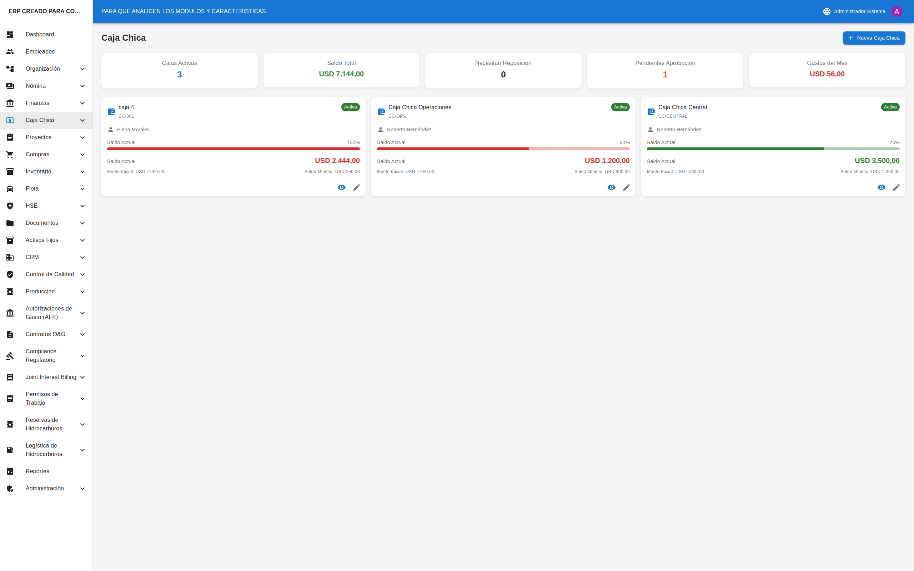

# 💵 Caja Chica

## Cómo Acceder al Módulo

1. En el **menú lateral izquierdo**, busque la opción **"Caja Chica"**
2. Haga clic para acceder directamente a la lista de cajas chicas

---

## Lista de Cajas Chicas

### Pantalla Principal

Al entrar al módulo verá:

#### Indicadores Principales (KPIs)

| Indicador | Descripción |
|-----------|-------------|
| **Cajas Activas** | Cantidad de cajas en operación |
| **Saldo Total** | Suma de saldos de todas las cajas |
| **Necesitan Reposición** | Cajas con saldo bajo el mínimo |
| **Pendientes de Aprobación** | Gastos sin aprobar |
| **Gastos del Mes** | Total gastado en el mes actual |

#### Tarjetas de Caja Chica

Cada caja se muestra como una tarjeta con:
- **Nombre** y código de la caja
- **Estado** (Activa, Inactiva, etc.)
- **Custodio** responsable
- **Barra de saldo** (porcentaje del monto inicial)
- **Saldo actual** (en color según nivel)
- **Monto inicial** y **saldo mínimo**
- **Alerta** si necesita reposición (borde rojo)

#### Colores del Saldo

| Color | Significado |
|-------|-------------|
| 🟢 Verde | Saldo saludable |
| 🟡 Naranja | Saldo bajo, considerar reposición |
| 🔴 Rojo | Necesita reposición urgente |

---

## Crear una Nueva Caja Chica

1. Haga clic en el botón **"+ Nueva Caja Chica"**
2. Se abrirá una página con el formulario

### Campos del Formulario

| Campo | Obligatorio | Descripción |
|-------|-------------|-------------|
| **Nombre** | ✅ Sí | Nombre descriptivo (ej: "Caja Oficina Principal") |
| **Código** | ✅ Sí | Código único (ej: "PC-001") |
| **Custodio** | ✅ Sí | Empleado responsable |
| **Moneda** | ✅ Sí | USD o VES |
| **Monto Inicial** | ✅ Sí | Cantidad de dinero inicial |
| **Saldo Mínimo** | ✅ Sí | Monto para alerta de reposición |
| **Descripción** | ❌ No | Propósito de la caja |

3. Complete los campos requeridos
4. Haga clic en **"Guardar"**
5. Se crea la caja con un movimiento inicial automático

---

## Ver Detalle de una Caja Chica

1. En la lista, haga clic en el ícono de **ojo** (👁) de la caja deseada
2. Se abrirá la página de detalle

### Información del Encabezado

- **Nombre** y código de la caja
- **Estado** (chip de color)
- **Alerta de reposición** (si aplica)
- **Custodio** (enlace al empleado)
- **Saldo actual** con barra de progreso

### Botones de Acción

| Botón | Descripción |
|-------|-------------|
| **Registrar Gasto** (rojo) | Agregar un nuevo gasto |
| **Reponer** (verde) | Solicitar reposición de fondos |
| **Editar** | Modificar datos de la caja |
| **Descargar PDF** | Exportar movimientos |
| **Refrescar** | Actualizar información |

### Pestañas Disponibles

#### Pestaña: Movimientos
Lista de todos los movimientos de la caja:
- Fecha
- Tipo (Gasto, Reposición, Ajuste)
- Descripción
- Categoría
- Monto
- Estado
- Acciones (Aprobar/Rechazar si está pendiente)

#### Pestaña: Documentos
Comprobantes adjuntos a los movimientos.

#### Pestaña: Auditoría
Historial de cambios en la caja.

---

## Registrar un Gasto

1. En el detalle de la caja, haga clic en **"Registrar Gasto"** (botón rojo)
2. Se abre un formulario

### Campos del Formulario

| Campo | Obligatorio | Descripción |
|-------|-------------|-------------|
| **Monto** | ✅ Sí | Cantidad del gasto |
| **Categoría** | ✅ Sí | Suministros, Transporte, Alimentación, etc. |
| **Descripción** | ✅ Sí | Detalle del gasto |
| **Fecha** | ✅ Sí | Fecha del gasto |
| **Referencia** | ❌ No | Número de factura o recibo |
| **Empleado** | ❌ No | Quien realizó el gasto |

3. Complete los campos
4. Haga clic en **"Guardar"**
5. El gasto queda en estado **"Pendiente"** esperando aprobación

### Adjuntar Comprobante

1. Después de guardar el gasto, vaya a la pestaña "Documentos"
2. Haga clic en **"Adjuntar"**
3. Seleccione el archivo (foto de factura, recibo, etc.)
4. El comprobante queda asociado al movimiento

---

## Aprobar o Rechazar Gastos

### Aprobar un Gasto

1. En la lista de movimientos, busque gastos en estado **"Pendiente"**
2. Haga clic en el ícono de **check verde** (✅)
3. Confirme la aprobación
4. El gasto se marca como **"Aprobado"**
5. El saldo de la caja disminuye

### Rechazar un Gasto

1. Haga clic en el ícono de **X roja** (❌)
2. Confirme el rechazo
3. El gasto se marca como **"Rechazado"**
4. El saldo NO se afecta

> 💡 **Tip**: Revise el comprobante adjunto antes de aprobar un gasto.

---

## Solicitar Reposición

### Cuándo Solicitar

- Cuando el saldo está bajo el mínimo (aparece alerta roja)
- Cuando hay muchos gastos pendientes de fondos
- Preventivamente antes de quedarse sin fondos

### Pasos

1. En el detalle de la caja, haga clic en **"Reponer"** (botón verde)
2. Se abre un formulario

| Campo | Obligatorio | Descripción |
|-------|-------------|-------------|
| **Monto** | ✅ Sí | Cantidad a reponer |
| **Descripción** | ❌ No | Justificación de la reposición |
| **Referencia** | ❌ No | Número de transferencia o cheque |

3. Haga clic en **"Guardar"**
4. La reposición queda **"Pendiente"** de aprobación

### Aprobar Reposición

1. Un supervisor revisa la solicitud
2. Hace clic en el ícono de **check verde** (✅)
3. La reposición se aprueba
4. El saldo de la caja aumenta

---

## Editar una Caja Chica

1. En el detalle de la caja, haga clic en **"Editar"**
2. Modifique los campos necesarios:
   - Nombre
   - Custodio
   - Saldo mínimo
   - Descripción
   - Estado
3. Haga clic en **"Guardar"**

> ⚠️ **Nota**: No puede modificar el monto inicial ni la moneda después de crear la caja.

---

## Cerrar una Caja Chica

1. En el detalle de la caja, haga clic en **"Editar"**
2. Cambie el estado a **"Cerrada"**
3. Guarde los cambios

> ⚠️ **Importante**: Una caja cerrada no puede registrar más movimientos.

---

## Exportar Reporte

1. En el detalle de la caja, haga clic en **"Descargar PDF"**
2. Se genera un PDF con:
   - Información de la caja
   - Saldo actual
   - Lista de movimientos
   - Totales por tipo

---

## Consejos Útiles

### Para Custodios
- ✅ Registre los gastos el mismo día que ocurren
- ✅ Siempre adjunte el comprobante (foto de factura)
- ✅ Use descripciones claras y detalladas
- ✅ Solicite reposición antes de quedarse sin fondos

### Para Supervisores
- ✅ Revise los comprobantes antes de aprobar
- ✅ Apruebe los gastos regularmente para mantener el control
- ✅ Monitoree las cajas que necesitan reposición
- ✅ Verifique que las categorías sean correctas

### Mejores Prácticas
- ✅ Defina un saldo mínimo realista (ej: 20% del inicial)
- ✅ Asigne un solo custodio por caja
- ✅ Haga arqueos periódicos (verificar dinero físico vs sistema)
- ✅ Archive los comprobantes físicos ordenadamente

---

## Preguntas Frecuentes

### ¿Por qué no puedo registrar gastos?
Verifique que la caja esté en estado "Activa". Las cajas inactivas, suspendidas o cerradas no permiten nuevos movimientos.

### ¿Qué pasa si rechazo un gasto?
El gasto se marca como rechazado y el saldo no se afecta. El custodio debe corregir el registro o proporcionar mejor documentación.

### ¿Puedo modificar un gasto aprobado?
No. Los gastos aprobados no pueden modificarse. Si hay un error, debe registrar un ajuste.

### ¿Cómo hago un arqueo de caja?
Compare el saldo mostrado en el sistema con el dinero físico. Si hay diferencia, registre un ajuste para corregir.

### ¿Puedo tener varias cajas chicas?
Sí. Puede crear tantas cajas como necesite (por departamento, por proyecto, por ubicación, etc.).

### ¿Quién puede aprobar gastos?
Los usuarios con permisos de aprobación de caja chica. Generalmente supervisores o personal de finanzas.
