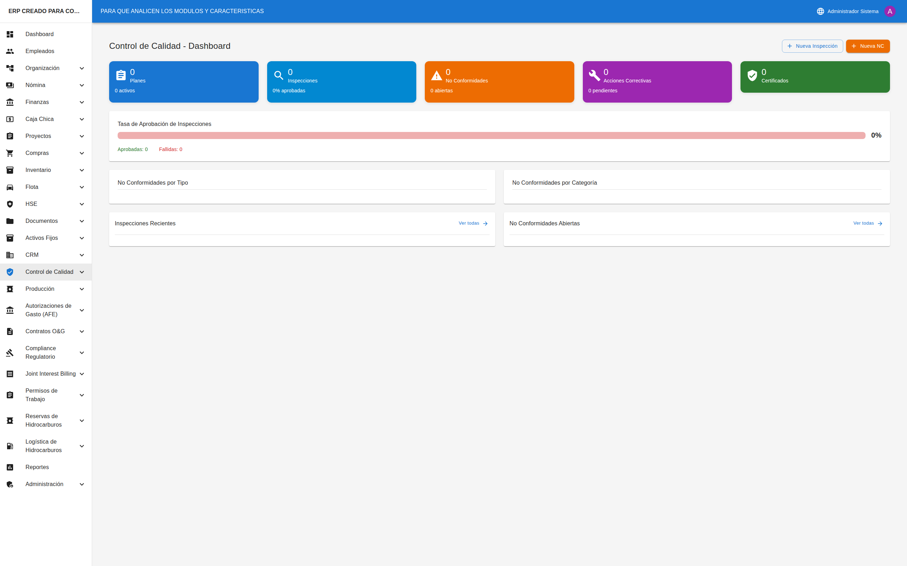
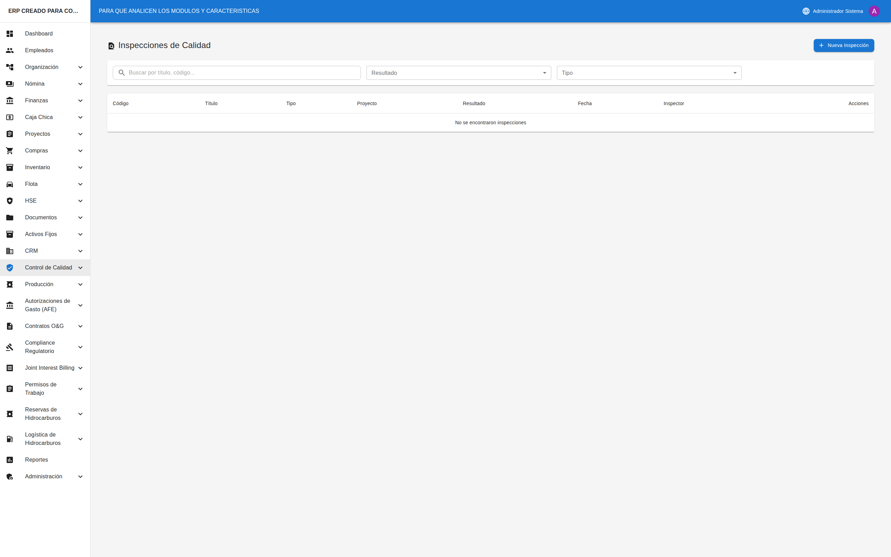

# ✅ Control de Calidad

## Cómo Acceder al Módulo

1. En el **menú lateral izquierdo**, busque la opción **"Calidad"**
2. Haga clic en el ícono de flecha (▼) para expandir las opciones
3. Verá las siguientes secciones:
   - **Dashboard**: Panel con indicadores
   - **Inspecciones**: Inspecciones de calidad
   - **No Conformidades**: Gestión de NC

---

## Dashboard de Calidad



### Acceder al Dashboard

1. En el menú, seleccione **"Calidad"** → **"Dashboard"**
2. Verá el panel principal con indicadores de calidad

### Indicadores Principales

| Indicador | Descripción |
|-----------|-------------|
| **Inspecciones Pendientes** | Inspecciones sin resultado |
| **NC Abiertas** | No conformidades sin cerrar |
| **Acciones Vencidas** | Acciones correctivas atrasadas |
| **Tasa de Aprobación** | % de inspecciones aprobadas |

---

## Inspecciones de Calidad

### Ver Lista de Inspecciones



1. En el menú, seleccione **"Calidad"** → **"Inspecciones"**
2. Verá la tabla/tarjetas de inspecciones

### Filtros Disponibles

| Filtro | Opciones |
|--------|----------|
| **Búsqueda** | Por título o código |
| **Resultado** | Pendiente, Aprobada, Fallida, Condicional |
| **Tipo** | Recepción, En Proceso, Final, etc. |

### Columnas de la Tabla

| Columna | Descripción |
|---------|-------------|
| **Código** | Identificador único |
| **Título** | Descripción de la inspección |
| **Tipo** | Tipo de inspección |
| **Proyecto** | Proyecto asociado |
| **Fecha** | Fecha de inspección |
| **Resultado** | Resultado obtenido |
| **Acciones** | Ver, Editar, Eliminar |

---

### Crear una Inspección

1. Haga clic en el botón **"+ Nueva Inspección"**
2. Complete el formulario:

| Campo | Obligatorio | Descripción |
|-------|-------------|-------------|
| **Código** | ✅ Sí | Código único |
| **Título** | ✅ Sí | Descripción |
| **Tipo** | ✅ Sí | Recepción, En Proceso, Final, etc. |
| **Proyecto** | ❌ No | Proyecto asociado |
| **Fecha** | ✅ Sí | Fecha de inspección |
| **Inspector** | ❌ No | Quién realiza |
| **Descripción** | ❌ No | Detalles |
| **Criterios** | ❌ No | Criterios de aceptación |

3. Haga clic en **"Guardar"**
4. La inspección queda en estado "Pendiente"

---

### Registrar Resultado

1. En el detalle de la inspección
2. Complete los hallazgos encontrados
3. Seleccione el **resultado**:
   - **Aprobada**: Cumple todos los criterios
   - **Fallida**: No cumple criterios críticos
   - **Condicional**: Cumple con observaciones
4. Si es "Fallida" o "Condicional", puede generar una NC
5. Haga clic en **"Guardar"**

---

## No Conformidades (NC)

### Ver Lista de NC

1. En el menú, seleccione **"Calidad"** → **"No Conformidades"**
2. Verá la lista de NC registradas

### Filtros Disponibles

| Filtro | Opciones |
|--------|----------|
| **Búsqueda** | Por título o código |
| **Estado** | Abierta, En Análisis, En Progreso, etc. |
| **Tipo** | Menor, Mayor, Crítica |
| **Categoría** | Material, Proceso, Equipo, etc. |

### Columnas de la Tabla

| Columna | Descripción |
|---------|-------------|
| **Código** | Identificador único |
| **Título** | Descripción del problema |
| **Tipo** | Menor, Mayor, Crítica |
| **Categoría** | Clasificación |
| **Proyecto** | Proyecto afectado |
| **Detectada** | Fecha de detección |
| **Vence** | Fecha límite |
| **Estado** | Estado actual |
| **Acciones** | Ver, Editar, Eliminar |

---

### Registrar una NC

1. Haga clic en el botón **"+ Nueva NC"**
2. Complete el formulario:

| Campo | Obligatorio | Descripción |
|-------|-------------|-------------|
| **Código** | ✅ Sí | Código único |
| **Título** | ✅ Sí | Descripción breve |
| **Tipo** | ✅ Sí | Menor, Mayor, Crítica |
| **Categoría** | ✅ Sí | Material, Proceso, etc. |
| **Proyecto** | ❌ No | Proyecto afectado |
| **Fecha Detectada** | ✅ Sí | Cuándo se detectó |
| **Fecha Límite** | ❌ No | Cuándo debe resolverse |
| **Descripción** | ✅ Sí | Detalle del problema |
| **Evidencia** | ❌ No | Fotos, documentos |
| **Responsable** | ❌ No | Quién debe resolver |

3. Haga clic en **"Guardar"**
4. La NC queda en estado "Abierta"

---

### Flujo de una NC

```
1. ABIERTA → NC detectada y registrada
   ↓
2. EN ANÁLISIS → Investigando causa raíz
   ↓
3. ACCIÓN PENDIENTE → Definiendo acciones correctivas
   ↓
4. EN PROGRESO → Ejecutando acciones
   ↓
5. EN VERIFICACIÓN → Verificando efectividad
   ↓
6. CERRADA → Problema resuelto
```

---

### Análisis de Causa Raíz

1. En el detalle de la NC, vaya a la sección de análisis
2. Documente:
   - Causa inmediata
   - Causa raíz (5 porqués, Ishikawa, etc.)
   - Factores contribuyentes
3. Cambie el estado a "Acción Pendiente"

---

### Definir Acciones Correctivas

1. En el detalle de la NC, agregue acciones
2. Para cada acción, especifique:
   - Descripción de la acción
   - Responsable
   - Fecha límite
   - Recursos necesarios
3. Cambie el estado a "En Progreso"

---

### Cerrar una NC

1. Verifique que todas las acciones estén completadas
2. Documente la verificación de efectividad
3. Cambie el estado a "Cerrada"
4. Agregue notas de cierre

---

## Consejos Útiles

### Para Inspecciones
- ✅ Use criterios de aceptación claros
- ✅ Documente con fotos cuando sea posible
- ✅ Sea objetivo en la evaluación
- ✅ Genere NC inmediatamente si hay fallas

### Para No Conformidades
- ✅ Describa el problema claramente
- ✅ Clasifique correctamente el tipo
- ✅ Investigue la causa raíz, no solo el síntoma
- ✅ Defina acciones medibles y verificables
- ✅ Respete las fechas límite

---

## Preguntas Frecuentes

### ¿Cuándo debo generar una NC?
Cuando una inspección falla, cuando se detecta un defecto, o cuando hay una desviación de los estándares establecidos.

### ¿Qué diferencia hay entre NC menor y mayor?
La NC menor no afecta la función principal del producto. La NC mayor sí afecta la función o requiere retrabajo significativo.

### ¿Puedo cerrar una NC sin acciones correctivas?
No se recomienda. Toda NC debe tener al menos una acción para prevenir recurrencia.

### ¿Qué pasa si una NC vence?
Aparece en las alertas del dashboard. Debe actualizar la fecha o escalar el problema.

### ¿Cómo verifico la efectividad de las acciones?
Después de implementar las acciones, realice una inspección o auditoría para confirmar que el problema no recurre.
