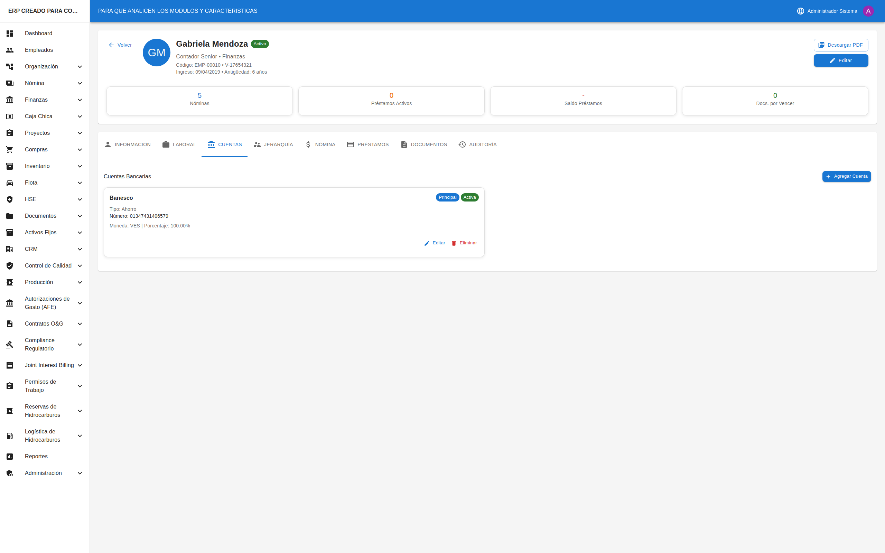

# 👥 Gestión de Empleados

## Cómo Acceder al Módulo

1. En el **menú lateral izquierdo**, busque la opción **"Empleados"**
2. Haga clic en **"Empleados"**
3. Se abrirá la lista de empleados de la empresa

---

## Pantalla Principal: Lista de Empleados

Al entrar al módulo verá:

### Parte Superior
- **Título**: "Empleados" o "Lista de Empleados"
- **Botón "+ Nuevo Empleado"**: Botón azul en la esquina superior derecha para agregar un nuevo empleado

### Zona de Filtros
Debajo del título encontrará opciones para filtrar la lista:
- **Campo de búsqueda**: Escriba nombre, cédula o código para buscar
- **Filtro de Estado**: Seleccione para ver solo Activos, Inactivos, etc.
- **Filtro de Departamento**: Seleccione para ver empleados de un departamento específico

### Lista de Empleados
Una tabla que muestra:
- **Foto**: Imagen del empleado (o iniciales si no tiene foto)
- **Nombre**: Nombre completo del empleado
- **Cédula**: Número de identificación
- **Cargo**: Puesto que ocupa
- **Departamento**: Área donde trabaja
- **Estado**: Etiqueta de color indicando si está Activo, Inactivo, etc.
- **Acciones**: Íconos para ver (👁) y editar (✏️)

---

## Ver el Detalle de un Empleado

### Paso 1: Encontrar al empleado
- Use el campo de búsqueda para escribir el nombre o cédula
- O navegue por la lista hasta encontrarlo

### Paso 2: Abrir el detalle
- Haga clic en el **ícono de ojo (👁)** en la columna de acciones
- O haga clic directamente en el **nombre del empleado**

### Paso 3: Explorar la información

La pantalla de detalle tiene varias **pestañas** en la parte superior:

| Pestaña | Qué contiene |
|---------|--------------|
| **Información** | Datos personales: nombre, cédula, fecha de nacimiento, contacto |
| **Trabajo** | Datos laborales: cargo, departamento, fecha de ingreso, salario |
| **Cuentas** | Cuentas bancarias registradas |
| **Jerarquía** | Supervisor y subordinados |
| **Nómina** | Historial de pagos |
| **Préstamos** | Préstamos y adelantos |
| **Documentos** | Documentos adjuntos |
| **Auditoría** | Historial de cambios |

Para cambiar de pestaña, simplemente haga clic en el nombre de la pestaña.

---

## Crear un Nuevo Empleado

### Paso 1: Iniciar la creación
- En la lista de empleados, haga clic en el botón **"+ Nuevo Empleado"** (esquina superior derecha)

### Paso 2: Completar información personal
En el formulario, complete los campos:
- **Nombre** (*): Nombre completo del empleado
- **Cédula** (*): Número de identificación
- **Fecha de Nacimiento**: Seleccione del calendario
- **Género**: Seleccione Masculino o Femenino
- **Estado Civil**: Seleccione de la lista
- **Teléfono**: Número de contacto
- **Email**: Correo electrónico
- **Dirección**: Dirección de residencia

*Los campos marcados con (*) son obligatorios*

### Paso 3: Completar información laboral
- **Código de Empleado**: Se genera automáticamente o ingrese uno
- **Cargo** (*): Seleccione de la lista de cargos
- **Departamento** (*): Seleccione de la lista de departamentos
- **Fecha de Ingreso** (*): Cuándo comenzó a trabajar
- **Tipo de Contrato**: Seleccione el tipo
- **Salario**: Monto del salario

### Paso 4: Guardar
- Revise que toda la información esté correcta
- Haga clic en el botón **"Guardar"** (generalmente verde o azul)
- Si hay errores, el sistema le indicará qué campos corregir
- Si todo está bien, volverá a la lista y verá el nuevo empleado

---

## Editar un Empleado

### Paso 1: Ir al detalle del empleado
- Busque al empleado en la lista
- Haga clic en su nombre o en el ícono de ojo (👁)

### Paso 2: Entrar en modo edición
- En la pantalla de detalle, busque el botón **"Editar"** o el **ícono de lápiz (✏️)**
- Generalmente está en la esquina superior derecha
- Haga clic en él

### Paso 3: Modificar la información
- Se abrirá el formulario con los datos actuales
- Modifique los campos que necesite cambiar
- Los campos obligatorios siguen marcados con (*)

### Paso 4: Guardar los cambios
- Haga clic en **"Guardar"**
- Los cambios se aplicarán inmediatamente

---

## Gestionar Cuentas Bancarias

### Ver cuentas existentes
1. Vaya al detalle del empleado
2. Haga clic en la pestaña **"Cuentas"**
3. Verá la lista de cuentas bancarias registradas
4. La cuenta marcada con una **estrella (⭐)** es la cuenta principal

### Agregar una nueva cuenta
1. En la pestaña "Cuentas", haga clic en **"+ Agregar Cuenta"**
2. Complete los campos:
   - **Banco**: Seleccione el banco
   - **Tipo de Cuenta**: Corriente o Ahorro
   - **Número de Cuenta**: Ingrese el número
   - **Es cuenta principal**: Marque si será la cuenta para pagos
3. Haga clic en **"Guardar"**

### Cambiar la cuenta principal
1. En la lista de cuentas, busque la cuenta que desea hacer principal
2. Haga clic en el **ícono de estrella vacía (☆)**
3. La estrella se llenará (⭐) indicando que ahora es la principal

### Eliminar una cuenta
1. Busque la cuenta que desea eliminar
2. Haga clic en el **ícono de papelera (🗑)**
3. Confirme la eliminación en el mensaje que aparece

---

## Buscar y Filtrar Empleados

### Búsqueda rápida
1. En la parte superior de la lista, busque el campo con el ícono de lupa (🔍)
2. Escriba el nombre, cédula o código del empleado
3. La lista se filtrará automáticamente mientras escribe

### Filtrar por estado
1. Busque el selector **"Estado"**
2. Haga clic y seleccione: Activo, Inactivo, De Permiso, o Terminado
3. La lista mostrará solo empleados con ese estado

### Filtrar por departamento
1. Busque el selector **"Departamento"**
2. Haga clic y seleccione el departamento deseado
3. La lista mostrará solo empleados de ese departamento

### Limpiar filtros
1. Busque el botón **"Limpiar"** o el ícono de X
2. Haga clic para quitar todos los filtros
3. Volverá a ver todos los empleados

---

## Consejos Útiles

### Para mantener información actualizada
- ✅ Actualice los datos de contacto cuando cambien
- ✅ Registre los cambios de cargo o departamento
- ✅ Mantenga las cuentas bancarias al día

### Para encontrar empleados rápidamente
- ✅ Use la búsqueda por nombre o cédula
- ✅ Combine filtros para resultados más específicos
- ✅ Los empleados activos aparecen primero por defecto

### Para evitar errores
- ✅ Verifique la cédula antes de guardar (no se puede duplicar)
- ✅ Asegúrese de seleccionar el cargo y departamento correctos
- ✅ Revise la información antes de guardar cambios

---

## Preguntas Frecuentes

### "No encuentro a un empleado"
- Verifique que no tenga filtros activos (límpielos)
- Pruebe buscar por cédula en lugar de nombre
- El empleado podría estar en estado "Terminado" (filtre por ese estado)

### "No puedo editar a un empleado"
- Verifique que tenga permisos para editar empleados
- Algunos campos pueden estar bloqueados según el estado del empleado

### "La cédula ya existe"
- Cada empleado debe tener una cédula única
- Verifique si el empleado ya está registrado
- Si es un error, contacte al administrador

### "No veo la pestaña de Nómina/Préstamos"
- Algunas pestañas solo son visibles para usuarios con permisos especiales
- Contacte al administrador si necesita acceso

### "¿Cómo cambio el estado de un empleado a Terminado?"
- Vaya al detalle del empleado
- Haga clic en Editar
- Cambie el campo "Estado" a "Terminado"
- Guarde los cambios
