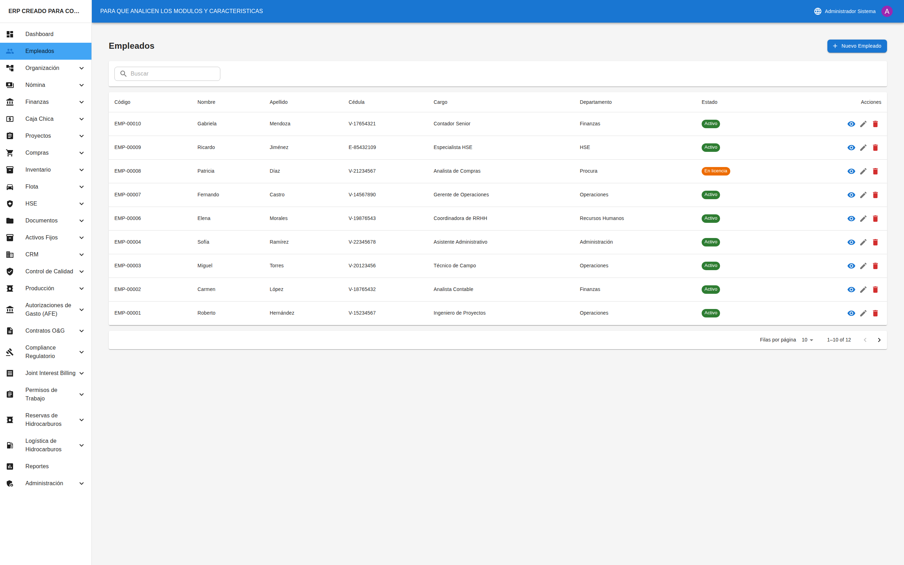
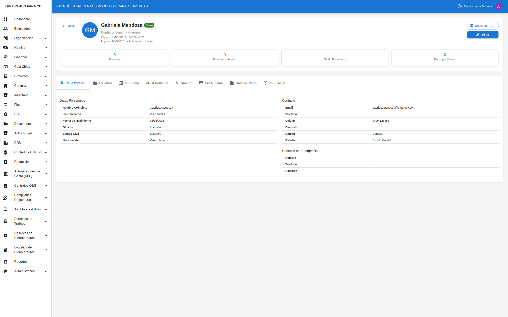

# 🏢 Introducción al Sistema

## Cómo Acceder al Sistema

### Iniciar Sesión

1. Abra su navegador web (Chrome, Firefox, Edge)
2. Ingrese la dirección del sistema que le proporcionó su empresa
3. Verá la pantalla de inicio de sesión con dos campos:
   - **Usuario**: Ingrese su nombre de usuario
   - **Contraseña**: Ingrese su contraseña
4. Haga clic en el botón **"Iniciar Sesión"**
5. Si los datos son correctos, entrará al Panel Principal

### Si Olvidó su Contraseña

1. Contacte al administrador del sistema
2. El administrador le generará una nueva contraseña temporal
3. Al ingresar con la contraseña temporal, el sistema le pedirá crear una nueva

---

## Pantalla Principal (Dashboard)

Al iniciar sesión, verá el **Panel Principal** que contiene:

### Tarjetas de Resumen (Parte Superior)
Son recuadros con números que muestran información importante:
- Total de empleados
- Proyectos activos
- Saldo en cuentas
- Otros indicadores según su rol

### Gráficos (Parte Central)
Muestran información visual como:
- Ingresos vs gastos por mes
- Proyectos por estado
- Empleados por departamento

### Alertas (Lado Derecho)
Lista de situaciones que requieren su atención:
- Documentos por vencer
- Aprobaciones pendientes
- Tareas atrasadas

---

## Cómo Usar el Menú Lateral

El menú lateral está en el **lado izquierdo** de la pantalla.

### Navegar a un Módulo

1. Busque el nombre del módulo que necesita (ej: "Empleados", "Proyectos")
2. Si el módulo tiene una flecha (▼), haga clic para ver las opciones
3. Haga clic en la opción deseada
4. La pantalla cambiará al módulo seleccionado

### Módulos con Submenús

Algunos módulos tienen varias opciones. Por ejemplo, **"Finanzas"** puede tener:
- Dashboard Financiero
- Cuentas Bancarias
- Transacciones
- Reportes

Para ver estas opciones:
1. Haga clic en **"Finanzas"** en el menú
2. Se expandirá mostrando las subopciones
3. Haga clic en la opción que necesita

### Contraer/Expandir el Menú

- En pantallas pequeñas, el menú puede estar oculto
- Busque el ícono de tres líneas (☰) en la parte superior para mostrarlo

---

## Cómo Buscar Información

La mayoría de las pantallas tienen opciones de búsqueda y filtros.

### Usar la Barra de Búsqueda

1. Busque el campo con el ícono de lupa (🔍) o el texto "Buscar..."
2. Escriba lo que está buscando (nombre, código, etc.)
3. Los resultados se filtrarán automáticamente mientras escribe

### Usar Filtros

1. Busque los selectores con opciones (ej: "Estado", "Tipo", "Fecha")
2. Haga clic en el selector
3. Elija la opción deseada
4. Los resultados se actualizarán según el filtro

### Limpiar Filtros

1. Busque el botón **"Limpiar"** o el ícono de X
2. Haga clic para quitar todos los filtros
3. Verá nuevamente todos los registros

---

## Cómo Ver el Detalle de un Registro

1. En cualquier lista, busque el registro que le interesa
2. Haga clic en el **ícono de ojo (👁)** o en el **nombre del registro**
3. Se abrirá la pantalla de detalle con toda la información

### Navegación en el Detalle

Muchas pantallas de detalle tienen **pestañas (tabs)** en la parte superior:
- Haga clic en cada pestaña para ver diferente información
- Por ejemplo: "Información General", "Documentos", "Historial"

---

## Cómo Crear un Nuevo Registro

1. En la pantalla de lista, busque el botón **"+ Nuevo"** o **"+ Agregar"**
   - Generalmente está en la esquina superior derecha
   - Es un botón azul o verde
2. Haga clic en el botón
3. Se abrirá un formulario con campos para llenar
4. Complete los campos requeridos (marcados con *)
5. Haga clic en **"Guardar"** para crear el registro

### Campos Obligatorios

- Los campos con asterisco (*) son obligatorios
- No podrá guardar hasta completar todos los campos obligatorios
- Si falta alguno, verá un mensaje indicando cuál

---

## Cómo Editar un Registro

1. Vaya al detalle del registro que desea modificar
2. Busque el botón **"Editar"** o el **ícono de lápiz (✏️)**
   - Generalmente está en la esquina superior derecha
3. Haga clic en el botón
4. Se abrirá el formulario con los datos actuales
5. Modifique lo que necesite
6. Haga clic en **"Guardar"** para aplicar los cambios

---

## Cómo Eliminar un Registro

⚠️ **Precaución**: La eliminación puede ser permanente.

1. Vaya al detalle del registro o búsquelo en la lista
2. Busque el **ícono de papelera (🗑)** o el botón **"Eliminar"**
3. Haga clic en el botón
4. Aparecerá un mensaje de confirmación
5. Haga clic en **"Confirmar"** solo si está seguro
6. El registro será eliminado

---

## Entender los Estados (Chips de Colores)

Los registros muestran su estado con etiquetas de colores:

| Color | Significado General |
|-------|---------------------|
| 🟢 Verde | Activo, Aprobado, Completado |
| 🟡 Amarillo/Naranja | Pendiente, En Proceso, Requiere Atención |
| 🔴 Rojo | Inactivo, Rechazado, Vencido, Urgente |
| 🔵 Azul | Información, En Revisión |
| ⚪ Gris | Borrador, Cancelado, Sin Estado |

---

## Consejos Útiles

### Para Trabajar Más Rápido
- Use los filtros para encontrar información rápidamente
- Las tarjetas del dashboard son clickeables y lo llevan al módulo
- Puede tener varias pestañas del navegador abiertas

### Para Evitar Errores
- Revise la información antes de guardar
- Lea los mensajes de confirmación antes de aceptar
- Si no está seguro, consulte antes de eliminar algo

### Si Algo No Funciona
- Recargue la página (F5 o botón de recargar)
- Cierre sesión y vuelva a entrar
- Contacte al administrador si el problema persiste

---

## Preguntas Frecuentes

### "No veo un módulo en el menú"
Es posible que no tenga permiso para acceder a ese módulo. Contacte al administrador si cree que debería tener acceso.

### "No puedo editar un registro"
Algunos registros no se pueden editar cuando están en ciertos estados (ej: aprobados, cerrados). Verifique el estado del registro.

### "El sistema está lento"
Intente recargar la página. Si persiste, puede ser un problema de conexión a internet o del servidor.

### "Perdí información que estaba escribiendo"
Siempre haga clic en "Guardar" antes de salir de una pantalla. El sistema no guarda automáticamente los cambios.

### "¿Cómo cambio mi contraseña?"
Vaya a Configuración (ícono de engranaje) > Perfil > Cambiar Contraseña.

### "¿Cómo cambio el idioma?"
Vaya a Configuración > Perfil > Idioma y seleccione su preferencia.
