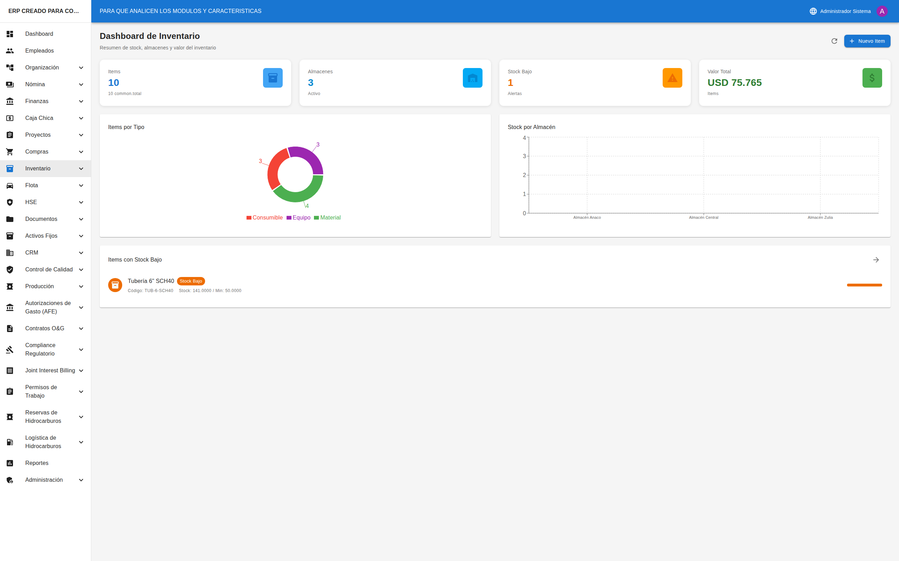
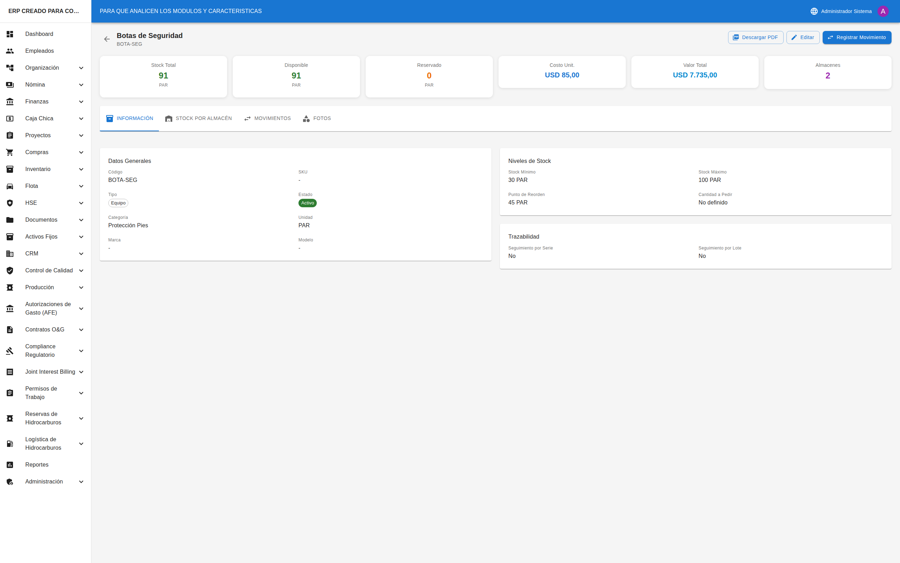
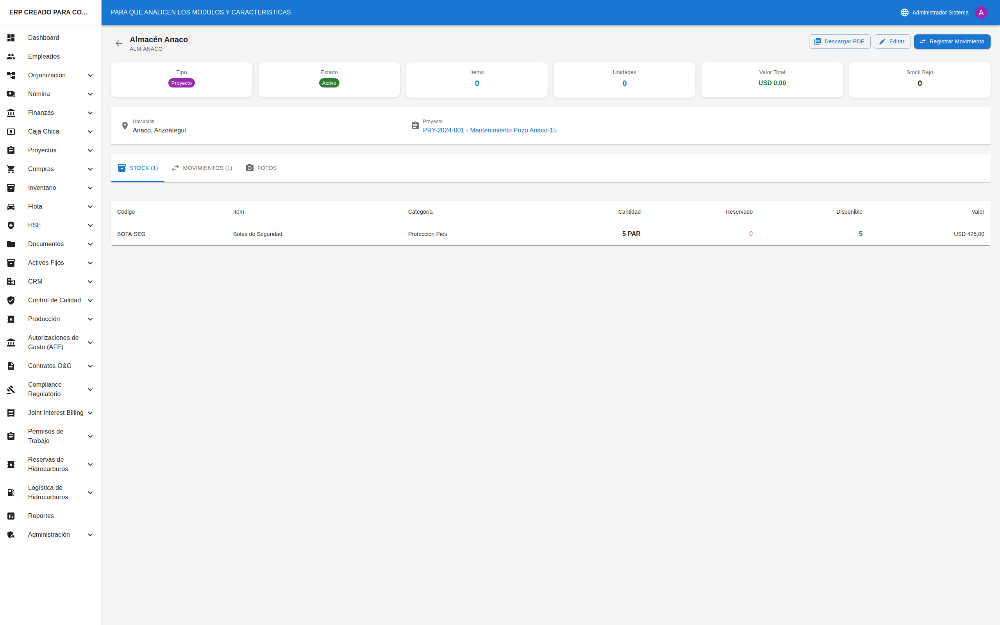
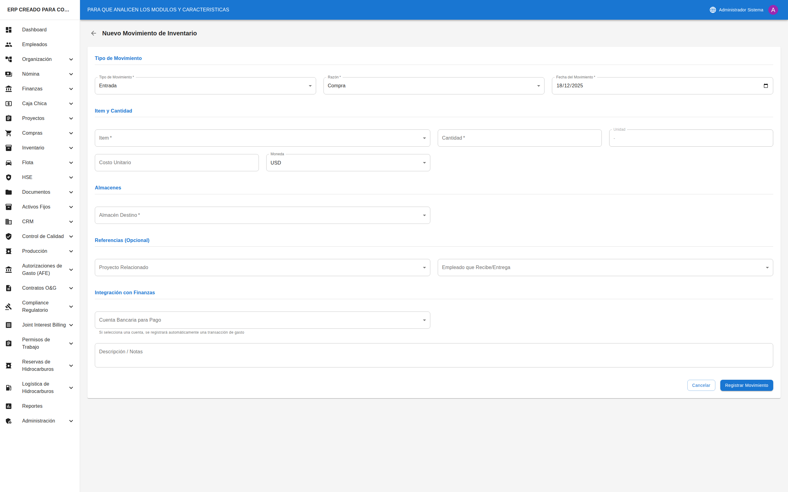

# 📦 Inventario y Almacén

## Cómo Acceder al Módulo

1. En el **menú lateral izquierdo**, busque la opción **"Inventario"**
2. Haga clic en el ícono de flecha (▼) para expandir las opciones
3. Verá las siguientes secciones:
   - **Dashboard**: Panel con indicadores
   - **Artículos**: Gestión de productos y materiales
   - **Almacenes**: Gestión de ubicaciones de almacenamiento
   - **Movimientos**: Registro de entradas y salidas

---

## Dashboard de Inventario



### Acceder al Dashboard

1. En el menú, seleccione **"Inventario"** → **"Dashboard"**
2. Verá el panel principal con indicadores y alertas

### Indicadores Principales

| Indicador | Descripción |
|-----------|-------------|
| **Total Artículos** | Cantidad de artículos registrados |
| **Valor del Inventario** | Suma del valor de todo el stock |
| **Almacenes Activos** | Cantidad de almacenes operativos |
| **Stock Bajo** | Artículos que necesitan reposición |

### Alertas de Stock Bajo

Lista de artículos cuyo stock está por debajo del mínimo definido.

---

## Artículos

### Ver Lista de Artículos


1. En el menú, seleccione **"Inventario"** → **"Artículos"**
2. Verá indicadores y la tabla/tarjetas de artículos

### Filtros Disponibles

| Filtro | Opciones |
|--------|----------|
| **Búsqueda** | Por nombre, código o SKU |
| **Categoría** | Categorías registradas |
| **Tipo** | Producto, Material, Herramienta, etc. |
| **Estado** | Activo, Inactivo, Descontinuado |
| **Stock Bajo** | Solo artículos con alerta |

### Columnas de la Tabla

| Columna | Descripción |
|---------|-------------|
| **Código** | Identificador único |
| **Nombre** | Nombre del artículo |
| **Categoría** | Clasificación |
| **Tipo** | Tipo de artículo |
| **Stock** | Cantidad total |
| **Disponible** | Cantidad sin reservar |
| **Costo Unit.** | Costo por unidad |
| **Estado** | Estado actual |
| **Acciones** | Ver, Editar, Eliminar |

### Indicadores de Alerta

| Ícono | Significado |
|-------|-------------|
| 🔴 ⚠️ | Sin stock (cantidad = 0) |
| 🟡 ⚠️ | Stock bajo (≤ mínimo) |

---

### Crear un Nuevo Artículo


1. Haga clic en el botón **"+ Nuevo Artículo"**
2. Se abrirá una página con el formulario

#### Campos del Formulario

| Campo | Obligatorio | Descripción |
|-------|-------------|-------------|
| **Código** | ✅ Sí | Código único (ej: "MAT-001") |
| **Nombre** | ✅ Sí | Nombre descriptivo |
| **SKU** | ❌ No | Código de barras o SKU |
| **Categoría** | ❌ No | Seleccione categoría |
| **Tipo** | ✅ Sí | Producto, Material, etc. |
| **Unidad** | ✅ Sí | Unidad de medida (UND, KG, LT, etc.) |
| **Descripción** | ❌ No | Descripción detallada |
| **Marca** | ❌ No | Marca del artículo |
| **Modelo** | ❌ No | Modelo específico |
| **Stock Mínimo** | ❌ No | Nivel para alerta |
| **Stock Máximo** | ❌ No | Capacidad máxima |
| **Costo Unitario** | ❌ No | Costo por unidad |
| **Precio de Venta** | ❌ No | Precio al público |
| **Moneda** | ❌ No | USD, VES |
| **Estado** | ✅ Sí | Activo, Inactivo |

3. Complete los campos requeridos
4. Haga clic en **"Guardar"**

---

### Ver Detalle de un Artículo



1. En la lista, haga clic en el ícono de **ojo** (👁)
2. Verá:
   - Información completa del artículo
   - Stock por almacén
   - Historial de movimientos
   - Documentos adjuntos

---

## Almacenes

### Ver Lista de Almacenes


1. En el menú, seleccione **"Inventario"** → **"Almacenes"**
2. Verá la lista de todos los almacenes

### Columnas de la Tabla

| Columna | Descripción |
|---------|-------------|
| **Código** | Identificador único |
| **Nombre** | Nombre del almacén |
| **Tipo** | Principal, Secundario, Tránsito, Proyecto |
| **Ubicación** | Dirección física |
| **Encargado** | Empleado responsable |
| **Proyecto** | Proyecto asociado (si aplica) |
| **Estado** | Activo, Inactivo, Cerrado |
| **Acciones** | Ver, Editar, Eliminar |

---

### Crear un Nuevo Almacén


1. Haga clic en el botón **"+ Nuevo Almacén"**
2. Complete el formulario:

| Campo | Obligatorio | Descripción |
|-------|-------------|-------------|
| **Código** | ✅ Sí | Código único (ej: "ALM-001") |
| **Nombre** | ✅ Sí | Nombre descriptivo |
| **Tipo** | ✅ Sí | Principal, Secundario, Tránsito, Proyecto |
| **Ubicación** | ❌ No | Dirección física |
| **Encargado** | ❌ No | Empleado responsable |
| **Proyecto** | ❌ No | Solo para tipo "Proyecto" |
| **Descripción** | ❌ No | Descripción adicional |
| **Estado** | ✅ Sí | Activo, Inactivo |

3. Haga clic en **"Guardar"**

---

### Ver Detalle de un Almacén



1. En la lista, haga clic en el ícono de **ojo** (👁)
2. Verá:
   - Información del almacén
   - Inventario actual (artículos y cantidades)
   - Historial de movimientos del almacén

---

## Movimientos

### Ver Lista de Movimientos


1. En el menú, seleccione **"Inventario"** → **"Movimientos"**
2. Verá el historial de todos los movimientos

### Filtros Disponibles

| Filtro | Opciones |
|--------|----------|
| **Tipo** | Entrada, Salida, Transferencia, Ajuste, etc. |
| **Razón** | Compra, Uso en Proyecto, Venta, etc. |
| **Almacén** | Filtrar por almacén específico |
| **Estado** | Pendiente, Completado, Cancelado |
| **Fecha Desde/Hasta** | Rango de fechas |

### Columnas de la Tabla

| Columna | Descripción |
|---------|-------------|
| **Código** | Identificador del movimiento |
| **Fecha** | Fecha del movimiento |
| **Tipo** | Entrada, Salida, etc. |
| **Razón** | Motivo del movimiento |
| **Artículo** | Artículo afectado |
| **Cantidad** | Cantidad movida |
| **Origen** | Almacén de origen |
| **Destino** | Almacén de destino |
| **Costo** | Costo total del movimiento |
| **Estado** | Estado actual |
| **Acciones** | Cancelar (si aplica) |

---

### Registrar un Nuevo Movimiento



1. Haga clic en el botón **"+ Nuevo Movimiento"**
2. Se abrirá una página con el formulario

#### Campos del Formulario

| Campo | Obligatorio | Descripción |
|-------|-------------|-------------|
| **Tipo** | ✅ Sí | Entrada, Salida, Transferencia, etc. |
| **Razón** | ✅ Sí | Motivo del movimiento |
| **Artículo** | ✅ Sí | Seleccione el artículo |
| **Cantidad** | ✅ Sí | Cantidad a mover |
| **Almacén Origen** | Según tipo | De dónde sale |
| **Almacén Destino** | Según tipo | A dónde llega |
| **Fecha** | ✅ Sí | Fecha del movimiento |
| **Costo Unitario** | ❌ No | Costo por unidad |
| **Referencia** | ❌ No | Número de factura, orden, etc. |
| **Notas** | ❌ No | Observaciones |

3. Complete los campos según el tipo de movimiento
4. Haga clic en **"Guardar"**

---

### Tipos de Movimiento y Campos Requeridos

| Tipo | Origen | Destino |
|------|--------|---------|
| **Entrada** | No aplica | Requerido |
| **Salida** | Requerido | No aplica |
| **Transferencia** | Requerido | Requerido |
| **Ajuste (+)** | No aplica | Requerido |
| **Ajuste (-)** | Requerido | No aplica |

---

### Cancelar un Movimiento

1. En la lista de movimientos, busque el movimiento a cancelar
2. Haga clic en el ícono de **X roja** (❌)
3. Confirme la cancelación
4. El stock se revierte automáticamente

> ⚠️ **Importante**: Solo puede cancelar movimientos en estado "Completado". Los movimientos cancelados no pueden revertirse.

---

## Flujo de Trabajo Típico

### Entrada por Compra
```
1. Recibir mercancía del proveedor
2. Ir a Movimientos → Nuevo Movimiento
3. Tipo: Entrada, Razón: Compra
4. Seleccionar artículo y cantidad
5. Indicar almacén destino
6. Guardar → Stock aumenta
```

### Salida para Proyecto
```
1. Recibir solicitud de materiales
2. Ir a Movimientos → Nuevo Movimiento
3. Tipo: Salida, Razón: Uso en Proyecto
4. Seleccionar artículo y cantidad
5. Indicar almacén origen
6. Guardar → Stock disminuye
```

### Transferencia entre Almacenes
```
1. Identificar necesidad de mover stock
2. Ir a Movimientos → Nuevo Movimiento
3. Tipo: Transferencia
4. Seleccionar artículo y cantidad
5. Indicar origen y destino
6. Guardar → Stock se mueve
```

---

## Consejos Útiles

### Para Artículos
- ✅ Defina stock mínimo para recibir alertas
- ✅ Use códigos consistentes (ej: MAT-001, HER-001)
- ✅ Mantenga actualizado el costo unitario
- ✅ Categorice correctamente para facilitar búsquedas

### Para Almacenes
- ✅ Asigne un encargado a cada almacén
- ✅ Use tipo "Proyecto" para almacenes de obra
- ✅ Mantenga actualizada la ubicación física

### Para Movimientos
- ✅ Registre los movimientos inmediatamente
- ✅ Use la razón correcta para cada movimiento
- ✅ Incluya referencias (facturas, órdenes)
- ✅ Haga conteos físicos periódicos

---

## Preguntas Frecuentes

### ¿Por qué no puedo eliminar un artículo?
Solo puede eliminar artículos con stock = 0. Si tiene stock, primero debe registrar una salida.

### ¿Cómo corrijo un error de stock?
Use un movimiento de tipo "Ajuste (+)" o "Ajuste (-)" con razón "Ajuste por Conteo".

### ¿Puedo tener el mismo artículo en varios almacenes?
Sí. El sistema muestra el stock total y también el stock por almacén en el detalle del artículo.

### ¿Qué pasa si cancelo un movimiento?
El stock se revierte automáticamente. Si fue una entrada, el stock disminuye. Si fue una salida, el stock aumenta.

### ¿Cómo veo el stock de un almacén específico?
Vaya al detalle del almacén para ver todos los artículos y cantidades en esa ubicación.

### ¿Puedo reservar stock para un proyecto?
Sí, use el tipo de movimiento "Reserva". El stock sigue en el almacén pero se reduce el "disponible".
